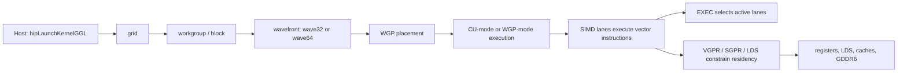
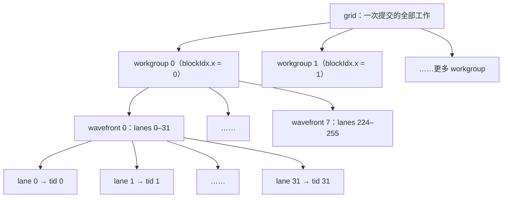
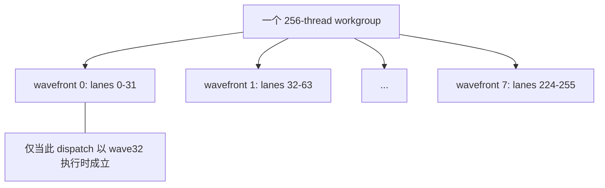
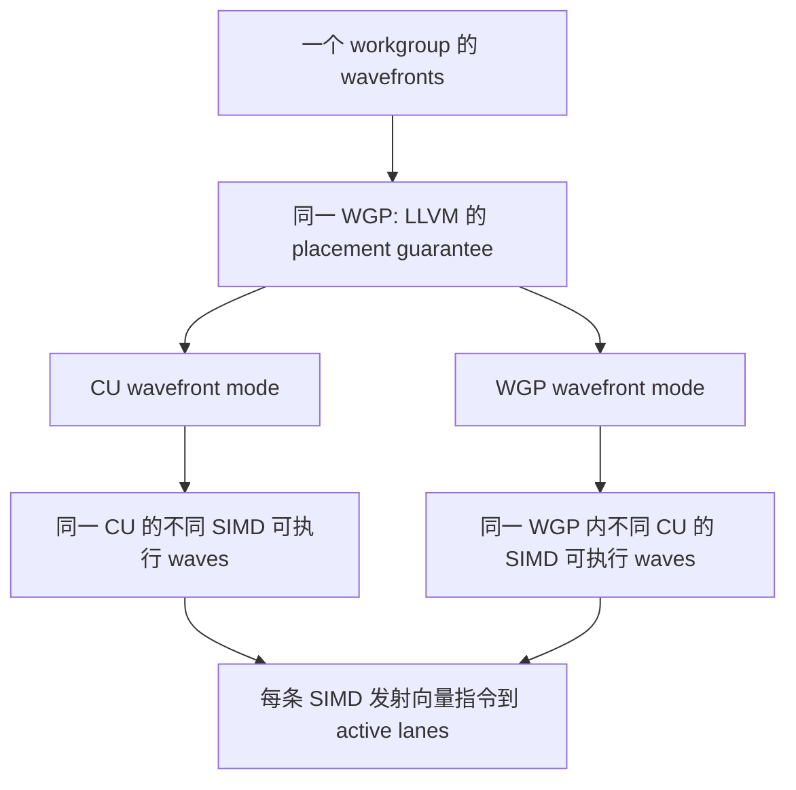
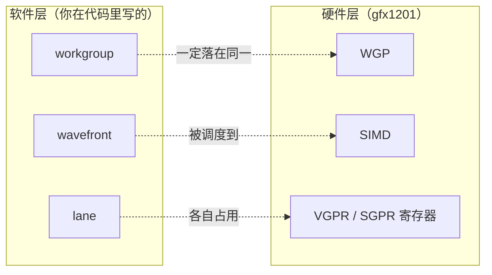
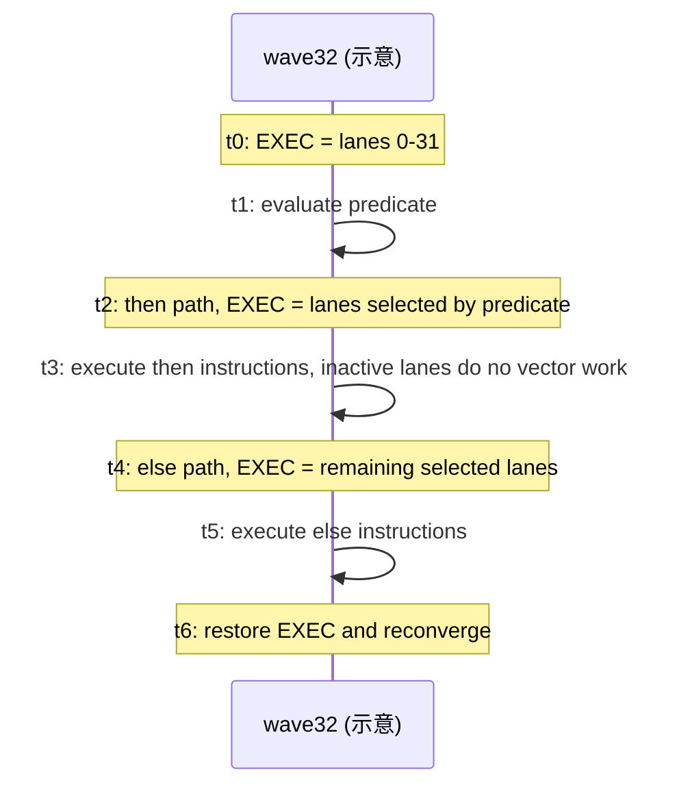

# 第2章 GPU 体系结构（上）：编程模型与波前执行

## 本章导读

> 第 1 章我们确认了环境是通的——ROCm 看得到 GPU、PyTorch 用得上 GPU、最小 HIP 程序能编译运行，环境这张地图已经在你手上。现在该铺开第二张地图了：**GPU 体系结构**。本章会做三件事：跟着一次真实的 kernel 提交（`hipLaunchKernelGGL`）看清线程怎么被划分（grid → workgroup → wavefront → lane）、搞清楚这些波前落到哪块硬件上执行（WGP/CU/SIMD）、再用 EXEC 掩码弄懂分支发散为什么会让一整排线程被拖住。
>
> 这套「软件怎么划分、硬件怎么执行」的两层视角，是后面一切优化的心智地基：下一章会接着讲片上资源和内存层级；Part 2 的每个算子优化——合并访存（[第 8 章 Element-Wise](../../part2-kernels/chapter8/index.md)）、跨线程归约（[第 9 章 Reduction](../../part2-kernels/chapter9/index.md)）、分块与寄存器累加（[第 11 章 GEMM-Like(../../part2-kernels/chapter11/index.md)）、矩阵指令与融合（[第 12 章 Fusion：融合算子](../../part2-kernels/chapter12/index.md)）——都建立在它之上。本章只负责把模型立起来，具体怎么优化，留到对应算子章。

本章对应代码在：

```text
code/part0-intro/
├── pyproject.toml
├── uv.lock
├── activate-rocm.sh
└── chapter2/
    ├── branch_divergence.hip   # 选做：分支发散受控对照
    └── run_all.sh
```

本章所有数字都锚定在一块具体的卡上：AMD Radeon RX 9070 XT。按 AMD 官方规格，它有 64 个计算单元（Compute Unit，CU）、16 GB 显存（GDDR6，256-bit 位宽）、最高约 640 GB/s 的显存带宽，以及 64 MB 的 Infinity Cache。[AMD RX 9070 XT 产品规格](https://www.amd.com/en/products/graphics/desktops/radeon/9000-series/amd-radeon-rx-9070xt.html) **请注意：这些是厂家标称的规格，不是我们实测跑出来的速度。** ROCm 文档里 `gfx1201` 这一条还给出了更细的资源数字：支持 wave32/wave64、128 KiB 片上内存（LDS）、768 KiB 向量寄存器和 32 KiB 标量寄存器。[ROCm GPU specifications](https://rocm.docs.amd.com/en/latest/reference/gpu-specs.html)

::: figure fig-ch2-kernel-journey


一次 HIP kernel 的全景：本章（上）覆盖从 launch 到 EXEC 的前半段；资源与内存（后半段）见第 3 章。
:::

这张图是**从「你写的代码」到「硬件怎么执行」的导览图**，不是某一次运行的真实录像。到底被分到哪个硬件单元、同时跑几个 wavefront、缓存命中没有——这些都得靠编译产物和 profiling 工具去证明，不能看图说话。另外，不少人是从 CUDA（NVIDIA）转过来的，为了避免把 CUDA 的习惯直接套到 AMD 上，我们先把两边对应的名词固定下来：

| HIP 里的词 | CUDA 里常见的词 | AMD 执行模型里的词 | 本章怎么理解它 |
| --- | --- | --- | --- |
| thread / work-item | thread | lane（通道）上的一份工作 | 只是一个逻辑编号，不等于一颗独立的处理器 |
| block | thread block | workgroup（工作组） | 一组能互相协作、能共用片上内存（LDS）的线程 |
| warp | warp | wavefront（波前） | 同一波前的线程步调一致，执行同一段指令；本机是 wave32，也可能是 wave64 |
| grid | grid | 一次提交（dispatch）里的全部工作组 | 你交给 GPU 的全部工作，但不保证它们立刻同时开跑 |
| `__shared__` | shared memory | LDS（局部数据存储，Local Data Share） | 工作组能自己支配的片上内存 |

> **读法约定**：下文说的「RX 9070 XT」，只指我们实测过的那台 `gfx1201` 机器；「wave32」既是这台机器在实验里测到的真实波前大小，也是本章代码用的分组。这些结论**不能**自动推广到所有 AMD 显卡、所有编译选项，或所有 wave64 的 kernel。

## 2.1 从 launch 到 workgroup

**这一节只解决一件事：你写下的一大堆线程，是怎么被分成组的。**

我们在 CPU 这边启动 kernel 时，会明确告诉它两件事：一共要算多少组（grid）、每组多少个线程（block）。本仓库的全局内存实验把每组定为 `kBlockSize=256` 个线程，于是代码写成 `dim3 grid(grid_for(n))` 和 `dim3 block(kBlockSize)`，再一起交给 `hipLaunchKernelGGL`。kernel 里面，则用下面这行算出「我是第几号线程」：

```cpp
std::size_t tid = blockIdx.x * blockDim.x + threadIdx.x;
if (tid < n) output[tid] = input[tid];
```

这样，每个线程（work-item）就对上了一个全局编号。这里要特别提醒一句：`block` 只是**软件上的分组**，它只告诉运行时「每组多少个线程」，**并没有**承诺「一组 block 就对应一个硬件计算单元（CU）」，也没承诺这些组会按你提交的顺序完成。

把这套划分画成一张层级图（@fig-ch2-thread-hierarchy），一眼就能看全：grid 切成 workgroup，workgroup 再切成 wavefront，每个 lane 对应一个全局下标。

::: figure fig-ch2-thread-hierarchy


HIP 的线程层级：grid 切成 workgroup，workgroup 再切成 wavefront（本机为 wave32），每个 lane 对应一个全局下标。这只是软件层的划分，和它最终落到哪块硬件（WGP/CU/SIMD）是两回事。
:::

所以到了这一节，你该先问两个问题，而且它们比「block 设成多大最好」更基础：第一，这群线程有没有正好覆盖该算的输出区域，不多也不少？第二，最后一组如果凑不满，多出来那几个越界的线程，是不是安全退出了、没有去写不该写的内存？如果你的 kernel 需要组内线程互相配合，那么所有线程到达同步点（`__syncthreads()`）的条件也必须一致——不然第一个炸的是**正确性**，根本轮不到谈速度。

**迁移范围：** `grid`/`block`/`threadIdx` 这些词的用法，在整个 HIP 编程模型里都通用；但 256 这个具体数字，只来自本仓库这一次实验，它**不是** RX 9070 XT 上放之四海皆准的最优 block 大小。block 大小怎么选最合适，要在具体算子里量——[第 8 章 Element-Wise](../../part2-kernels/chapter8/index.md) 会第一次系统地做这件事。

## 2.2 workgroup 怎样拆成 wavefront

**一个工作组，会被硬件再切成几个「波前」。**

运行时拿到一个 workgroup 后，还会把它拆成一个或多个 wavefront（波前）。ROCm 的 `gfx1201` 规格支持两种波前大小：wave32 和 wave64。我们这台机器在实验里报告 `wave_size=32`，所以 `blockDim.x=256` 这个例子，应该读成**8 个 wave32**，而**不是**「256 个各自独立、同时执行的线程」。[ROCm GFX1201 wavefront specifications](https://rocm.docs.amd.com/en/latest/reference/gpu-specs.html)

::: figure fig-ch2-wavefront-split


一个 256-thread workgroup 在实际 wavefront size 为 32 时的 8×wave32 分组示意；它不将此实例泛化到 wave64 或其他 block shape。
:::

为什么我们关心的是波前，而不是单个线程？因为硬件执行的最小单位就是波前：同一个 wavefront 里的所有 lane 共用一段指令，要动一起动。遇到边界或分支时，其中一些 lane 会被暂时关掉，但它们仍然属于同一个波前。

打个比方：一个 workgroup 是一辆大巴上的全体乘客，wavefront 则是其中一排座位——硬件一次只对一排下达同一个动作，整排一起做。本机是 wave32，256 人正好坐满 8 排；要是换成 wave64 的车，每排座位数和分支边界都得重新算。这个比方到这里为止：它帮你建立「成排执行」的直觉，但真实的调度细节，还是要以下文的 LLVM 文档和 profiling 结果为准。所以别把 `warpSize=32` 当成「所有 AMD 显卡都固定是 32」，也别看到一个 workgroup 有多少线程，就想当然地认为一条 wavefront 有多宽。

**迁移范围：** 「wavefront」这个词作为 AMD 的术语，到哪里都适用；但本节「8 个 wave32」的结论，只适用于 256 线程的 block、且波前大小确实是 32 的情况。换成 wave64 的 kernel，分组和分支边界都要重新算。

## 2.3 wavefront 怎样落到 WGP、CU 和 SIMD

**这些波前，会被放到哪块硬件上去执行？**

先别急着把 wavefront 想象成「钉死」在某张固定的硬件示意图上。我们先固定三个硬件名词：WGP（Workgroup Processor，工作组处理器）、CU（Compute Unit，计算单元）和 SIMD（一条向量指令作用在一组 lane 上的执行单元）。LLVM 的 AMDGPU 文档给出的、可以依赖的保证只有一条：**同一个 workgroup 的所有 wavefront，一定在同一个 WGP 里执行。** 在这个前提下分两种模式：CU 模式下，它们可以落在同一个 CU 里不同的 SIMD 上；WGP 模式下，它们可以分散到同一个 WGP 里不同 CU 的 SIMD 上。至于 WGP 模式能不能用，取决于编译器和目标，**不能**从你 kernel 的源码或 block 大小反推出来。[LLVM AMDGPU：workgroup 的 WGP/CU execution mode](https://llvm.org/docs/AMDGPUUsage.html)

::: figure fig-ch2-wgp-cu-simd


WGP/CU/SIMD 的安全读法：图表达 LLVM 的执行模式关系，不规定每个 WGP 含几个 CU 或 SIMD。
:::

RX 9070 XT 的官方规格是 64 个 CU；本章环境里 `rocminfo` 也确实报告 64 个物理 CU 和 `gfx1201`。但有一个容易踩的坑：HIP 里的 `hipDeviceProp_t::multiProcessorCount` 在本机读出来是 **32**，而不是 64。我们在实验输出里就原样记成 `hip_multiprocessor_count=32`，**绝不把它改口叫成物理 CU 数**。[AMD 的 64 CU 产品规格](https://www.amd.com/en/products/graphics/desktops/radeon/9000-series/amd-radeon-rx-9070xt.html) 换句话说，`multiProcessorCount` 可以当作这次运行环境的一个诊断字段，但**不能**拿它去代替真实的物理 CU 总数。

再说 SIMD：它是真正发射向量指令的地方。它解释了为什么「同一个 wavefront 的 lane 要做同一类工作」很重要——但仅此而已。我们**不能**从编程模型出发，去推断每条指令要几个周期、每个 WGP 里固定有几个什么单元、或者一个 kernel 的并发度有多高。这些都是编译目标、指令、资源占用和当时的调度状态共同决定的，得实测才知道。

把软件和硬件两层对应起来看（@fig-ch2-sw-hw），就不容易把两边混为一谈：

::: figure fig-ch2-sw-hw


软件概念到硬件单元的对应。LLVM 唯一能保证的是：同一 workgroup 的所有 wavefront 落在同一 WGP；至于 wavefront 落到哪条 SIMD、lane 占哪些寄存器，由编译器和当时的调度状态决定，不能从源码反推。
:::

**迁移范围：** 64 个 CU 是 RX 9070 XT 的产品规格；`multiProcessorCount=32` 是本机 HIP 运行时读出来的值。WGP/CU 两种模式的关系，按 LLVM 文档理解就好，别外推成「WGP 内部一定是某种固定结构」。

## 2.4 分支、EXEC 与有效 lane

**同一个波前里的线程，如果走了不同的 `if` 分支，会发生什么？**

答案是：整条向量指令流还是照常往前走，但有一个叫**执行掩码（EXEC，Execution Mask）**的东西，负责决定这一刻哪些 lane 的运算是「算数的」。LLVM 的 AMDGPU 文档用嵌套条件描述了它的套路：先存好原来的 `EXEC`，把掩码和当前条件取「与」后执行 then 分支，再把掩码反转去执行 else 分支，最后恢复原样、重新合流。这套机制，正是理解**分支发散（Divergent Control Flow）**的可靠入口——所谓发散，本质就是「哪些 lane 此刻有效」这个集合，随着一段段指令在变化。[LLVM AMDGPU：divergent control flow 与 EXEC](https://llvm.org/docs/AMDGPUUsage.html)

::: figure fig-ch2-exec-divergence


受控发散时间线：它显示 mask 的概念顺序，不主张每段恰好耗费一个周期。
:::

我们可以把 EXEC 想成每排座位上的举手表决：遇到岔路，举手的那部分 lane 走 then 分支，没举手的原地待命——注意，它们**不是**另开一辆车并行跑，只是这一拍不干活；等另一条路走完，两拨再重新合流。失活的 lane 并没有离场，只是被掩码暂时关掉了。这也解释了为什么分支发散会浪费时间：一整排的执行时间，是被最长的那条路拖着走的。

我们用一个只改判断条件的受控实验验证了这一点：让两条路径做完全相同的四条依赖 FP32 乘加，只把 predicate 换成「按波前一致」或「按 lane 奇偶交替」，后者慢了约 3%。这个数很小、且只属于这套特定的谓词和指令组合——它**不是**「分支发散永远慢 3%」的通用罚单（编译器、路径长短、波前大小都会改）。**选做实验：分支发散受控对照**

下面是这个实验的核心 kernel：两条路径做完全相同的四条依赖 FP32 乘加，唯一区别是 `take_a` 这个判断条件——`WaveUniform` 按波前（`tid / warpSize`）让整组走同一路，`WaveDivergent` 按 lane 奇偶（`tid & 1`）交替走两路。

<details>
<summary>代码：branch_divergence.hip（核心 kernel）</summary>

```cpp
template <BranchMode mode>
__global__ void branch_kernel(const float* input, float* output,
                              std::size_t n) {
    const std::size_t tid =
        static_cast<std::size_t>(blockIdx.x) * blockDim.x + threadIdx.x;
    if (tid >= n) {
        return;
    }

    bool take_a = mode == BranchMode::WaveUniform
        ? (((tid / warpSize) & 1u) == 0u)
        : ((tid & 1u) == 0u);
    float value = input[tid];
    if (take_a) {
        value = fmaf(value, 1.0001f, 0.125f);
        value = fmaf(value, 0.9997f, -0.250f);
        value = fmaf(value, 1.0003f, 0.500f);
        value = fmaf(value, 0.9999f, -0.375f);
    } else {
        value = fmaf(value, 0.9991f, -0.125f);
        value = fmaf(value, 1.0007f, 0.250f);
        value = fmaf(value, 0.9983f, -0.500f);
        value = fmaf(value, 1.0019f, 0.375f);
    }
    output[tid] = value;
}
```

完整可运行版本（含参数解析、正确性校验与三进程计时脚手架）位于 [`code/part0-intro/chapter2/branch_divergence.hip`](https://github.com/datawhalechina/hello-gpu/blob/dev/code/part0-intro/chapter2/branch_divergence.hip)。

</details>

**怎么运行**（原生 Ubuntu 实验机，已 `uv sync` 并 `source ./activate-rocm.sh`）：

```bash
cd code/part0-intro/chapter2
hipcc --offload-arch=gfx1201 -O3 -std=c++17 branch_divergence.hip -o branch_divergence
# --implementation all 会依次跑 wavefront-uniform 和 wavefront-divergent 两种
./branch_divergence --implementation all --size 16777216 --warmup 10 --repeat 50
```

**结果**（RX 9070 XT + ROCm 7.13，三进程中位数 [进程范围]，`N=16,777,216` FP32）：

| 实现 | 中位数时间（ms） | 吞吐（TFLOPS） | 相对差距 |
| --- | ---: | ---: | ---: |
| `wavefront-uniform` | 0.237341 [0.237041, 0.239320] | 0.565507 | 基线 |
| `wavefront-divergent` | 0.245241 [0.243860, 0.246920] | 0.547289 | +3.33% |在真实算子里，分支发散要不要紧、怎么排布数据来缓解，会结合具体场景在 Part 2 反复出现——比如 [第 9 章 Reduction](../../part2-kernels/chapter9/index.md) 里归约树的 lane 参与模式。

**迁移范围：** EXEC 这套掩码执行的模型，来自 LLVM AMDGPU 文档，是通用的；但上面那个约 3% 只属于那套受控组合，**不能**拿去当别的 kernel 的预算。

## 本章小结

- 一个 kernel 从 launch 出发，先被切成 workgroup，再被切成 wavefront（本机是 wave32）；每个 lane 对应一个全局下标。这是**软件层**的划分。
- 它最终落到 WGP/CU/SIMD 哪块硬件，由 LLVM 的执行模式和编译器决定——唯一能保证的只是「同一 workgroup 的 wavefront 落在同一 WGP」。别从源码或 block 大小反推物理拓扑。
- 同一个 wavefront 的 lane 走不同分支时，靠 EXEC 掩码轮流执行 then/else 再合流；发散的代价是「整排被最长路径拖住」，而不是两条路并行。
- 这套「软件划分 → 硬件执行」的两层视角是全书的地基。下一章我们补上另一半：片上资源（能同时塞下多少活儿）和内存层级（数据从哪里取）。

## 自我检验

读完本章，你应该能：

1. 能说清 grid、workgroup、wavefront、lane 之间的层级关系，以及 `blockDim.x=256` 为什么在本机是 8 个 wave32。
2. 能区分「软件划分」（workgroup/wavefront）和「硬件落点」（WGP/CU/SIMD），并说出 LLVM 唯一保证的是什么。
3. 能区分 `hipDeviceProp_t::multiProcessorCount=32` 与 `rocminfo` 的 64 physical CU，并解释二者为什么不能互换命名。
4. 能解释 EXEC 掩码如何让同一个 wavefront 的 lane 分别走 then/else 再合流，以及为什么分支发散的代价是「整排被最长路径拖住」。
5. 能把 thread/block/warp/shared memory 这些 CUDA 名词，对应到 HIP 与 AMD 执行模型里的说法。

## 延伸阅读

- [AMD Radeon RX 9070 XT 产品规格](https://www.amd.com/en/products/graphics/desktops/radeon/9000-series/amd-radeon-rx-9070xt.html)：产品级 CU、显存与理论带宽。
- [ROCm GPU specifications](https://rocm.docs.amd.com/en/latest/reference/gpu-specs.html)：用 target 表核对 `gfx1201` 的 wavefront、LDS 和寄存器资源。
- [LLVM AMDGPU Usage Guide](https://llvm.org/docs/AMDGPUUsage.html)：查 WGP/CU execution mode、wavefront 与 EXEC 的编译器级语义。
- 选做实验：[`code/part0-intro/chapter2/`](https://github.com/datawhalechina/hello-gpu/tree/dev/code/part0-intro/chapter2)（branch_divergence 受控对照）。
