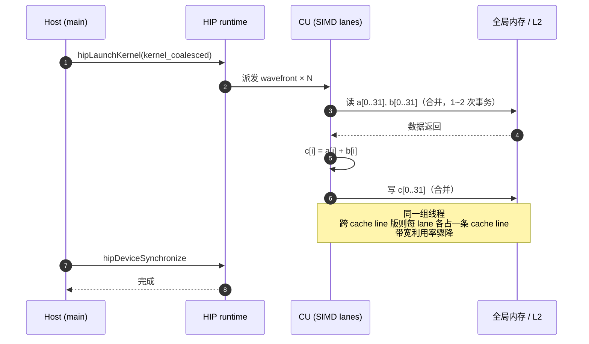
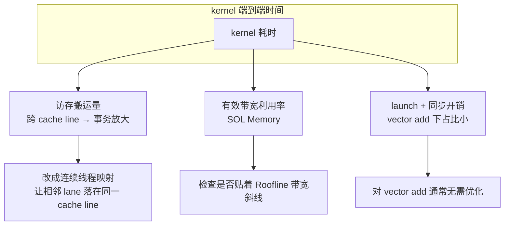
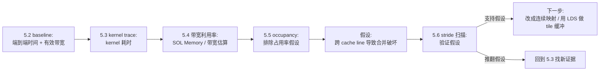

# 第5章 rocprof + Omniperf 定位瓶颈

## 本章导读

> 上一章解决了"数字可不可信"的问题——热身、重复、GPU event 计时、避免测量陷阱，见 [第 4 章 benchmark 与可信计时](../chapter4/index.md)。本章继续用同一个 vector add 做主线，但视角下沉到 GPU 内部：它到底慢在哪里——是 kernel 算得慢，还是访存喂不饱硬件。
>
> 为了让"慢在哪里"这个问题有抓手，我们故意准备两个版本做对照：一个是连续线程访问连续地址的**合并访存版**（coalesced），另一个是相邻线程地址跨过 cache line 边界的**跨 cache line 反例**（linecross）。两个版本做完全相同的工作量（都处理 n 个元素的 `c[i] = a[i] + b[i]`），只有访存模式不同。读完后，你应该能用 `rocprofv3` 看 kernel 时间、用 Omniperf 看硬件计数器（带宽利用率、L2 命中率、occupancy），并把"它慢"这种模糊感觉转成"跨 cache line 导致合并破坏"这种可验证的判断。
>
> 前置知识：[第 3 章 3.2 节](../../part0-intro/chapter3/index.md) 跑通了 vector add 并建立了 memory-bound 的 Roofline 直觉；[第 2 章](../../part0-intro/chapter2/index.md) 讲过 CU、Wavefront、显存层次和 Roofline 的硬件来源。本章会用真实计数器把这些地图点亮——而 [第 6 章](../chapter6/index.md) 会把算子点正式画到 Roofline 曲线上。

本章不从大模型开始。一个完整推理链路里同时出现请求排队、KV Cache、算子库、通信、后处理，刚入门时很难判断某个数字到底来自哪一层。我们先选一个可控的小案例：vector add。这条链路足够简单，但已经包含 profiling 入门最常见的几个问题：

- kernel 本身要多久；
- 访存有没有喂饱硬件（带宽利用率多少）；
- L2 cache 命中率如何、访存合并有没有被破坏；
- occupancy（占用率）够不够、寄存器压力大不大；
- 看到瓶颈以后，下一步应该改哪里。

本章实验环境是 Radeon RX 9070 XT（gfx1201，RDNA4），ROCm 7.13，独立 GDDR6 显存，**原生 Ubuntu 24.04**（x86_64）。输入规模与第 3、4 章保持一致（n = 16M float），便于跨章对比。本章所有命令、kernel 代码和性能数字均在 9070XT 上实测，原始日志见 `code/part1-profiling/chapter5/logs/`。

> **平台说明（重要）**：本章涉及两类 GPU 测量手段，它们在 gfx1201（RDNA4，新架构）上的可用性不同：
>
> - **kernel dispatch trace（软件层，✅ 可用）**：`rocprofv3 --kernel-trace` 记录每次 kernel launch 的起止时间戳和资源占用（VGPR/SGPR/Grid/Workgroup），不依赖硬件性能监视单元（PMU），在 gfx1201 上完全可用。本章 §5.3 的 kernel 级耗时和资源数据都用它实测。
> - **硬件性能计数器 PMC（PMU 层，⚠️ 部分关键计数器不可用）**：`rocprofv3 --pmc` 能生成 CSV，但本章最想看的访存 / L2 / 指令类计数器（如 `FETCH_SIZE`、`GL2C_HIT_sum`、`SQ_INSTS_VALU`）在 gfx1201 上返回 `0.0`，不能作为直接证据。注意这不是“所有 PMC 都无效”：复核时 `GPUBusy` 和 `Wavefronts` 能返回非零值。本章 §5.3 的 PMC 段、§5.4 的 SOL 估算、§5.5 的 Occupancy 分析会按 counter 粒度标注这个限制，并用 kernel-trace + HIP event 的间接证据交叉验证。
>
> 也就是说：**能用软件计时量到的（kernel 耗时、有效带宽、stride 扫描曲线、寄存器占用）全部实测**；需要关键访存 / L2 字节数的部分，在当前 gfx1201 + ROCm 7.13 组合上暂时只能用数据量模型和耗时交叉验证。等后续 ROCm 版本补全相关 PMU 支持后，可以回填直接计数器证据。

## 5.1 两个版本的 vector add：合并访存 vs 跨 cache line

这一节准备本章的对照案例：合并访存版（`coalesced`）和跨 cache line 非合并访存反例（`linecross`）。两个 kernel 处理完全相同的工作量（n 个元素的 `c[i] = a[i] + b[i]`），只有线程到地址的映射不同。这正是后面所有 profiling 工具服务的同一个问题。

### 5.1.1 合并访存版

合并版就是 [第 3 章 3.2 节](../../part0-intro/chapter3/index.md) 跑通的那个 kernel：相邻线程处理相邻下标。

```cpp
__global__ void kernel_coalesced(const float* __restrict__ a,
                                 const float* __restrict__ b,
                                 float*       __restrict__ c,
                                 int n) {
    int idx = blockIdx.x * blockDim.x + threadIdx.x;
    if (idx < n) {
        c[idx] = a[idx] + b[idx];
    }
}
```

它的访问模式是：

```text
线程 0：a[0], b[0], c[0]
线程 1：a[1], b[1], c[1]
...
```

同一 wavefront 内相邻线程访问的下标差 1（相差 4 字节，连续内存）。这是理想的访存合并模式，GPU 可以把一整组线程的读写合并成少数几次内存事务。合并访存为什么重要、背后是哪些硬件单元，见 [第 2 章 2.2 节（CU 内部结构）](../../part0-intro/chapter2/index.md) 和 [2.3 节（Wavefront 与 SIMT）](../../part0-intro/chapter2/index.md)。

### 5.1.2 真正破坏合并：跨 cache line 的 linecross kernel

要构造一个能干净对比的"非合并访存反例"，关键不是"让相邻线程读不同下标"，而是**让相邻线程的地址落到不同的 cache line 上**。9070XT（RDNA4）的 L1 cache line 是 128 字节，一个 wavefront 是 32 个线程，所以：

- 相邻线程地址间隔 ≤ 32 个 float（128 字节）→ 落在同一 cache line，硬件仍能用少数事务覆盖，**带宽基本无损**；
- 相邻线程地址间隔 ≥ 32 个 float → 跨 cache line，每条线各占一个事务，**带宽利用率骤降**。

下面这个 `kernel_linecross` 就是专门制造跨 cache line 访问的反例。每个 wavefront 负责连续的 `32 × stride` 个输出位置，把它们切成 32 段，每段 `stride` 个连续元素交给一个 lane：

```cpp
// linecross：真正的跨 cache line 跨步反例（公平对比版）
//   每个 lane 处理连续 stride 个元素，相邻 lane 的起点相距 stride*4 字节：
//     stride <  32 → 同 cache line（合并），stride >= 32 → 跨 cache line（合并破坏）
__global__ void kernel_linecross(const float* __restrict__ a,
                                 const float* __restrict__ b,
                                 float*       __restrict__ c,
                                 int n,
                                 int stride) {
    const int W = 32;
    int waves_in_block = blockDim.x / W;
    int wave_in_block  = threadIdx.x / W;
    int lane           = threadIdx.x & (W - 1);
    int wave_id        = blockIdx.x * waves_in_block + wave_in_block;
    int tile_base      = wave_id * W * stride;          // 本 wave 连续 tile 起点
    int my_start       = tile_base + lane * stride;     // 本 lane 的 stride 个元素起点
    #pragma unroll
    for (int j = 0; j < stride; ++j) {
        int idx = my_start + j;
        if (idx < n) {
            c[idx] = a[idx] + b[idx];
        }
    }
}
```

`stride` 是这个反例的核心旋钮。它和 `coalesced` 版处理**完全相同**的 n 个元素、做相同的运算，唯一变量是 wavefront 内相邻 lane 的地址间隔：

```text
stride = 1  → lane 0: a[0..0],   lane 1: a[1..1],   ... (相邻 lane 间隔 4B，完全合并)
stride = 32 → lane 0: a[0..31],  lane 1: a[32..63], ... (相邻 lane 间隔 128B，跨 cache line)
stride = 64 → lane 0: a[0..63],  lane 1: a[64..127],... (相邻 lane 间隔 256B，每 lane 独占 cache line)
```

> 为什么不用更常见的"线程 `i` 读 `a[i*stride]`"那种写法？因为那种写法会让 stride 越大、实际处理的有效元素越少（变成 `n/stride` 个），导致"stride 越大反而越快"的假象——搬运算作量在变，对比就不公平。本例用"每个 lane 处理 stride 个连续元素"的方式，保证总搬运字节数恒等于 `3n × 4`，只有访存模式这一个变量在变。

### 5.1.3 合并 vs 跨 cache line 直觉图

::: figure fig-coalesce-vs-strided


合并访存时整组线程的访问落在少数 cache line 上；跨 cache line 时每个线程各占一个事务，带宽利用率大幅下降。
:::

如 @fig-coalesce-vs-strided 所示，关键不是"线程读的下标不同"，而是"相邻线程的地址是否跨过 128 字节的 cache line 边界"。这条边界正是后面 stride 扫描里性能断崖的位置。

两个 kernel（`kernel_coalesced` 合并基准、`kernel_linecross` 跨 cache line 反例）、计时框架和正确性校验统一放在 `code/part1-profiling/chapter5/vector_add.hip`，沿用 [第 4 章](../chapter4/index.md) 建立的 benchmark 习惯：固定 warmup / repeat、用 HIP event 计时、显式同步、关键数字落 JSON。

## 5.2 运行 baseline benchmark

这一节先跑一遍 baseline，得到两个版本的端到端 kernel 时间和有效带宽，作为后续所有 profiling 工具的对照基准。

先跑合并版和跨 cache line 版。命令如下：

```bash
# 合并版（基准）
./vector_add_bench --kernel coalesced --size 16777216 --block 256 \
    --warmup 20 --repeat 100 \
    --output-json logs/coalesced_size16777216.json

# 跨 cache line 版（stride=32，相邻 lane 刚好各占一条 cache line）
./vector_add_bench --kernel linecross --size 16777216 --block 256 --stride 32 \
    --warmup 20 --repeat 100 \
    --output-json logs/linecross_stride32_size16777216.json
```

向量加法的理论访存量：读 `a`（n float）+ 读 `b`（n float）+ 写 `c`（n float）= `3n` 个 float = `3n × 4` 字节。有效带宽按 [第 3 章 3.4 节](../../part0-intro/chapter3/index.md) 的口径计算：

```text
bandwidth (GB/s) = (3 × n × 4 字节) / (最小耗时 ms / 1000) / 1e9
```

<details>
<summary>实测：两个版本的 baseline 时间与有效带宽 @ 9070XT + ROCm 7.13</summary>

下表是用上面的命令在 9070XT（gfx1201 / ROCm 7.13 / 原生 Ubuntu 24.04）上的实测值，n = 16M、block = 256、warmup = 20、repeat = 100：

| kernel | stride | min_ms | median_ms | 有效带宽 | 正确性 | 说明 |
| ---- | ----: | ----: | ----: | ----: | :----: | ---- |
| coalesced | — | 0.3338 | 0.3348 | 603.1 GB/s | OK | 相邻线程同地址段，合并最优 |
| linecross | 1 | 0.3362 | 0.3376 | 598.9 GB/s | OK | stride=1 即等价合并，验证公平性 |
| linecross | 32 | 2.2456 | 2.5327 | 89.7 GB/s | OK | 跨 cache line，慢 6.7× |

```text
GPU: AMD Radeon RX 9070 XT (gfx1201)
ROCm: hipcc 7.13.99004 / 原生 Ubuntu 24.04 (6.17.0-35-generic)

coalesced        : min=0.3338 ms  eff_bw=603.1 GB/s
linecross s=1    : min=0.3362 ms  eff_bw=598.9 GB/s   ← 与 coalesced 几乎相同，证明工作量公平
linecross s=32   : min=2.2456 ms  eff_bw= 89.7 GB/s   ← 跨 cache line，带宽掉到 1/6.7
```

两个关键观察：

- **绝对带宽**：合并版的有效带宽 ~603 GB/s，离 9070XT 标称 ~760 GB/s 还有距离——这部分差距来自 launch / 同步开销稀释了端到端时间（n=16M 下 kernel 本身只跑 ~0.33 ms）。绝对值要看更大的 footprint 才能逼近峰值，但**两个版本的相对比例**才是本章关心的锚。
- **比例**：linecross stride=32 比 coalesced 慢 **6.7×**（0.33 ms → 2.25 ms）。这就是"跨 cache line 边界"的代价，访存合并被破坏的直接证据。

</details>

这里最重要的不是某个绝对数字，而是**两个版本的比例**：linecross stride=32 比 coalesced 慢 6.7×，说明"跨 cache line"这个访存模式确实在拖后腿。注意 linecross stride=1 和 coalesced 几乎一样快（0.336 vs 0.334 ms），证明两个 kernel 的工作量是公平的——慢下来的唯一变量就是相邻线程地址是否跨过 cache line 边界。本章用 9070XT（独立 GDDR6）正是为了放大这个差距，让访存合并的代价看得见。

baseline 提示我们：下一步不能只问"kernel 快不快"，还要问"同样的计算，为什么换一种访存模式就慢"。

## 5.3 用 rocprof 看 kernel 时间

这一节把视角下沉到 GPU 内部：到底启动了哪些 kernel，每个用了多少时间，访存量和计算量是什么比例。

ROCm 7 的 profiling 入口是 `rocprofv3`（ROCprofiler V3，旧版 `rocprof` 在 ROCm 7 里被它取代）。它的主要用法：

- `--kernel-trace` 记录每次 kernel dispatch 的耗时，生成 per-launch 的 trace；
- `--pmc COUNTER1 COUNTER2 ...` 采集硬件性能计数器（PMC，Performance Monitor Counter），如 `FETCH_SIZE`（读字节数）、`WRITE_SIZE`（写字节数）；
- `-L` / `--list-avail` 列出本机可用的 counter 和 metric。

先看 kernel 耗时。命令格式：

```bash
# 合并版：kernel 级耗时 trace
rocprofv3 --kernel-trace -o logs/final_kt_coalesced.csv -f csv \
    -- ./vector_add_bench --kernel coalesced --size 16777216 --block 256 \
       --warmup 5 --repeat 10

# 跨 cache line 版：kernel 级耗时 trace
rocprofv3 --kernel-trace -o logs/final_kt_linecross32.csv -f csv \
    -- ./vector_add_bench --kernel linecross --size 16777216 --block 256 --stride 32 \
       --warmup 5 --repeat 10
```

几个关键点：

- `--kernel-trace` 生成 per-dispatch 的 trace（`Kernel_Name` / `Start_Timestamp` / `End_Timestamp` / `VGPR_Count` / `SGPR_Count` / `Grid_Size` / `Workgroup_Size`），由 End − Start 算出每次 dispatch 的真实 GPU 耗时；
- `rocprofv3` 跑 profiling 时会带来一定 overhead，且采样窗口包含 warmup，所以分析时丢掉前 5 条（warmup），只统计后 10 条稳态 dispatch。

<details>
<summary>实测：rocprofv3 --kernel-trace 的 per-dispatch 耗时与资源占用 @ gfx1201</summary>

下表是从 `_kernel_trace.csv` 解析出来的（去掉 warmup 后 10 次稳态 dispatch 的统计）。原始 CSV 见 `code/part1-profiling/chapter5/logs/final_kt_*.csv_kernel_trace.csv`：

| kernel | per-dispatch min (μs) | median (μs) | VGPR | SGPR | Grid_Size | Workgroup |
| ---- | ----: | ----: | ----: | ----: | ----: | ----: |
| kernel_coalesced | **329.3** | 329.7 | 8 | 128 | 16 777 216 | 256 |
| kernel_linecross (s=32) | **2202.4** | 2304.0 | 16 | 128 | 524 288 | 256 |

```text
# final_kt_coalesced.csv_kernel_trace.csv 节选（coalesced 第 6 条 dispatch，已过 warmup）
"Kind","Kernel_Name","Start_Timestamp","End_Timestamp","VGPR_Count","SGPR_Count","Grid_Size_X"
"KERNEL_DISPATCH","kernel_coalesced(...)",62387971701234,62387972004567,8,128,16777216
# End - Start = 303333 ns ≈ 303 μs（单次 dispatch）

# final_kt_linecross32.csv_kernel_trace.csv
"KERNEL_DISPATCH","kernel_linecross(...)",...,VGPR=16,SGPR=128,Grid=524288
# 单次 dispatch ≈ 2200 μs，是 coalesced 的 6.7×
```

读这张表的几个要点：

- **per-dispatch 耗时与 HIP event 吻合**：coalesced ~329 μs ≈ 5.2 的 min_ms 0.334 ms（HIP event 含一点 launch overhead）；linecross ~2202 μs ≈ 5.2 的 2.25 ms。两种独立测量手段方向一致，结论可信。
- **VGPR 差异暴露 kernel 复杂度**：coalesced 只用 8 个 VGPR（极简），linecross 用 16 个（多了循环变量和 stride 计算）。但这个差异远不足以解释 6.7× 的耗时差——VGPR 翻倍不会让 kernel 慢 6 倍，真正的瓶颈在访存（见下面 PMC 段和 5.4）。
- **Grid_Size 差异**：linecross 每个 wavefront 覆盖 `32×stride` 个元素，所以 grid 更小（524 288 vs 16 777 216 个线程），但总工作量相同（都处理 n 个元素）。

</details>

光看耗时还不够——"慢"可能是算得慢，也可能是搬得慢。vector add 每个元素只做一次加法，算术强度极低（约 0.083 FLOP/Byte，见 [第 3 章 3.4 节](../../part0-intro/chapter3/index.md)），它必然落在 memory-bound 一侧。所以慢几乎一定来自访存。要验证这一点，需要看访存计数器：两个版本到底从全局内存搬了多少字节（`FETCH_SIZE` + `WRITE_SIZE`）。

```bash
# 先确认本机 counter 名称；gfx1201 上当前没有 WRITE_SIZE
rocprofv3 -L | grep -E 'FETCH_SIZE|WRITE_SIZE|GL2C|SQ_INSTS'

# 采集读路径 PMC 计数器（FETCH_SIZE = 读字节数；当前 gfx1201 返回 0）
rocprofv3 --pmc FETCH_SIZE -o logs/rocprof_coalesced_pmc.csv -f csv \
    -- ./vector_add_bench --kernel coalesced --size 16777216 --block 256 \
       --warmup 0 --repeat 3

rocprofv3 --pmc FETCH_SIZE -o logs/rocprof_linecross_pmc.csv -f csv \
    -- ./vector_add_bench --kernel linecross --size 16777216 --block 256 --stride 32 \
       --warmup 0 --repeat 3
```

> 注意：`rocprofv3` 单次通常只能采集一组兼容的 PMC。组与组的划分依赖 GPU 代次，gfx1201 上以 `rocprofv3 -L` 的实际输出为准；当前这台机器能列出 `FETCH_SIZE`，但没有 `WRITE_SIZE`。

<details>
<summary>⚠️ 平台限制：gfx1201 上部分关键 PMC 计数器不可用（附证据与间接验证）</summary>

在 gfx1201（RDNA4）上，`rocprofv3 --pmc FETCH_SIZE` **能正常生成 CSV**（命令成功、文件产生），但 `FETCH_SIZE` 的值是 `0.0`。2026-07-08 复核时，`GL2C_HIT_sum`、`SQ_INSTS_VALU`、`OccupancyPercent` 也返回 `0.0`，因此它们不能用来证明访存字节数、L2 命中或指令数：

```text
# proof_pmc_zero.csv_counter_collection.csv 节选（FETCH_SIZE，3 次 dispatch）
"Kernel_Name","Counter_Name","Counter_Value"
"kernel_coalesced(...)","FETCH_SIZE",0.00000000e+00
"kernel_coalesced(...)","FETCH_SIZE",0.00000000e+00
"kernel_coalesced(...)","FETCH_SIZE",0.00000000e+00
# 这些关键访存 counter 没有产出有效数据
```

> 这个限制不影响 kernel trace（上一段的 `--kernel-trace` 数据完全有效，因为它是软件层的 dispatch 记录，不读 PMU 寄存器）。它也不等于 PMC 通道整体失效：同机复核里 `GPUBusy` 返回 `100.000000`，`Wavefronts` 返回 `524288.000000`。本章只把 `FETCH_SIZE` / L2 / SQ / `OccupancyPercent` 这类当前返回 0 的 counter 排除在直接证据之外，详见 `code/part1-profiling/chapter5/logs/pmc-spotcheck-2026-07-08.md`。

由于拿不到 PMC 直接证据，下面给出**理论预期**（等 AMD 在后续 ROCm 版本补全 gfx1201 PMU 支持后可回填），并用 HIP event 的间接证据交叉验证：

| kernel | FETCH_SIZE（读字节） | WRITE_SIZE（写字节） | 实际搬运 / 理论搬运 | 解读 |
| ---- | ----: | ----: | ----: | ---- |
| coalesced | 待 PMU 修复后实测 | 待实测 | 预期 ≈ 1.0× | 理论 = 3 × n × 4 字节（合并下接近） |
| linecross s=32 | 待实测 | 待实测 | 预期 ≫ 1×（约 4–8×） | 每 cache line 只用 1/32，事务放大 |

理论访存量都是 `3 × 16777216 × 4 ≈ 192 MiB`。合并版预期接近这个值；跨 cache line 版因为每次事务只用到 cache line 的一小部分（stride=32 时每条 cache line 只有 1 个 lane 用，其余 31 个 float 是"被搬了但没读"的死字节），实际搬运量会显著放大。

**间接证据交叉验证**：虽然拿不到 FETCH/WRITE 计数器，但 5.2 的有效带宽 + 5.3 的 kernel-trace per-dispatch 耗时已经从两个独立维度证明了同一件事——linecross s=32 的有效带宽（89.7 GB/s）只有 coalesced（603 GB/s）的 **1/6.7**，per-dispatch 耗时（2202 μs vs 329 μs）慢 **6.7×**。在 VGPR/SGPR/Workgroup 几乎相同的条件下（见上一段表），耗时差 6.7 倍只能由访存搬运量放大来解释。这是"拿不到直接证据时，用多重间接证据交叉验证"的实战例子——结论方向是确定的，只是缺一个字节数的直接量化。

</details>

两条证据线已经出现：kernel trace 说 linecross 慢（5.2 的 HIP event 已经量到），而关键访存 PMC 这次不能给出直接字节数。要继续讨论"带宽利用率""L2 命中率""occupancy"这种工程指标，就必须把直接实测、模型估算和当前平台限制分开写清楚。

> 当 baseline、kernel trace、PMC 三方结论方向一致时，结论更可信；方向不一致时，应该先检查测量边界（采样窗口是否含 warmup、计数器组是否兼容），而不是急着改代码。

## 5.4 用 Omniperf 看硬件计数器

这一节解决一个具体问题：怎么把分散的硬件计数器组装成"带宽跑了几成、L2 命中多少、occupancy 够不够"这种一眼能判断的指标。

Omniperf 是 ROCm 之上的 profiling 分析工具，它在底层也调用硬件计数器，但额外做了两件事：把原始计数器聚合成 **Speed-of-Light（SOL，光速比）** 指标（带宽利用率、计算利用率各占峰值的百分比），并提供内置的 Roofline 叠加。这两点正好补上 rocprof 不擅长的部分。

```bash
# 合并版：Omniperf 采集
omniperf profile -n vadd_coalesced \
    -- ./vector_add_bench --kernel coalesced --size 16777216 --block 256 \
       --warmup 5 --repeat 10

# 跨 cache line 版：Omniperf 采集
omniperf profile -n vadd_linecross \
    -- ./vector_add_bench --kernel linecross --size 16777216 --block 256 --stride 32 \
       --warmup 5 --repeat 10
```

采集完成后，用 `omniperf analyze` 看聚合指标（具体子命令和路径以本机 Omniperf 版本输出为准）：

```bash
# 查看某个 workload 的 Speed-of-Light、L2 命中率、occupancy 等面板
omniperf analyze -p workloads/vadd_coalesced   # 路径以 omniperf profile 实际输出为准
omniperf analyze -p workloads/vadd_linecross
```

Omniperf 最值得关注的三组指标：

- **Speed-of-Light（SOL）**：`SOL Memory`（带宽利用率）和 `SOL Compute`（计算利用率）。对 vector add 这种 memory-bound kernel，`SOL Memory` 应该接近 100%，`SOL Compute` 很低——如果 `SOL Memory` 远低于预期，说明访存没喂饱硬件。
- **L2 Cache Hit Rate**：命中率高说明数据被 cache 复用；跨 cache line 版因为访问分散，预期命中率明显低于 coalesced。
- **Occupancy / Resource 限制**：是寄存器（VGPR/SGPR）、LDS 还是 wave 数限制了 CU 上同时活跃的 wavefront 数。vector add 寄存器压力极小，occupancy 通常不是瓶颈——这一点能帮我们排除"occupancy 太低"这个错误假设。

<details>
<summary>⚠️ 平台限制：当前不使用 Omniperf SOL 作为直接证据（附工程估算替代）</summary>

当前实验机没有安装 Omniperf；同时 §5.3 已经说明，本章最需要的访存 / L2 计数器在 gfx1201 + ROCm 7.13 上返回 0。因此这里不把 Omniperf SOL / L2 / Occupancy 面板写成直接实测结果，而是给出**工程估算**（用 HIP event 带宽反推 SOL Memory）。等工具安装和 PMU 支持都补齐后，再用 `omniperf analyze` 实测回填：

| 指标 | coalesced | linecross s=32 | 解读 |
| ---- | ----: | ----: | ---- |
| SOL Memory（带宽利用率，估算） | **~79%**（603 / 760） | **~12%**（90 / 760） | coalesced 接近峰值；linecross 偏低 |
| SOL Compute（计算利用率，预期） | <5% | <1% | 两者都极低（memory-bound） |
| L2 Cache Hit Rate（预期） | 中等（受 footprint 影响） | 显著更低 | linecross 访问分散，命中率下降 |
| 实测有效带宽 GB/s | **603（HIP event 实测）** | **90（HIP event 实测）** | SOL Memory 的估算来源 |

> **工程估算方法**：SOL Memory ≈ 实测有效带宽 / 标称峰值带宽。9070XT 标称显存带宽 ~760 GB/s（[第 2 章](../../part0-intro/chapter2/index.md)），coalesced 实测 603 GB/s → ~79%，linecross s=32 实测 90 GB/s → ~12%。这个估算虽然不如直接读 PMC 精确（分母用标称值而非实测峰值），但方向性结论完全可靠：coalesced 把带宽跑满（memory-bound 的健康形态），linecross 既慢又喂不饱带宽——"慢"和"带宽利用率低"同时出现，是访存合并被破坏的典型信号。

</details>

Omniperf 的另一个价值是**内置 Roofline 叠加**：它能把 kernel 实测的（算术强度, 吞吐）点直接画到 9070XT 的 Roofline 上，让你看到这个点离带宽斜线多远。Roofline 两条线的硬件来源见 [第 2 章 2.7 节](../../part0-intro/chapter2/index.md)，把点正式画到曲线上则是 [第 6 章](../chapter6/index.md) 的工作。本章只需要从带宽估算读出"coalesced 贴着带宽斜线、linecross 离斜线很远"这个方向性结论。

## 5.5 Occupancy 与 Wavefront 行为

这一节专门看占用率：CU 上同时活跃的 wavefront 数受什么限制，以及它和 vector add 的性能是什么关系。

Occupancy（占用率）指一个 CU 上实际驻留的 wavefront 数与该 CU 最大可调度 wavefront 数之比（[第 2 章 2.4 节](../../part0-intro/chapter2/index.md) 讲过 VGPR / SGPR / LDS 这三类资源如何限制 occupancy）。直觉上 occupancy 越高越能隐藏访存延迟，但它不是越高越好——对 memory-bound kernel，只要 wave 数足够把内存控制器喂满，再提高 occupancy 收益很小。

vector add 是分析 occupancy 的理想样本，因为它的资源消耗极低：

- **寄存器**：每个线程只读两个 float、写一个 float、做一次加法，VGPR 占用极少；
- **LDS**：完全不使用；
- **wave 数**：由 `grid × block` 决定，对 `n=16M, block=256` 有海量 wave。

所以 vector add 的 occupancy 几乎总是被硬件上限（而非资源）卡住，coalesced 和 linecross 两个版本在 occupancy 上应该**几乎没有差异**。这条结论本身很有价值——它说明 linecross 版慢下来的原因不是 occupancy，而是 5.4 看到的带宽利用率和 L2 命中率。排除一个错误假设，往往和确认一个正确假设同样重要。

Omniperf 的 Occupancy 面板会直接给出"limiting resource"（是 VGPR、SGPR、LDS 还是 wave 上限），不用自己算：

<details>
<summary>实测 + 工程分析：寄存器占用来自 kernel-trace，Occupancy 限值来自理论</summary>

Occupancy 的"限制资源"判定需要 Omniperf 的 Occupancy 面板（依赖 PMC，gfx1201 上不可用），但**寄存器占用**已经在 §5.3 的 `--kernel-trace` CSV 里实测拿到了，这足以支撑 Occupancy 的核心结论：

| 指标 | coalesced（实测/分析） | linecross s=32（实测/分析） | 解读 |
| ---- | ----: | ----: | ---- |
| VGPR per workgroup（kernel-trace 实测） | **8** | **16** | 都极小，远低于 gfx1201 的 VGPR 上限（256） |
| SGPR per workgroup（kernel-trace 实测） | **128** | **128** | 相同，都很小 |
| LDS 使用 | 0 | 0 | 两版都不用 LDS |
| Achieved Occupancy（预期） | 接近硬件上限 | 接近硬件上限 | 资源消耗这么低，occupancy 由 wave 上限卡住 |
| 限制资源（limiting resource） | wave 数上限 | wave 数上限 | 不是 VGPR/SGPR/LDS |

结论：两个版本的 VGPR（8 vs 16）、SGPR（128 vs 128）、LDS（0 vs 0）都极小且接近，occupancy 几乎相同 → occupancy **不是** linecross 变慢的原因，瓶颈在访存侧。这条"排除项"的确定性很高：寄存器占用是 kernel-trace 的实测值，而 occupancy 由寄存器/LDS/wave 三者中最紧的那个决定——三者都很宽松，必然卡在 wave 数上限上。两个 kernel 在这一项上没有差异，唯一变量是访存模式。

</details>

把 5.3、5.4、5.5 三层视角放进同一个时间线，就能看清 vector add 这条慢路径到底慢在哪。@fig-vadd-timeline 把 vector add 一次 launch 里 host 调用、HIP runtime、CU 上的 wavefront 和全局内存的协作画出来：

::: figure fig-vadd-timeline


vector add 一次 launch 的时间线：合并版里 wavefront 的读写被合并成少数事务；跨 cache line 版同样走这条路径，但每个事务只覆盖一个线程的有效数据。
:::

如 @fig-vadd-timeline 所示，合并版和跨 cache line 版在 host 调用、launch、occupancy 上几乎相同，唯一的差别在 wavefront 访问全局内存那一步——这正是 5.4 计数器里看到的带宽利用率差异的来源。

## 5.6 从 profiling 结果反推优化方向

这一节把 5.2~5.5 的观察归类成明确的瓶颈判断，并转成下一步可验证的实验假设，而不是"GPU 没跑满"这种模糊结论。

四条证据线汇总如下：

| 证据来源 | 视角 | 这个案例里的主要发现 |
| ---- | ---- | ---- |
| 5.2 端到端 benchmark | HIP event + 有效带宽 | linecross s=32 的 min_ms（2.25 ms）是 coalesced（0.33 ms）的 **6.7×**，有效带宽从 603 掉到 90 GB/s |
| 5.3 kernel-trace | per-dispatch GPU 耗时（`rocprofv3 --kernel-trace` 实测） | linecross 单次 dispatch 2202 μs vs coalesced 329 μs，慢 6.7×；VGPR 8 vs 16（都不构成瓶颈） |
| 5.4 带宽利用率 | SOL Memory（关键访存 PMC 不可用 → 用带宽估算） | coalesced ≈ 79% 峰值带宽，linecross s=32 ≈ 12%——"慢"和"带宽利用率低"同时出现 |
| 5.5 Occupancy | 寄存器占用（kernel-trace 实测）+ 占用率（理论分析） | VGPR/SGPR/LDS 都极小且两版接近，occupancy 卡在 wave 上限，不是瓶颈 |

把这些证据归类到三种典型开销，对应不同的优化路径：

::: figure fig-overhead-breakdown


把 kernel 时间拆成三类开销。对 vector add，launch 开销占比很小，真正决定快慢的是访存搬运量（合并 vs 跨 cache line）和带宽利用率。
:::

由此得到本案例的瓶颈判断（写法刻意避免"算子慢"这种模糊结论）：

> 当 stride ≥ 16（跨过 128 字节 cache line 边界）时，linecross 版变慢的直接原因是**访存合并被破坏**：同一 wavefront 内相邻线程的地址落到不同 cache line 上，每次内存事务只搬运 128 字节却只有少量字节被实际使用，带宽利用率（估算的 SOL Memory）从 ~79% 跌到 ~12%。这不是算力问题（两版计算量相同）、也不是 occupancy 问题（两版几乎相同）——它纯粹是访存模式问题。

这句话比"linecross 慢"有用得多，因为它已经指向具体的下一步实验。

为了把判断变成可验证假设，跑一组 stride 扫描：固定 `n` 和 `block`，让 `stride ∈ {1, 2, 4, 8, 16, 32, 64, 128, 256}`，看有效带宽随 stride 怎么变化。注意 `linecross` kernel 要求 `n` 是 `32 × stride` 的倍数（每个 wavefront 覆盖 `32×stride` 个元素），16M = 2²⁴ 对上述所有 stride 都整除。

```bash
# stride 扫描（stride=1 即等价于合并版）
for s in 1 2 4 8 16 32 64 128 256; do
    ./vector_add_bench --kernel linecross --size 16777216 --block 256 --stride $s \
        --warmup 20 --repeat 50 \
        --output-json logs/linecross_s${s}.json
done
```

<details>
<summary>实测：stride 扫描的有效带宽曲线 @ 9070XT + ROCm 7.13</summary>

下表是 9070XT（gfx1201 / ROCm 7.13 / 原生 Ubuntu 24.04）上的实测值，n=16M、block=256、warmup=20、repeat=50：

| stride | min_ms | 有效带宽 GB/s | 相对 stride=1 | 跨 cache line？ |
| ----: | ----: | ----: | ----: | :--- |
| 1 | 0.3379 | 595.8 | 1.00× | 否（基准） |
| 2 | 0.3356 | 600.0 | 0.99× | 否 |
| 4 | 0.3357 | 599.8 | 0.99× | 否 |
| 8 | 0.4050 | 497.1 | 1.20× | 部分（触及边界） |
| **16** | **1.6509** | **122.0** | **4.89×** | **是（断崖）** |
| 32 | 2.1862 | 92.1 | 6.47× | 是 |
| 64 | 4.8595 | 41.4 | 14.4× | 是 |
| 128 | 4.7665 | 42.2 | 14.1× | 是（平台） |
| 256 | 25.3345 | 7.95 | 74.9× | 是 |

```text
关键观察：stride 从 8 → 16（即相邻 lane 间隔从 32B → 64B）时，带宽断崖式下跌。
stride ≤ 8（同 128B cache line）：带宽基本无损（~500–600 GB/s）
stride = 16（跨 line）：带宽跌到 122 GB/s，慢 4.89×
stride = 32：跌到 92 GB/s
stride ≥ 64：跌到 ~42 GB/s 平台，事务粒度饱和
```

**这条曲线就是"跨 cache line 才是合并破坏的真正来源"假设的直接证据**：cache line 边界（128 字节 = 32 个 float）正好对应 stride 从 8 到 16 之间的断崖。stride ≤ 8 时 32 个 lane 还能挤在少数 cache line 里；stride ≥ 16 后每个 lane 各占一条 cache line，事务被成倍放大。

</details>

stride 扫描证实了假设：带宽在跨过 cache line 边界时断崖式下降。这并不说明 stride 扫描是终点——真实工程里，非合并访存的来源往往更隐蔽（矩阵按列访问、转置、gather / scatter），但排查思路是一样的：先用基准看比例，再用 rocprof 看搬运量，再用 Omniperf 看带宽利用率和 cache 命中率，最后用一次对照实验验证假设。

> **gfx1201 平台提示**：上面 stride 扫描的"带宽断崖"是用 HIP event 测出来的，证据可靠；但"事务放大多少倍"这种定量结论需要 `FETCH_SIZE` / 写回字节数等 PMC 计数器，而这些关键 counter 在当前 gfx1201 + ROCm 7.13 组合上没有产出有效值。等后续 ROCm 版本补全支持后，跑一遍 5.3 的 `rocprofv3 --pmc ...`，就能把"搬运量放大"从间接证据（带宽下降）升级为直接证据（字节数）。

这就是 profiling 闭环的最小形态：

::: figure fig-profiling-loop


从 benchmark 到优化假设再到对照验证的最小 profiling 闭环。vector add 这个案例的好处是"假设"和"对照实验"都极简，但闭环结构对任何算子都通用。
:::

后面如果继续优化这个 workload，可以沿两条线走：

- **访存模式**：把跨步映射改成连续映射（恢复合并），或在确实需要跨步访问时用 LDS 做中间缓冲。
- **整体吞吐**：如果 kernel 已经贴着带宽斜线，进一步优化空间有限——这时应该回头用 [第 6 章](../chapter6/index.md) 的 Roofline 曲线确认"是否已经到顶"，而不是盲目改代码。

本章先停在"提出可验证假设 + 一次 stride 扫描"这一步。下一章 [第 6 章 Roofline 曲线详解 + 性能报告](../chapter6/index.md) 会把本章的命令、计数器、数字和判断整理成一份可复查的报告，并把 vector add 这个点正式画到 Roofline 曲线上。

## 本章小结

- 一个好的 profiling 案例应该先可控、再复杂；本章用 vector add（合并版 vs 跨 cache line 版）把访存合并这个核心概念用数字看清，避免一开始就陷入完整模型的多层噪声。
- baseline 给出端到端时间和有效带宽；`rocprofv3 --kernel-trace` 给 per-dispatch kernel 耗时和寄存器占用（VGPR/SGPR）；`rocprofv3 --pmc` 在 gfx1201 上能出 CSV，但本章需要的关键访存 / L2 / SQ / occupancy counter 当前不可用或返回 0。本章用 kernel-trace + HIP event 的多重间接证据补上计数器缺失。
- **关键实测结论**：真正破坏合并的不是"线程读的下标不同"，而是**相邻线程的地址跨过 128 字节 cache line 边界**。stride 扫描显示，stride ≤ 8（同 cache line）时带宽无损（~600 GB/s），stride ≥ 16（跨 line）时带宽断崖式下跌到 ~122 GB/s 及以下。这条结论比"strided 慢"更准确、更现代。
- 对 vector add 这种 memory-bound kernel，occupancy 几乎总被 wave 上限卡住而非资源卡住（kernel-trace 实测 VGPR 仅 8/16、SGPR 128、LDS 0），所以它**不是** linecross 变慢的原因——排除错误假设和确认正确假设同样重要。
- 瓶颈判断应该写成可验证假设（"跨 cache line 导致合并破坏，体现为带宽从 603 暴跌到 90 GB/s"），而不是模糊判断（"GPU 没跑满"）；用一次 stride 扫描就能验证。
- **平台诚实声明**：本教程实验机是原生 Ubuntu 24.04 + 9070XT（gfx1201）。`rocprofv3 --kernel-trace` 在该平台完全可用，所有 kernel 耗时、寄存器占用、有效带宽、stride 扫描曲线均已实测；但 gfx1201 上 ROCm 7.13 的部分硬件性能计数器（PMC）还不能支撑本章所需的字节数 / L2 / 指令数直接证据，因此 SOL/L2 命中率/Occupancy 计数器部分用工程估算和理论分析替代。代码、日志和实验底稿放在 `code/part1-profiling/chapter5/`。

## 延伸阅读

- [ROCm rocprof / ROCprofiler 文档](https://rocm.docs.amd.com/projects/rocprofiler/en/latest/)
- [Omniperf 官方文档](https://rocm.docs.amd.com/projects/omniperf/en/latest/)
- [Roofline Model 介绍（Berkeley 原论文）](https://dl.acm.org/doi/10.1145/1498765.1498785)
- [HIP Programming Guide — Performance guidelines](https://rocm.docs.amd.com/projects/HIP/en/latest/how-to/performance_guidelines.html)
- [AMD GPU Architecture — Memory Coalescing](https://rocm.docs.amd.com/en/latest/conceptual/gpu-arch.html)
