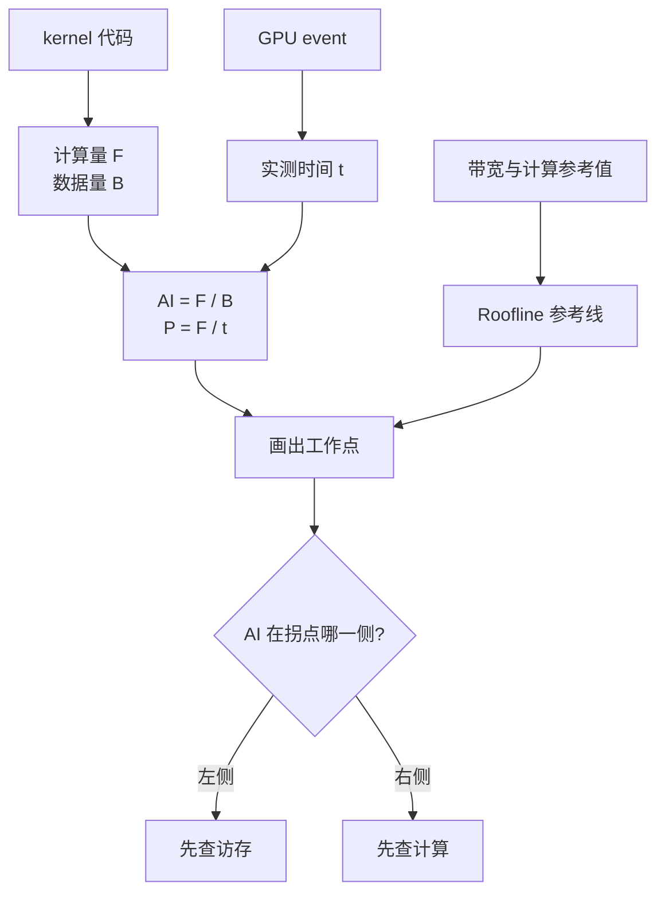
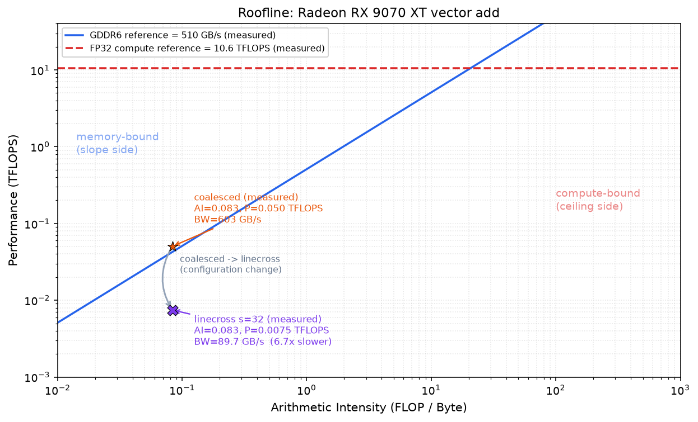

# 第6章 读懂 Roofline 图

## 本章导读

> 第 4 章教你把时间量准，第 5 章教你找到慢在哪个 kernel。本章再往前走一步：把时间、数据量和硬件上限放到同一张 Roofline 图上。
>
> 读完后，你应该能判断一个工作点位于拐点哪一侧、离对应上限还有多远，知道下一步该先查访存还是计算，并把这次结果记成一页以后还能看懂的性能记录。

## 6.1 Roofline 只看三件事

这一节把 Roofline 压缩成三个读图动作，不重新推导第 2、3 章已经讲过的公式。把一次实测结果画到图上得到的那个点，后面统一叫**工作点**。

1. **看横轴落在哪一侧**：算术强度（Arithmetic Intensity，AI）表示每搬运 1 Byte 数据做多少次计算。斜线和水平线的交点叫拐点；工作点在拐点左侧，理论上更容易受带宽限制，在右侧则更容易受算力限制。
2. **看纵轴有多高**：纵轴是实际计算性能，通常用 FLOPS 表示。工作点越高，说明单位时间完成的计算越多。
3. **看它离对应上限还有多远**：左侧工作点主要看它到带宽斜线的垂直差距，右侧工作点主要看它到计算水平线的差距。差距很大时，再继续查访存、计算路径、launch 或同步。

| 工作点位置 | 先想到什么 | 常见下一步 |
| ---- | ---- | ---- |
| AI 小，接近带宽斜线 | 典型 memory-bound | 减少访存、做融合或提高数据复用 |
| AI 小，离斜线很远 | 访存效率不高 | 检查地址是否连续、是否有多余读写 |
| AI 大，靠近水平线 | 典型 compute-bound | 使用 WMMA、降精度或减少计算 |
| 离两条线都远 | 还有别的开销 | 检查 launch、同步和输入规模 |

Roofline 不会直接告诉你哪一行代码有问题。它更像一张地图：先根据 AI 选择访存或计算方向，再看工作点离相应上限还有多少空间。

## 6.2 把 vector add 放到图上

这一节用第 5 章的 vector add 走一遍完整计算。

每个 float32 元素需要：

```text
读 a[i]：4 Byte
读 b[i]：4 Byte
写 c[i]：4 Byte
做加法：1 FLOP

算术强度 AI = 1 / 12 ≈ 0.083 FLOP/Byte
```

`0.083 FLOP/Byte` 很低，所以 vector add 会落在图的左侧，属于典型的 memory-bound 算子。

画工作点只需要三样东西：

| 信息 | 从哪里来 |
| ---- | ---- |
| 计算量 F | 从 kernel 代码数操作数 |
| 数据量 B | 从输入、输出的数据类型和元素个数计算 |
| 时间 t | 用第 4 章的 GPU event 实测 |

计算关系是：

```text
算术强度 AI = F / B
实际性能 P = F / t
有效带宽   = B / t
```

下面用 Radeon RX 9070 XT（gfx1201）+ ROCm 7.13 + 原生 Ubuntu 24.04 的这组结果演示：

| 版本 | AI | 时间 | 实际性能 | 有效带宽 |
| ---- | ----: | ----: | ----: | ----: |
| coalesced | 0.083 FLOP/Byte | 0.334 ms | 0.0503 TFLOPS | 603 GB/s |
| linecross stride=32 | 0.083 FLOP/Byte | 2.25 ms | 0.00748 TFLOPS | 89.7 GB/s |

Roofline 的参考线沿用第 2 章独立测得的硬件基线：大数组 copy 的 GDDR6 稳态带宽为 510 GB/s，fp32 matmul 为 10.6 TFLOPS。

这里会出现一个值得认识的现象：coalesced 按 `12 × n / t` 换算出的有效带宽是 603 GB/s，高于 510 GB/s 的 GDDR6 参考线。这不表示显存突破了硬件上限；有效带宽统计的是算法有效字节，而本例的工作集和写路径还可能受到 cache 等因素影响。这个点更适合用来比较两个实现，而不是当作实际 DRAM 流量。

::: figure fig-data-to-roofline


从代码、实测时间和硬件上限得到 Roofline 工作点。
:::

如 @fig-data-to-roofline 所示，Roofline 用到的输入并不多。先把数据量和计算量算清楚，再把实测时间代进去即可。图 6.2 的横轴和纵轴都是对数轴，同一格表示倍数变化，而不是固定差值；本例是 fp32，所以只保留 fp32 计算参考线。

图 6.2 不是 `rocprofv3` 自动导出的，也不会在绘图时重新运行 vector add。它由仓库中的 `plot_roofline_ch6.py` 生成，脚本使用两组已经测得的数据：

- 第 2 章的大数组 copy 带宽 `510 GB/s` 和 fp32 matmul 性能 `10.6 TFLOPS`，用来画两条参考线；
- 第 5 章的 coalesced、linecross 有效带宽，结合 `AI = 1 / 12` 算出两个工作点的纵坐标。

从仓库根目录开始，在实验机上运行：

```bash
# 实验机执行
cd code/part1-profiling
source ./activate-rocm.sh
python chapter6/plot_roofline_ch6.py --save
```

绘图完成后，图片位于 `code/part1-profiling/chapter6/roofline-ch6.png`。

::: figure fig-roofline-vadd-linecross


第 2、5 章实测数据经绘图脚本生成的 9070XT Roofline 工作点。
:::

如 @fig-roofline-vadd-linecross 所示，两个版本按算法口径计算出的算术强度相同。蓝色斜线是独立实测的 510 GB/s GDDR6 参考线，红色水平线是 10.6 TFLOPS 的 fp32 计算参考值。两个工作点的区别在纵轴：

- coalesced 的有效带宽为 603 GB/s，点略高于 GDDR6 参考线；
- linecross stride=32 的有效带宽为 89.7 GB/s，点明显更低。

这张图只描述两个配置的实测结果，不单独解释 6.7 倍差距来自哪里。第 5 章已经看到，`linecross stride=32` 同时改变了地址排布、每线程循环次数和 Grid Size。

## 6.3 工作点离线很远怎么办

这一节给出一个入门排查顺序。不要一看到工作点低就立刻研究全部硬件细节，先从最容易验证的方向开始。

| 现象 | 第一个问题 | 最简单的检查 |
| ---- | ---- | ---- |
| AI 很低，离斜线远 | 地址是否连续 | 做连续 / 分散访存对照 |
| AI 很高，离水平线远 | 是否走了矩阵计算路径 | 对比 WMMA 和普通 VALU 实现 |
| 输入很小，点很低 | launch 是否占了大头 | 放大输入，观察时间是否近似线性增长 |
| 许多短 kernel 串联 | 是否频繁启动和同步 | 看 kernel trace 的数量与间隔 |
| 使用大量寄存器或 LDS | 是否限制了 occupancy | 对比 VGPR、SGPR、LDS 用量 |

回到 vector add：它的 AI 只有 0.083，所以先从访存方向检查是合理的。不过，第 5 章的 stride 还会同时改变每线程循环次数和 Grid Size；当前曲线只能提示方向，不能单独证明访存合并就是全部原因。下一步应补一个线程数和每线程工作量都固定的对照。

遇到更复杂的算子时也按这个顺序来：**先用 Roofline 选方向，再用 profiler 缩小范围，最后做一个只改一个变量的实验。**

## 6.4 写一页性能记录

这一节把前面的结果记下来，目标是让未来的你知道：当时测了什么、结果怎样、为什么准备这样改。

一页记录保留五项就够：

| 项目 | 写什么 |
| ---- | ---- |
| 环境与对象 | OS、GPU、ROCm、kernel、输入规模和 dtype |
| 运行命令 | 能再次执行的 benchmark / profiling 命令 |
| 关键结果 | 时间口径（min / median）和两三个重要数字 |
| 当前判断 | 用一句话解释慢在哪里 |
| 下一步 | 只改一个变量的实验 |

可以直接使用下面这个简短模板：

```markdown
# 性能记录：<workload>

## 环境与对象
- OS / GPU / ROCm：<版本>
- kernel / 输入：<名称、shape、dtype>
- 计时口径：<warmup、repeat、min 或 median>

## 运行命令
<benchmark 命令>
<可选：profiling 命令>

## 关键结果
| 版本 | 时间 | 有效带宽或吞吐 |
| ---- | ----: | ----: |

## 当前判断
<哪一部分慢，依据是什么>

## 下一步
<只改哪个变量，准备观察什么>
```

套到本章的 vector add 上，最核心的三行就是：

| 版本 | 时间 | 有效带宽 |
| ---- | ----: | ----: |
| coalesced | 0.334 ms | 603 GB/s |
| linecross stride=32 | 2.25 ms | 89.7 GB/s |

当前判断可以写成：`linecross` 的时间会随 stride 整体增加，但 stride 同时改变了地址排布和工作划分。下一步应固定线程数与每线程循环次数，只打开或关闭数据预重排，再重新测量。

这样的记录已经足够支持下一轮优化。

## 6.5 Part 1 的四步闭环

这一节把 Part 1 收成一条后面可以反复复用的路线。

::: figure fig-part1-loop


Part 1 建立的四步性能优化闭环。
:::

如 @fig-part1-loop 所示，这四步分别回答：

1. **量准**：这个数字能不能重复出现；
2. **找到慢点**：时间花在哪个 kernel；
3. **解释**：更像访存问题、计算问题，还是启动开销；
4. **验证**：只改一个变量，结果是否按预期变化。

Part 2 的 Reduction、Softmax、GEMM 和 Attention 会继续使用这条路线。算子会更复杂，但你仍然不需要一次看完所有工具输出，只要沿着当前问题一步步缩小范围。

## 本章小结

- Roofline 先用横轴和拐点判断理论瓶颈方向，再看工作点离对应上限还有多远。
- vector add 的 AI 约为 0.083 FLOP/Byte，理论上位于 memory-bound 一侧；有效带宽点还会受到算法口径和 cache 的影响。
- Roofline 负责选择排查方向，`rocprofv3` 和单变量实验负责找到更具体的原因。
- 一页性能记录只需要环境、命令、结果、判断和下一步。

## 延伸阅读

- [Roofline Model 原论文](https://dl.acm.org/doi/10.1145/1498765.1498785)
- [ROCm Profiling Tools 总览](https://rocm.docs.amd.com/en/latest/conceptual/gpu-arch/rocm-tools.html)
- [HIP Performance Guidelines](https://rocm.docs.amd.com/projects/HIP/en/latest/how-to/performance_guidelines.html)
