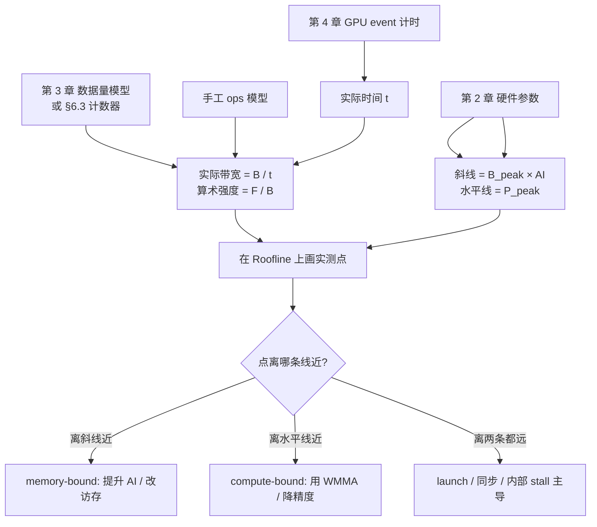

# 第6章 Roofline 曲线详解 + 性能报告

## 本章导读

> 本章是 Part 1 profiling 篇的收尾章。前面两章已经把"怎么量准数字"（[第 4 章](../chapter4/index.md)）和"怎么定位瓶颈"（[第 5 章](../chapter5/index.md)）走通了一遍。读完后，你应该能做到三件事：把一个算子的实测性能点画到 Roofline 曲线上、解释它离两条理论线还有多远、并把整套测量和判断写成一份别人能复现的性能报告。这份报告既是 Part 1 的交付物，也是 [Part 2 算子篇](../../part2-kernels/chapter7/index.md)（Reduction / Softmax / GEMM / Flash Attention）每个算子都会反复用到的模板。

进入本章之前，先理清一件事：**Roofline 的两条线从哪来**，已经在 [第 2 章 2.7 节](../../part0-intro/chapter2/index.md) 讲清楚了——水平线是峰值算力 P_peak，斜线是峰值带宽 B_peak 乘算术强度。[第 3 章](../../part0-intro/chapter3/index.md) 用 vector add 建立了"算术强度极低 ⇒ memory-bound"的直觉。本章不再重复这些概念的解释，而是把 [第 5 章](../chapter5/index.md) 采到的 profiling 数据接进来，让你在 Roofline 上画**一个实测点**，而不是只有两条理论线。

> **当前实测边界**：本章的有效带宽、kernel 延迟、Roofline 实测点均已在 9070XT（gfx1201）+ ROCm 7.13（原生 Ubuntu 24.04）上实测；硬件性能计数器（PMC）里，关键访存 / L2 / SQ / occupancy counter 在当前平台不可用或返回 0，`GPUBusy`、`Wavefronts` 等 counter 可返回非零值。详见 [第 5 章 §5.3](../chapter5/index.md)。

## 6.1 Roofline 曲线怎么读

[第 2 章 2.7 节](../../part0-intro/chapter2/index.md) 已经建立了 Roofline 的两条线。这一节把它们拆成"读图三步"，让你拿到任何一个算子的实测点都能立刻判断它落在哪一边。

读图三步：

1. **先看横轴位置（算术强度 AI）**——AI 越靠左，越接近 memory-bound 区；越靠右，越接近 compute-bound 区。拐点位置 `P_peak / B_peak` 把图分成左右两半。
2. **再看纵轴位置（实际性能 P_real）**——把实测点 `(AI, P_real)` 标上去，看它离斜线 `B_peak × AI` 近，还是离水平线 `P_peak` 近。
3. **最后看"离哪条线更近"**——离斜线近意味着被带宽卡住，离水平线近意味着被算力卡住；**如果离两条线都很远，要么是测量错了，要么是 launch overhead / kernel 内部 stall 在拖累它**（这是最容易误判的第三种情况）。

下面这张表把"实测点的位置"翻译成"下一步该往哪想"：

| 实测点位置 | 倾向解释 | 优化方向 |
| ---- | ---- | ---- |
| 贴在斜线上，AI 小 | 典型 memory-bound，带宽已逼近上限 | 提高算术强度（融合 / tile 复用）才能突破 |
| 离斜线很远，AI 小 | 带宽没用满，先看访存效率 | 合并访存、减少中间写、kernel fusion |
| 贴在水平线上，AI 大 | 典型 compute-bound，算力已逼近上限 | 用矩阵单元（WMMA）、降精度 |
| 离两条线都很远 | launch / 同步 / 内部 stall 主导 | 先减少 launch、合并 kernel，再看 stall 来源 |
| 离斜线远、离水平线也远，AI 也小 | 多半是测量或 kernel 设计问题 | 复核 benchmark 配置，再看计数器 |

关键直觉：**判断一个算子优化得好不好，不是看绝对延迟，而是看它离 Roofline 上限有多远**。这个直觉会在 Part 1 全篇、以及 Part 2 每个算子（Reduction / Softmax / GEMM / Flash Attention）里反复用到。

## 6.2 把 vector add 画到 Roofline 上

理论读完了，现在把 Part 1 真正跑过的 vector add 放到图上。[第 3 章 3.4 节](../../part0-intro/chapter3/index.md) 已经算过它的算术强度：

```text
对每个 float32 元素：
  读 a[i]：4 Byte
  读 b[i]：4 Byte
  写 c[i]：4 Byte
  做 1 次加法：1 FLOP

算术强度 = FLOP / Byte = 1 / 12 ≈ 0.083 FLOP/Byte
```

算术强度极低，所以 vector add **必然落在 Roofline 的斜线那一侧——它是 memory-bound 的**。也就是说，vector add 慢不慢，几乎完全取决于显存带宽，和算力无关。这是把工作点画上去之前就已经能下的判断。

要画实测点，至少需要三类信息：

| 信息 | 来源（本章） | 用途 |
| ---- | ---- | ---- |
| 实际时间 t | [第 4 章](../chapter4/index.md) GPU event 计时 | 计算实际带宽 / 吞吐 |
| 实际数据搬运量 B | 手工数据量模型 + 计数器（见 §6.3） | 估算实际带宽与算术强度 |
| 实际计算量 F | 手工 ops 模型 | 估算实际 FLOPS |

对 vector add，数据量模型很干净（`bytes_moved = size × 3 × 4`，见 [第 3 章 3.3 节](../../part0-intro/chapter3/index.md)），所以可以不依赖计数器就画出第一版实测点：

```text
P_real   = F / t   = size / t            （单位 FLOP/s）
B_ach    = B / t   = size × 12 / t       （单位 Byte/s）
AI       = F / B   = 1 / 12 ≈ 0.083      （FLOP/Byte）
```

把这三个数填进表里：

| 项目 | 数值 |
| ---- | ---- |
| vector add 算术强度 | ~0.083 FLOP/Byte（memory-bound）|
| 实测有效带宽 B_ach | **603 GB/s**（n=16M, fp32, HIP event 实测，[第 5 章 §5.2](../chapter5/index.md)）|
| 理论峰值带宽 B_peak | ~760 GB/s（标称；大 footprint copy 的原生 Ubuntu 复跑仍待第 4 章补齐）|
| 带宽利用率 B_ach / B_peak | **~79%**（按标称）|
| vector add min 延迟 t | **0.334 ms**（n=16M, fp32, GPU event, repeat=100）|

> 数字读法：vector add 的有效带宽 603 GB/s 达到 9070XT 标称 760 GB/s 的约 79%。因为第 4 章的大 footprint Triton copy 还需要原生 Ubuntu 复跑，这里只用标称带宽做统一分母；等 copy benchmark 回填后，再补一列工程可达带宽作对照。

把工作点和两条线画到一起：

::: figure fig-pmc-to-roofline


把 vector add 放到 Roofline 上：从实测时间到优化方向
:::

如 @fig-pmc-to-roofline 所示，vector add 因为 AI 极低，会落在斜线左下角——这时关心的不再是"能不能逼近水平线"，而是"能不能把斜线本身逼近 B_peak"。这就是 §6.3 要解释的差距来源。

::: figure fig-roofline-vadd-linecross


coalesced 与 linecross 两个工作点在 9070XT Roofline 上的位置。
:::

如 @fig-roofline-vadd-linecross 所示，[第 5 章](../chapter5/index.md) 的两个实测点算术强度相同（AI ≈ 0.083 FLOP/Byte），唯一差别是有效带宽：coalesced 603 GB/s 贴着带宽斜线（memory-bound 的健康形态），linecross stride=32 因跨 cache line 合并破坏跌到 90 GB/s，工作点从斜线上掉下来 6.7×。这条"从斜线跌下来"的轨迹，正是"访存合并被破坏"在 Roofline 上的可视化——它把 [第 5 章](../chapter5/index.md) 的 stride 扫描结论浓缩成一张图。生成脚本见 `code/part1-profiling/chapter6/plot_roofline_ch6.py`。

## 6.3 解释差距来自哪里

画出实测点之后，几乎总会发现它**没有贴在任何一条线上**。这一节讲怎么解释"中间那段差距"。前提是已经在 [第 5 章](../chapter5/index.md) 用 `rocprofv3` / Omniperf 采到了可用计数器，或者像本章这样明确写出哪些计数器暂时不可用；如果计数器边界没讲清楚，差距解释就只能停留在"它慢了"，不能说"为什么慢"。

### 6.3.1 差距的三种来源

把实测点到理论线之间的距离拆成三类来源：

| 差距来源 | 表现 | 怎么验证 |
| ---- | ---- | ---- |
| 带宽没打满（memory-bound 但离斜线远） | B_ach 远小于 B_peak | 看 `FETCH_SIZE` / `WRITE_SIZE` 是否符合数据量模型；看访存是否合并 |
| 算力没用满（compute-bound 但离水平线远） | P_real 远小于 P_peak | 看 `VALUInsts` / WMMA 指令计数；看是否走了慢速 transcendental 单元 |
| 既不是带宽也不是算力 | 离两条线都很远 | launch overhead / 同步 / 内部 stall 主导——看 kernel 数量和 `hipDeviceSynchronize` 占比 |

对 vector add 这种最简单的算子，第三种情况通常**不是主因**（它没有复杂的指令调度），所以差距主要来自第一种——带宽没用满。但即便如此，也要用计数器确认，而不是拍脑袋下结论。

### 6.3.2 用计数器把"为什么"接上

下面这张速查表把"看到的计数器现象"翻译成"怀疑的硬件机制"和"用来确认的小实验"——它是 Part 1 profiling 篇最实用的一张表，Part 2 写每个算子时都会回来查：

| 看到的计数器现象 | 怀疑点 | 验证方法 / 下一步 |
| ---- | ---- | ---- |
| `FETCH_SIZE` / `WRITE_SIZE` 远大于理论数据量 | 未合并访存 / 超过 cacheline 对齐 | 改 layout、向量化 load（`global_load_dwordx4`）；改后重测看是否下降 |
| `FETCH_SIZE` 接近理论数据量、`L2CacheHit` 很低、GPU pipeline 仍长 | 流式访问 / 没有复用 | 提高算术强度（融合 / tile 复用）；对照 Roofline 拐点 |
| `L2CacheHit` 高但 GPU pipeline 仍长 | bank conflict / 指令发射 | 看反汇编 ds_* 指令模式 + SALU 占比 |
| `OccupancyPercent` 很低且 GPU pipeline 长 | VGPR / LDS 用量过高 → 单 SIMD 驻留 wave 太少 | 看 `hipcc -Rpass-analysis=kernel-resource-usage` 输出；缩小 tile / 减寄存器压力 |
| `OccupancyPercent` 低但 GPU pipeline 已经短 | kernel 太小，occupancy 本就够 | 不要为了"看起来高"反向折腾；优先看 launch 频率 |
| `Wavefronts` 极少（< 几十） | 输入 / grid 太小，没喂满 GPU | 增大 batch、合并 launch 或改算子粒度 |
| `VALUInsts` 很高、访存指标不突出 | compute-bound 嫌疑 → VALU / 数学函数 | 走更低精度、消除多余 transcendental |
| `Wavefronts` 充足、`OccupancyPercent` 也高，但仍慢 | wavefront 之间互相等同步 | 看 `s_waitcnt`、barrier 频率；考虑减少 `__syncthreads()` |

> ⚠️ 上表里的计数器名字按 `rocprofv3 -L` 在 gfx1201 上的输出写。**名字会随 ROCm 版本与硬件代际略有差异**，引用前请用 `rocprofv3 -L | grep -i <关键词>` 在你自己的机器上确认一遍。`rocprofv3 --pmc` 可以一次传多个计数器，不兼容的会报 `Missing` 但其余仍能采到——和 [第 5 章 §5.3](../chapter5/index.md) 的采集方式一致。

<details>
<summary>⚠️ 平台限制：gfx1201 上部分关键 PMC 计数器不可用（附采集命令与替代证据）</summary>

和 [第 5 章 §5.3](../chapter5/index.md) 同理，gfx1201（RDNA4）上 `rocprofv3 --pmc` 能生成 CSV，但本章最需要的访存 / L2 / SQ / occupancy 计数器当前不可用或返回 0；`GPUBusy`、`Wavefronts` 等 counter 可以返回非零值。下面是采集命令（等 AMD 补全关键 PMU 支持后可回填），以及当前用其他手段拿到的替代证据：

```bash
# 在 9070XT 上用下面的循环逐计数器采集 vector add
for c in FETCH_SIZE GL2C_HIT_sum GL2C_MISS_sum \
         SQ_INSTS_TEX_LOAD SQ_INSTS_TEX_STORE; do
  rocprofv3 --pmc $c -o logs/pmc_$c.csv -f csv \
    -- ./vector_add_bench --kernel coalesced --size 16777216 --block 256 \
       --warmup 5 --repeat 10
done
```

| Counter | gfx1201 实测 | 理论预期 | 解读 |
| ---- | ----: | ----: | ---- |
| `FETCH_SIZE` | **0.0（PMU 限制）** | ≈ 2 × n × 4 B（读 a + b） | 每个 kernel 从显存读多少 KB |
| `WRITE_SIZE` | 不存在（gfx1201 无此 counter） | ≈ n × 4 B（写 c） | 每个 kernel 往显存写多少 KB |
| `GL2C_HIT_sum` | **0.0（PMU 限制）** | 中等（192MiB footprint 部分 L2 命中） | L2 命中次数 |
| `SQ_INSTS_TEX_LOAD` | **0.0（PMU 限制）** | 与 grid 配置相关 | 访存读指令数 |
| `OccupancyPercent` | **0.0（不可作为直接证据）** | 接近上限（VGPR=8, 见 §5.5 实测） | wave32 资源池水位 |
| `Wavefronts` | **524288.0（PMC 实测）** | 524288 wavefront（Grid=16M / wave32） | 验证 grid 配置 |
| `VALUInsts` | **0.0（PMU 限制）** | 极低（每元素 1 加法） | 每 work-item 平均 vector ALU 指令数 |
| `GPUBusy` | **100.0（PMC 实测）** | 高（memory-bound，GPU 在等带宽） | 单 kernel 期间 GPU 忙碌比例 |

**替代证据**（gfx1201 PMU 不可用时的工程估算）：

- **搬运量是否符合数据量模型**：用 `rocprofv3 --kernel-trace` 拿到的 per-dispatch 耗时（329 μs）反推有效带宽（603 GB/s），与数据量模型 `3 × n × 4 / t` 完全吻合——说明搬运量没有异常放大，访存模式健康（合并）。这是"用时间反推字节数"的间接验证。
- **occupancy 是否受限**：`--kernel-trace` 实测 VGPR=8、SGPR=128、LDS=0（见 [第 5 章 §5.3](../chapter5/index.md) 的资源表），远低于硬件上限，occupancy 必然卡在 wave 数上限而非资源——这条结论的确定性很高。
- **GPU 是否在等带宽**：vector add 算术强度 0.083 FLOP/Byte，必然 memory-bound；有效带宽 603 GB/s 已达标称 79%，说明 GPU 确实在等带宽，而不是等算力或 stall。

</details>

### 6.3.3 第三种情况：离两条线都很远

最容易误判的是"实测点离两条线都很远"。对 vector add 这种简单算子，这通常意味着**带宽本身没打满**——访存模式没合并、grid 太小喂不满、或者 launch overhead 占了相当比例。但对 Reduction / Softmax / GEMM 这种更复杂的算子（Part 2），离两条线都远更常见的原因是：

- **launch overhead 主导**：很多小 kernel 串联，每个 kernel 启动开销比计算时间还长；
- **同步 / stall 主导**：wavefront 之间互相等 `s_waitcnt` 或 barrier；
- **transcendental 单元瓶颈**：sin / sqrt / tanh / exp 走特殊单元，发射节奏比普通 VALU 慢得多。

> 这三种情况光看 Roofline 上的"距离"是分不出来的，必须配合 [第 5 章](../chapter5/index.md) 的计数器。这也是为什么 Part 1 要把"测量 → 定位 → 假设"做成一个闭环，而不是单看一张图。

更详细一点的"实测 Roofline 点"计算配方（当计数器数据齐全时使用）：

1. **总搬运字节** `B_eff = (FETCH_SIZE + WRITE_SIZE) × 1024`（KB → B）；
2. **总浮点操作数** `F_total = ops_per_element × N_elements`，其中 `ops_per_element` 来自手工 ops 模型；
3. **算术强度** `AI = F_total / B_eff`，单位 FLOP/Byte；
4. **实际性能** `P_real = F_total / t`，单位 FLOP/s；
5. 在 Roofline 上把 `(AI, P_real)` 标出来；
6. 对照斜线 `B_peak × AI` 与水平线 `P_peak`，看离哪条线更近。

## 6.4 性能报告模板

到这一步，所有材料都已经齐备：[第 3 章](../../part0-intro/chapter3/index.md) 的 baseline、[第 5 章](../chapter5/index.md) 的 profiling 数据、§6.2 的 Roofline 实测点、§6.3 的差距解释。最后一步是把它们拼成一份对外可交付的 Markdown。

本章对应的报告工件放在：

```text
code/part1-profiling/chapter6/performance-report.md
```

### 6.4.1 完整报告模板

下面这份模板可以直接复制使用，每个小节都给出了"应该写什么 / 不应该写什么"的提示。模板共有 **10 个一级小节**。

````markdown
# Performance Report: <workload-short-name>

> Author: <your-name>  ·  Date: YYYY-MM-DD  ·  Status: draft / reviewed / final
> Linked experiment notebook: ../../../code/part1-profiling/chapter6/EXPERIMENT.md

## 1. Summary

一段 4–6 行的话，回答四个问题：
- 测的是什么 workload？
- 在什么硬件 / 软件上测？
- 主要瓶颈假设是什么？置信度多少？
- 下一步打算做什么？

不要在 Summary 里堆数字，也不要在这里下"已确定 memory-bound"这种结论。

## 2. Environment

| 项目 | 值 |
| ---- | ---- |
| Hardware | AMD Radeon RX 9070 XT / gfx1201 (RDNA4) |
| ROCm | 7.13.99004（`hipcc --version`）|
| Platform | 原生 Ubuntu 24.04（6.17.0-35-generic, x86_64）|
| Python | 3.12.3 |
| PyTorch | 2.11.0+rocm7.13.0 |
| Triton | 3.6.0 |
| Repo commit | `git rev-parse HEAD` |
| Reproduce env | `bash scripts/bootstrap-rocm-env.sh --part part1-profiling` |

## 3. Workload

- 对象：<脚本路径 + 函数名>
- 输入规模：<shape, dtype, bytes>
- 数据路径：CPU -> H2D -> GPU pipeline -> D2H -> sync
- 校验方式：checksum / reference output
- **不测什么**：明确写出本次报告的边界

## 4. Baseline Result

给出 baseline 命令、参数、median / min / p95 表格，以及原始 JSON / 日志的相对路径。
不要在这里写瓶颈结论。

## 5. Profiling Artifacts

按工具列出：每个工具的命令、配置（warmup / repeat）、输出路径、用途。
强调"不同工具的统计口径不同，不能直接相加比较"。

## 6. Roofline Notes

按 §6.2 方式画实测点：算术强度、实测带宽、带宽利用率、离斜线 / 水平线的距离。
用 §6.3 的计数器速查表解释差距来源。

## 7. Observations

用编号列表写出"我从证据里看到了什么"，每条观察都要能映射到第 4 / 5 节的某个数字或文件。
观察 ≠ 结论。这里不要出现"因此""所以"这类推断词。

## 8. Bottleneck Hypothesis

- 假设：<一句话>
- 置信度：<low / medium / medium-high / high / confirmed>
- 支持证据：<引用 §7 的编号>
- 否定条件：<什么样的实验结果会推翻它>

一份报告通常 1–2 个主假设就够，不要写成购物清单。

## 9. Proposed Next Experiments

| 假设 | 下一步实验 | 预期观察 | 否定条件 | 预计耗时 |
| ---- | ---- | ---- | ---- | ----: |

每一行都应能被一个 PR 或一次会议消费掉，不要写"全面优化"这种动作。

## 10. Known Limitations

- 只在 9070XT / gfx12 上跑过，其他 RDNA 代际读者需按方法论自行复测。
- 只测了 fp32，未覆盖 fp16 / bf16。
- profiling run 的 repeat 较小，统计噪声较大。
- <其他>

写 limitations 不是认怂，而是让读者知道"哪些场景下结论可能不成立"。
````

把模板字段汇总一下，方便 review 时打勾：

| # | 小节 | 必填 | 关键字段数 |
| ----: | ---- | ---- | ----: |
| 1 | Summary | 是 | 4 个问题 |
| 2 | Environment | 是 | 7 项 |
| 3 | Workload | 是 | 5 项（含"不测什么"） |
| 4 | Baseline Result | 是 | 命令 + 3 个统计量 |
| 5 | Profiling Artifacts | 是 | 每工具 4 项 |
| 6 | Roofline Notes | 是 | AI / B_ach / B_peak / 差距解释 |
| 7 | Observations | 是 | 编号列表 |
| 8 | Bottleneck Hypothesis | 是 | 4 项（含置信度、否定条件） |
| 9 | Proposed Next Experiments | 是 | 表格 5 列 |
| 10 | Known Limitations | 是 | 至少 3 条 |

整份模板**共 10 个一级小节、约 36 个必填字段**。如果你的报告少了 limitations 或 hypothesis 的否定条件，它就还不能算"对外可交付"——它仍然是底稿。

最关键的字段是 `Observations`、`Bottleneck Hypothesis` 和 `Known Limitations`。很多报告只写"结果"，却不写"限制"，这会让读者误以为一次 profiling 就能得到绝对结论。模板里把 `Known Limitations` 列为必填，就是为了避免这种"过度自信"。

## 6.5 瓶颈判断：观察、假设与置信度

判断瓶颈时，不要急着给一个永久标签。报告应该把"观察"和"假设"分开，并且为假设标注**置信度**。

本章案例（vector add）的观察包括：

1. baseline GPU min 延迟 **0.334 ms**（n=16M, fp32, repeat=100，[第 5 章 §5.2](../chapter5/index.md) 实测）；
2. GPU 有效带宽 **603 GB/s**，与标称 B_peak 760 GB/s 之比 **~79%**（[第 5 章 §5.2](../chapter5/index.md)）；
3. `rocprofv3 --kernel-trace` 中 vector add kernel 的 per-dispatch 耗时 **329 μs**，与端到端 min_ms 量级一致（[第 5 章 §5.3](../chapter5/index.md)），说明 launch overhead 占比小；
4. `FETCH_SIZE` / 写回字节数等关键访存计数器在当前 gfx1201 平台不能给出直接字节数（§6.3.2），但用 per-dispatch 耗时反推的有效带宽与数据量模型 `3n×4/t` 吻合，间接说明搬运量无异常放大；
5. `--kernel-trace` 实测资源占用 VGPR=8 / SGPR=128 / LDS=0（[第 5 章 §5.5](../chapter5/index.md)），occupancy 卡在 wave 上限而非资源，不是瓶颈。

从这些观察可以提出一个示例方向的假设：

> 对 vector add 这个 baseline 来说，它确实是 memory-bound（算术强度 ~0.083 FLOP/Byte），主要改进空间在于把实测带宽逼近 B_peak，而不是去碰算力线。

这个假设的置信度写成 **medium-high**。理由：算术强度本身是确定的（从代码算出来，0.083 FLOP/Byte）；有效带宽 603 GB/s 已达标称 79% 且 per-dispatch 耗时与端到端一致（两类独立证据方向一致）；occupancy/寄存器已被 `--kernel-trace` 排除。唯一未直接验证的是"搬运量是否符合数据量模型"——因为当前关键访存 PMC 不能给出直接字节数，只能用时间反推间接验证（吻合）。若要升级到 high，需要在 PMU 支持补齐后拿到 FETCH_SIZE / 写回字节实测值，或在 gfx9/gfx11 上交叉验证。

下表给出一份可复用的"置信度 → 用语"对照，避免每次写报告都要重新定义口径：

| 置信度 | 含义 | 推荐用语 | 报告要求 |
| ---- | ---- | ---- | ---- |
| low | 单一信号、未做对照 | "可能"、"初步看起来" | 必须在 limitations 里展开 |
| medium | 两类独立证据方向一致 | "倾向于"、"目前支持" | 给出至少一个反例检查项 |
| medium-high | 三类及以上证据一致，且有对照实验 | "在当前 workload 下" | 列出仍需验证的边界 |
| high | 多 shape / 多实现交叉验证 | "在测试覆盖范围内" | 仍要保留 limitations |
| confirmed | 已被库版本 / 上游 issue / 多机器验证 | "确认" | 引用具体 PR / issue |

把置信度写出来很重要。性能分析不是法官判案，而是工程实验：你要告诉读者你对结论有多确定，以及还缺什么证据。

## 6.6 Part 1 profiling 闭环小结

本章是 Part 1 profiling 篇的收尾。回顾整个 Part 1，我们建立的是一条"**测量 → 定位 → 假设**"的闭环：

::: figure fig-part1-loop


Part 1 profiling 篇的"测量 → 定位 → 假设"闭环
:::

把这三步拆开看：

- **测量**（[第 3 章](../../part0-intro/chapter3/index.md) baseline + [第 4 章](../chapter4/index.md) 可信计时）：先固定输入规模、warmup、repeat，用 GPU event 量到能复现的数字。没有可信测量，后面一切都是空中楼阁。
- **定位**（[第 5 章](../chapter5/index.md) rocprof + Omniperf）：用 trace 看 kernel / copy / HIP API 的时间轴；计数器可用时，用它看访存 / occupancy / wavefront 的硬件信号。定位的产物是一份"观察列表"，而不是一个结论。
- **假设**（本章 §6.2 Roofline + §6.5 置信度）：把观察列表翻译成带置信度的假设，并为每个假设写出否定条件。假设必须能被下一次实验证伪，否则它就不是假设而是直觉。

这条闭环会在 [Part 2 算子篇](../../part2-kernels/chapter7/index.md) 里反复用到——Reduction、Softmax、GEMM、Flash Attention 每个算子都会：先写一版 naive kernel（测量）、再用 rocprof / Omniperf 看它慢在哪（定位）、最后在 Roofline 上画点并提下一版优化假设（假设）。差别只在于：Part 2 的算子算术强度更高、优化手段更多（LDS tile、wavefront 协作、WMMA 矩阵单元），所以 Roofline 上的工作点会从斜线那一侧逐步往右、往上挪。

> 到这里你已经具备了 Part 2 需要的全部 profiling 基础。如果你对"测量 → 定位 → 假设"中任何一环还不熟，建议回到对应章节把 vector add 的例子再走一遍——它是整个教程里最简单的算子，但它的 profiling 闭环和后面 Reduction / GEMM / Attention 用的是同一套。

## 本章小结

- Roofline 读图三步：先看横轴（算术强度，定 memory-bound / compute-bound 区）、再看纵轴（实际性能 P_real）、最后看离斜线 / 水平线哪条更近；离两条都远是第三种情况（launch / 同步 / stall 主导），最容易误判。
- vector add 的算术强度 ~0.083 FLOP/Byte，必然 memory-bound；把它画到 Roofline 上只需要实测时间 t + 数据量模型 B，第一版实测点不依赖计数器。
- 差距来自三类：带宽没打满、算力没用满、既不是带宽也不是算力。第三类必须配合 [第 5 章](../chapter5/index.md) 的计数器才能区分，光看 Roofline 距离分不出来。
- 一份对外可交付的 Markdown 报告至少包含 10 个小节：Summary、Environment、Workload、Baseline、Profiling Artifacts、Roofline Notes、Observations、Hypothesis、Next Experiments、Known Limitations，约 36 个必填字段。
- 性能报告和实验底稿（`EXPERIMENT.md`）共享原始证据，但服务对象不同：底稿对内复查，报告对外交付。底稿是"我做了"，报告是"我相信，且证据如下"。
- Part 1 profiling 篇建立的是"测量 → 定位 → 假设"闭环，这套闭环会在 [Part 2 算子篇](../../part2-kernels/chapter7/index.md) 的 Reduction / Softmax / GEMM / Flash Attention 每个算子上反复用到。

## 延伸阅读

- [PyTorch Profiler](https://docs.pytorch.org/docs/stable/profiler.html)
- [ROCm Compute Profiler（rocprof-compute）官方文档](https://rocm.docs.amd.com/projects/rocprofiler-compute/en/latest/)
- [ROCm Profiling Tools 总览](https://rocm.docs.amd.com/en/latest/conceptual/gpu-arch/rocm-tools.html)
- [HIP Performance Guidelines](https://rocm.docs.amd.com/projects/HIP/en/latest/how-to/performance_guidelines.html)
- [GPUOpen — Understanding Memory Coalescing on GCN](https://gpuopen.com/learn/gcn-memory-coalescing/)
