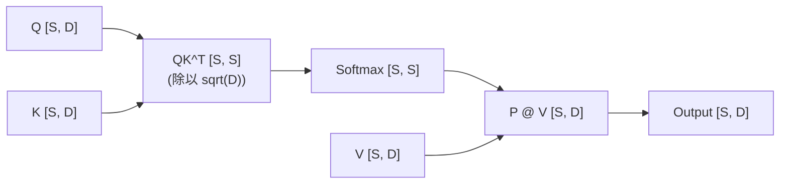
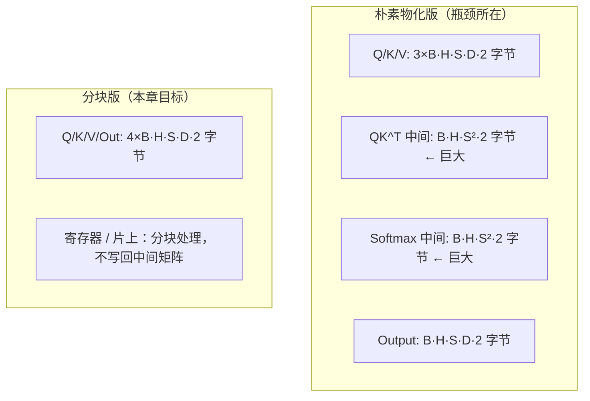

# 第10章 Flash Attention 思路

## 本章导读

> 本章是算子篇的压轴。前面三章我们分别打磨了三块积木：第7章 Reduction 教我们「局部累加、分层合并」；第8章 Softmax 教我们「数值稳定的在线归一化」；第9章 GEMM 教我们「分块、复用、控制访存」。本章把这三块积木拼成一个真正接近真实模型的算子——Attention，并回答一个核心问题：**为什么 FlashAttention 能在不改变计算结果的前提下，把显存访问量降下来？**
>
> 本章的重心是「思路」而不是追平官方实现。我们会先用最朴素的视角看清楚 Attention 的显存瓶颈从哪来，再一步步把「分块（Tiling）」和「在线 Softmax（Online Softmax）」这两把刀用上去，最后落地为一段可跑的 Triton 实现示例。读完本章，你应该能用自己的话讲清楚「FlashAttention 为什么快」。

## 10.1 Attention 计算流程

Scaled Dot-Product Attention 的数学定义是：

$$\text{Attention}(Q, K, V) = \text{softmax}\!\left(\frac{QK^\top}{\sqrt{D}}\right) V$$

其中 Q/K/V ∈ R^(B×H×S×D)。对每个 batch、每个 head 独立计算，流程可以拆成三个阶段：

::: figure fig-attention-flow


单个 head 的 Attention 数据流：QK^T → Softmax → PV
:::

**阶段一：QK^T 并缩放**——一次矩阵乘，规模 [S, D] × [D, S] → [S, S]，和第9章 GEMM 完全同构。

**阶段二：Softmax**——对 S 的每一行做 Softmax，得到注意力权重矩阵 P，规模 [S, S]。这一步就是第8章逐行 Softmax。

**阶段三：PV**——将权重矩阵 P 与 V 相乘，得到输出 O = PV，规模 [S, D]。又是一次矩阵乘，同构于第9章的 GEMM。

看出来了吗？Attention 本质上就是「一次 GEMM + 一次逐行 Softmax + 一次 GEMM」。如果只是算对，按这三步照抄就行。真正的麻烦在下一节。

## 10.2 朴素 Attention 的显存瓶颈

### 10.2.1 物化中间矩阵的代价

如果按 §10.1 的数据流「老老实实」实现，最自然的写法是把每一步的结果写回显存（物化，materialization）：

1. 先算出 S = QK^T / sqrt(D)，写到一张 [B, H, S, S] 的显存张量；
2. 再算出 P = softmax(S)，又写一张 [B, H, S, S] 的显存张量；
3. 最后算 O = PV。

问题在第一、二阶段：S 和 P 这两个中间矩阵的大小是 **O(B·H·S²)**。当 S=4096、B=4、H=16、fp16 时：

- 单个 [B, H, S, S] 矩阵占用约 4×16×4096²×2 字节 ≈ **2 GB**；
- S 和 P 加起来接近 4 GB，**还不算 Q/K/V/O 本身**。

这不只是「显存放不放得下」的问题。哪怕放得下，把这么大的矩阵**写出去再读回来**本身就是巨大的带宽开销——这正是第7章 Reduction 里反复强调的那条主线：**算子篇真正的敌人往往是访存，不是 FLOPS**。

::: figure fig-attention-mem-compare


显存占用对比：物化版 O(B·H·S²) 与分块版 O(B·H·S·D)
:::

### 10.2.2 显存峰值对比

| 版本 | 中间矩阵 | 说明 |
| ---- | ---- | ---- |
| 朴素物化版 | B·H·S²×2 字节（巨大） | 物化后 PV 只读一遍 P 和 V，但写/读 S、P 的开销巨大 |
| 分块版（本章） | 无 | K/V 读一遍，分块友好 L2 |

以具体数字说明：B=4，H=16，S=4096，D=64，fp16 时：

- 物化版单个中间矩阵：4×16×4096²×2 = **2 GB**
- 分块版全部张量（Q/K/V/Out）：4×4×16×4096×64×2 = **128 MB**

这个差距在 S=4096 时已经达到 16 倍，而 S 越长差距越大（**二次方 vs 线性**）。这就是 FlashAttention 思路要解决的核心问题。

> 🚧 待 job 填充（9070XT）：在 9070XT + ROCm 7.13 / 原生 Ubuntu 24.04 上，用一个物化 S=QK^T 的 PyTorch 参考实现，跑 S ∈ {512, 1024, 2048, 4096}，记录 `torch.cuda.max_memory_allocated()` 的峰值，验证上面这条「二次方 vs 线性」的曲线。原始数据放进 `code/part2-kernels/chapter10/logs/`。

## 10.3 分块计算（Tiling）

这一节引入第一把刀：分块。它的思想我们在第9章 GEMM 里已经用过——不要一次性把整张矩阵搬进计算单元，而是切成小块、分批处理、提高片上复用。

### 10.3.1 为什么分块能减少全局访存

朴素实现里，整张 [S, S] 的得分矩阵 S 要么被物化（写回显存），要么在一个 program 内顺序遍历所有 j（无法利用并行、K 被读两遍）。分块把这两件事一起改掉：

- **把 K/V 切成 BLOCK_S 大小的块**，每次只把一个 [BLOCK_S, D] 的 K 块和 V 块加载到片上；
- **每个块算完就地用掉**（参与 softmax 和 PV），用完即弃，不再写回显存；
- **一个 Q 行对同一个 K 块只需读一次**，而不是物化版里反复读写整张 S。

### 10.3.2 分块单独够吗？不够

只分块还不行。注意 §10.1 的阶段二 Softmax 是「**对整行**做归一化」，而分块后我们一次只看到 BLOCK_S 个 score。如果在每个块内单独做 softmax 再拼起来，结果一定是错的——因为分母（那一行的 exp 之和）必须覆盖**整行**，而不是 BLOCK_S 个。

所以分块必须和「能在只看到局部的情况下、逐步逼近全局归一化」的技巧配合使用。这就是下一节的在线 Softmax。

## 10.4 在线 Softmax（Online Softmax）

这一节是整章的关键。它解决一个看似矛盾的需求：**在只遍历一遍数据、且不知道后面还有多少 score 的前提下，把 softmax 的分母算对。**

### 10.4.1 数值稳定的 softmax：为什么需要 max

对一行 score {s_1, ..., s_S}，softmax 的稳定写法是：

$$p_j = \frac{\exp(s_j - m)}{\sum_k \exp(s_k - m)}, \quad m = \max_k s_k$$

减去行最大值 m 是为了防止 `exp` 上溢。这个 m 在朴素实现里需要先扫一遍整行才能拿到，于是 Softmax 天然需要「两遍」。

### 10.4.2 在线 softmax：一遍搞定

在线 softmax 的核心观察是：**当 max 更新时，我们可以把之前累积的量「纠正」到新基准下**，从而不需要回头重读数据。

设当前已经处理到第 t 个块，维护三个状态：

- `m_t`：到目前为止所有 score 的最大值（running max）；
- `l_t`：到目前为止 sum(exp(s_j - m_t)) 的和（running sum，已用 m_t 修正过）；
- `acc_t`：到目前为止 sum(exp(s_j - m_t) × v_j) 的加权和。

当处理一个新块（块内 score 的最大值为 m_blk）时，新的全局 max 为 m_new = max(m_t, m_blk)。关键一步是**纠正因子**：

$$\text{corr} = \exp(m_t - m_{new})$$

它把「基于旧 max m_t 的累积量」调整到「基于新 max m_new 的基准」。于是更新规则是：

```
corr    = exp(m_t - m_new)
l_{t+1}   = l_t * corr + sum(exp(s_j - m_new))
acc_{t+1} = acc_t * corr + sum(exp(s_j - m_new) × v_j)
m_{t+1}   = m_new
```

最后输出 `acc / l`。

这条规则做了三件事：

1. **只遍历一遍**：每个块只读一次 K 和 V，永不回头；
2. **数值稳定**：exp 的参数始终是 `s - m_new`，不会上溢；
3. **不物化中间矩阵**：score 只活在寄存器里，用完即弃，整行 [S, S] 的 S、P 从不被写回显存。

> 这里的 `corr = exp(m_t - m_new)` 是整章最容易写错的一行。如果你更新 l_t 时**忘记乘 corr**，最终归一化因子会比真实值大、输出整体偏小。

## 10.5 不物化中间矩阵：分块 + 在线 softmax 合体

这一节把 §10.3 的分块和 §10.4 的在线 softmax 合在一起，得到本章的目标：**一个 Attention kernel，它遍历一遍 K/V，永不写回 [S, S] 的中间矩阵**。

### 10.5.1 合体后的控制流

每个 program 负责输出的一行（第 i 行的 query q_i）：

1. 把 q_i 加载到寄存器；
2. 初始化在线 softmax 三状态：`m = -inf, l = 0, acc = 0`；
3. **分块遍历 K/V（只一遍）**：对每个 [BLOCK_S, D] 的块，
   - 算出本块 score s = q_i · K_block × scale；
   - （可选）应用 causal / padding mask；
   - 用 §10.4.2 的规则更新 m、l、acc（别忘了 corr 纠正！）；
   - 用本块权重对 V_block 加权累加进 acc；
4. 遍历结束，输出 `acc / l`。

注意第3步里，**本块的 score、本块的权重都只在寄存器里存活一瞬间**——整张 [S, S] 的 S 和 P **从未被分配、从未被写回显存**。

### 10.5.2 实现示例：分块 Triton Attention（实现参考）

下面是一段可跑的 Triton 实现示例，对应上面的控制流。**把它当作「实现参考」而非生产代码**。RDNA4 上 `tl.dot` 最终由 Triton 后端映射到 WMMA，本章不做手工张量核心调用。

```python
@triton.jit
def attention_kernel(
    Q, K, V, Out,
    ...,
    B, H, S, D,
    scale,
    causal,
    BLOCK_S: tl.constexpr,
    BLOCK_D: tl.constexpr,
):
    pid      = tl.program_id(0)
    batch_id = pid // (H * S)
    rem      = pid  % (H * S)
    head_id  = rem  // S
    row_id   = rem  % S

    d_offs = tl.arange(0, BLOCK_D)
    q_ptr  = Q + batch_id * stride_qb + head_id * stride_qh + row_id * stride_qs
    q      = tl.load(q_ptr + d_offs).to(tl.float32)

    # Online softmax 三状态
    m_i = tl.full([1], float('-inf'), dtype=tl.float32)
    l_i = tl.zeros([1], dtype=tl.float32)
    acc = tl.zeros([BLOCK_D], dtype=tl.float32)

    # 分块遍历 K/V（只遍历一遍，不物化中间矩阵）
    for block_start in range(0, S, BLOCK_S):
        block_offs = block_start + tl.arange(0, BLOCK_S)
        mask       = block_offs < S

        k_ptr = K + batch_id * stride_kb + head_id * stride_kh
        k_blk = tl.load(k_ptr + block_offs[:, None] * stride_ks + d_offs[None, :],
                         mask=mask[:, None], other=0.0).to(tl.float32)

        s = tl.sum(q[None, :] * k_blk, axis=1) * scale  # [BLOCK_S]

        if causal:
            s = tl.where(block_offs > row_id, float('-inf'), s)

        # ★ 在线 softmax 更新：注意 corr 纠正因子 ★
        m_blk = tl.max(s, keep_dims=True)
        m_new = tl.maximum(m_i, m_blk)
        p     = tl.exp(s - m_new)               # [BLOCK_S]
        corr  = tl.exp(m_i - m_new)             # 把历史累积量纠正到新基准
        l_i   = l_i * corr + tl.sum(p, keep_dims=True)
        acc   = acc * corr

        # 加载 V block，加权累加（本块 score/权重用完即弃，不写回）
        v_ptr = V + batch_id * stride_vb + head_id * stride_vh
        v_blk = tl.load(v_ptr + block_offs[:, None] * stride_vs + d_offs[None, :],
                         mask=mask[:, None], other=0.0).to(tl.float32)
        acc  += tl.sum(p[:, None] * v_blk, axis=0)  # [BLOCK_D]
        m_i   = m_new

    # 归一化并写回（只写最终输出 O，从不写 S/P）
    out   = acc / l_i
    o_ptr = Out + batch_id * stride_ob + head_id * stride_oh + row_id * stride_os
    tl.store(o_ptr + d_offs, out.to(tl.float16))
```

### 10.5.3 数值对齐与 mask 细节

实现示例需要和 PyTorch 的 `F.scaled_dot_product_attention`（SDPA）做数值对齐，期望 fp16 下最大绝对误差 < 1e-2。两个最容易踩的坑：

**Causal mask**：在自回归模型里，位置 i 的 query 只能看到位置 ≤ i 的 key。分块实现中，把 j > i 的 score 设为 -inf 即可：

```python
if causal:
    s = tl.where(block_offs > row_id, float('-inf'), s)
```

**忘记纠正因子**：正确写法是 `l_i = l_i * corr + sum(p)`、`acc = acc * corr`，错误写法是直接 `l_i = l_i + sum(p)`。

### 10.5.4 性能与显存：待实测

> 🚧 待 job 填充（9070XT）：
>
> 1. **数值对齐表**（B=1, H=8，S ∈ {128,256,512,1024}, D ∈ {64,128}, causal ∈ {False,True}，max_err vs SDPA，期望 < 1e-2）；
> 2. **性能表**（固定 B=4, H=8, fp16, warmup=20, repeat=100 取中位数，S ∈ {512,1024,2048,4096}，对比「分块版」与「torch SDPA」）；
> 3. **显存峰值表**（`torch.cuda.max_memory_allocated()`，验证分块版不物化 O(S²)、峰值约 4×B·H·S·D×2 字节）。
>
> 原始 CSV/log 放进 `code/part2-kernels/chapter10/logs/`。

## 10.6 本章小结：算子篇的方法论回顾

至此，算子篇（第7~10章）的方法论主线已经完整展开。我们把四个算子串起来看，它们其实在做同一件事：

- **第7章 Reduction** —— 一遍扫描、running 累积、避免回读全局内存；
- **第8章 Softmax** —— 减去 running max 保证数值稳定，把「两遍」压成可在线推进的形式；
- **第9章 GEMM** —— 分块、提高片上复用、把访存量从 O(N³) 的朴素搬运压到接近算术强度上限；
- **第10章 Attention（本章）** —— 把以上三招合体：分块（来自 GEMM）+ 在线 softmax（来自 Reduction + Softmax）+ 不物化中间矩阵，把 O(B·H·S²) 的显存降到 O(B·H·S·D)，把「两遍遍历」压成「一遍」。

这条主线可以用一句话概括：**算子优化永恒的两条主线——减少访存、提升数据复用。**

几条带走的要点：

- Attention = 一次 GEMM（QK^T）+ 一次逐行 Softmax + 一次 GEMM（PV）；朴素实现的瓶颈不在 FLOPS，而在物化 O(B·H·S²) 中间矩阵的显存与带宽。
- **分块** 把 K/V 切成 BLOCK_S 的块，就地计算、用完即弃，告别 O(S²) 中间矩阵。
- **在线 softmax** 用纠正因子 corr = exp(m_old − m_new) 在一遍遍历里维护数值稳定的 running max / running sum / 加权和，忘记 corr 是最常见的实现错误。
- **不物化中间矩阵** 是分块 + 在线 softmax 合体后的自然结果：score 和权重只在寄存器里存活一瞬间。
- 本章的实现示例是教学简化版，与 FlashAttention v2 官方实现的差距主要在：无 backward、无 j 维度并行（split-K）、无多 head 融合。实际项目优先使用 `F.scaled_dot_product_attention`。
- 下一章（第11章）会把刷题方法论系统化，帮你能上手 GPU 算子题库。

## 延伸阅读

- [FlashAttention 原论文（Dao et al., 2022）](https://arxiv.org/abs/2205.14135) —— 在线 softmax + 分块设计的原始来源
- [FlashAttention-2 论文（Dao, 2023）](https://arxiv.org/abs/2307.08691) —— 改进并行度和访存效率
- [Online Normalizing Calculation for Softmax（Milakov & Gimelshein, 2018）](https://arxiv.org/abs/1805.02867) —— 在线 softmax 数值推导的原始来源
- [Triton 官方 Fused Attention 示例](https://triton-lang.org/main/getting-started/tutorials/06-fused-attention.html) —— 含 forward + backward 的完整实现
- [PyTorch scaled_dot_product_attention 文档](https://pytorch.org/docs/stable/generated/torch.nn.functional.scaled_dot_product_attention.html)
