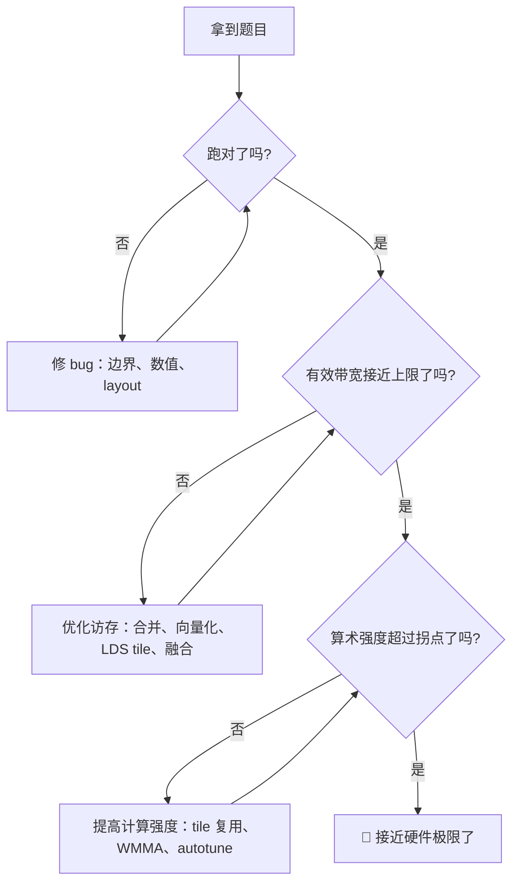

# 第11章 怎么刷 LeetGPU

## 本章导读

> 前面四章（Reduction / Softmax / GEMM / Flash Attention）你已经走过了完整的「naive → 优化 → benchmark」流程。本章把这些经验系统化成一套**刷题方法论**——当你打开一道 GPU 算子题时，从读题到 AC（Accepted）该走什么路径。
>
> 重要前提：LeetGPU 目前仅支持 CUDA / Triton / PyTorch（跑在 NVIDIA 硬件上），不在 AMD GPU 上提交。但刷题的**方法论是硬件无关的**——怎么读题、怎么搭本地评测、怎么用 profiling 驱动迭代，这些在哪个平台都通用。等 AMD 等价平台出现，本章方法论迁移成本很低。

## 11.1 GPU 算子题库长什么样

GPU 算子刷题和传统 LeetCode 不一样——它不是「写出正确答案」就结束，而是要**在时间限制内写出足够快的 kernel**。目前主流的几个平台：

| 平台 | 支持语言 | 评分方式 | 特点 |
| ---- | ---- | ---- | ---- |
| [LeetGPU](https://leetgpu.com/) | CUDA / Triton / PyTorch | 性能分（ms / TFLOPS）| 题目结构清晰，有 playground |
| [Tensara](https://www.tensara.org/) | CUDA / Triton | 性能排行榜 | 竞技性更强，刷 GFLOPS |
| [GPU MODE](https://www.gpumode.com/) | CUDA / Triton | 讲座 + hackathon + 题目 | 社区活跃，有 lectures |

这类平台的题目结构通常是：

```text
题目描述：实现某个算子（如 vector add / matmul / softmax / conv）
输入约束：shape、dtype、memory layout
输出要求：正确结果 + 性能达标（如 < X ms）
评分：按 kernel 延迟或吞吐排名
```

和传统 LeetCode 最大的区别是：**正确只是入场券，性能才是分数**。一个「能跑对但慢 10 倍」的 kernel 和一个「跑错」的 kernel，在排行榜上没有本质区别。

## 11.2 题型套路分类

刷了几十道 GPU 算子题后，你会发现题目类型其实高度收敛——绝大多数都能归到下面四类之一。这四类正好对应本书的四个算子章：

| 题型 | 特征 | 代表题目 | 对应本书章节 |
| ---- | ---- | ---- | ---- |
| **elementwise** | 每个元素独立计算，无跨线程依赖 | vector add、ReLU、scale | [第 3 章](../../part0-intro/chapter3/index.md) vector add |
| **reduction** | 跨线程汇总（求和/求 max）| sum、norm、argmax | [第 7 章](../chapter7/index.md) Reduction |
| **GEMM-like** | 矩阵乘、卷积，核心是 tile + 数据复用 | matmul、conv2d、batched gemm | [第 9 章](../chapter9/index.md) GEMM |
| **融合型** | 多步操作合并到一个 kernel | softmax、layernorm、flash attention | [第 8 章](../chapter8/index.md) Softmax、[第 10 章](../chapter10/index.md) Flash Attention |

**为什么这个分类有用**：因为同一类型的优化手段高度相似。一旦你掌握了 reduction 的 LDS 归约树 + wavefront shuffle，所有 reduction 类题目（sum / max / norm）都能套用同一个优化框架。GEMM 类题目更是如此——tiling + LDS + register blocking 的模板几乎不变，变的只是 tile 参数。

刷题时先判断这道题属于哪一类，就能直接调出对应的优化模板，而不是从零开始想。

## 11.3 本地评测器怎么搭

在线平台有提交限制（每天提交次数、排队时间），不适合快速迭代。高效的做法是**先在本地搭一个评测器**，把 kernel 跑通 + 调优到满意再提交。

一个最小的本地评测器只需要做四件事：

```text
1. 生成测试输入（固定 shape + dtype + 随机种子）
2. 运行你的 kernel（计时）
3. 运行参考实现（如 torch 原生）验证正确性
4. 输出：延迟、有效带宽、与参考的 max_error
```

下面是一个可以直接拿去用的评测器模板（基于 PyTorch + Triton，在 9070XT 上可跑）：

<details>
<summary>代码：本地评测器模板 bench_kernel.py</summary>

```python
"""通用 GPU kernel 本地评测器：计时 + 正确性校验 + 带宽估算。

用法：把 your_kernel 替换成你要测的 kernel，改 shape/dtype 即可。
"""
import argparse
import statistics

import torch


def reference(x):
    """参考实现（用 PyTorch 原生算子）。改成你要测的算子。"""
    return torch.softmax(x, dim=-1)


def your_kernel(x):
    """你要测的 kernel。替换成 Triton / HIP 实现。"""
    # 示例：先直接调用参考实现占位
    return reference(x)


def bench(x, repeats=100, warmup=20):
    # 正确性校验
    out = your_kernel(x)
    ref = reference(x)
    max_err = (out - ref).abs().max().item()

    # 计时
    for _ in range(warmup):
        your_kernel(x)
    torch.cuda.synchronize()
    starts = [torch.cuda.Event(enable_timing=True) for _ in range(repeats)]
    ends = [torch.cuda.Event(enable_timing=True) for _ in range(repeats)]
    for i in range(repeats):
        starts[i].record()
        your_kernel(x)
        ends[i].record()
    torch.cuda.synchronize()
    times = [s.elapsed_time(e) for s, e in zip(starts, ends)]

    min_ms = min(times)
    median_ms = statistics.median(times)
    # 带宽估算：根据算子的访存量调整 bytes_moved
    # softmax 近似：读 x 一遍 + 写 out 一遍 = 2 * numel * dtype_size
    bytes_moved = 2 * x.numel() * x.element_size()
    gbs = bytes_moved / (min_ms / 1e3) / 1e9
    return max_err, min_ms, median_ms, gbs


if __name__ == "__main__":
    p = argparse.ArgumentParser()
    p.add_argument("--shape", default="4096,4096")
    p.add_argument("--dtype", default="fp32")
    args = p.parse_args()

    shape = tuple(int(x) for x in args.shape.split(","))
    dt = {"fp32": torch.float32, "fp16": torch.float16}[args.dtype]
    x = torch.randn(*shape, dtype=dt, device="cuda")

    max_err, min_ms, med_ms, gbs = bench(x)
    status = "PASS" if max_err < 1e-3 else "FAIL"
    print(f"max_error: {max_err:.2e}")
    print(f"min_ms: {min_ms:.4f}")
    print(f"median_ms: {med_ms:.4f}")
    print(f"bandwidth: {gbs:.1f} GB/s")
    print(f"status: {status}")
```

</details>

这个评测器的三个核心设计：

1. **正确性先于性能**：先跑参考实现做 `max_error` 校验。一个跑错但很快的 kernel 没有任何意义。
2. **用 GPU event 计时**：和 [第 4 章](../../part1-profiling/chapter4/index.md) 讲的一样，不用 `time.time()`。
3. **带宽估算**：把延迟换算成有效带宽，和 [第 2 章](../../part0-intro/chapter2/index.md#_2-11-实测9070xt-的带宽与算力) 的实测上限对比——这样你能立刻判断「这个 kernel 是卡在带宽上还是算力上」。

## 11.4 刷题策略：正确性 → 带宽 → 计算强度

这是本章最核心的一节。拿到一道 GPU 算子题后，**不要一上来就追求最快**，而是按三个阶段推进：

### 阶段一：正确性（先跑对）

目标：让 kernel 产出正确结果（`max_error < 阈值`），不管多慢。

- 先写最 naive 的实现（一线程一元素，无优化），确认逻辑正确
- 用本地评测器跑 `max_error` 校验
- 处理边界条件（非整除 shape、padding、causal mask）
- **这一步不碰 profiling**——你要的是正确，不是快

### 阶段二：带宽利用率（让访存变高效）

目标：让 kernel 的有效带宽逼近硬件上限。

这一步的核心问题是：「搬的数据有没有被充分利用？」对应的优化手段：

| 优化手段 | 适用题型 | 对应章节 |
| ---- | ---- | ---- |
| 合并访存（连续线程读连续地址）| 所有 | [第 2 章 §2.8](../../part0-intro/chapter2/index.md) |
| 寄存器局部累加（减少组内归约前的值）| reduction | [第 7 章 §7.4](../chapter7/index.md) |
| LDS 缓存 tile（减少全局内存重复读）| GEMM / 融合型 | [第 9 章 §9.4](../chapter9/index.md) |
| 融合多个 kernel（减少中间写回）| softmax / attention | [第 8 章 §8.4](../chapter8/index.md) |

怎么判断你处于这一阶段：**用 [第 4 章](../../part1-profiling/chapter4/index.md) 的 benchmark 测有效带宽，和 [第 2 章 §2.11](../../part0-intro/chapter2/index.md) 的 GDDR6 实测上限（~500 GB/s）对比**。如果利用率低于 60%，说明访存还有大量优化空间——先解决这一层。

### 阶段三：计算强度（用上算力）

目标：当带宽已经逼近上限后，提高算术强度，让 kernel 从 memory-bound 区移动到 compute-bound 区。

这一步的核心问题是：「搬一次数据能做多少 FLOP？」对应的优化手段：

| 优化手段 | 适用题型 | 效果 |
| ---- | ---- | ---- |
| tile + register blocking | GEMM | 让每个 byte 被复用多次 |
| WMMA / MFMA 矩阵单元 | GEMM / Attention | 一条指令完成小 matmul tile |
| 在线 softmax（不物化中间矩阵）| Flash Attention | 把两次遍历压成一次 |
| autotune（自动搜索最优 tile 参数）| 所有 compute-bound | 让编译器帮你选 BLOCK_M/N/K |

怎么判断你处于这一阶段：**在 Roofline 上画点（[第 3 章 §3.4](../../part0-intro/chapter3/index.md) 的方法），看它从斜线那一侧往右上方移动**。当算术强度超过拐点（fp32 AI≈29、fp16 AI≈248），kernel 就进入了 compute-bound 区。

::: figure fig-leetcode-strategy


刷题的三阶段策略：正确性 → 带宽 → 计算强度
:::

如 @fig-leetcode-strategy 所示，这三个阶段是**严格有序的**——跳过正确性直接优化性能，会发现优化的 kernel 跑错了；在带宽没用满时就去追算力，会发现不管怎么调 tile 都快不了。

## 11.5 调试常见问题

刷 GPU 题时最容易踩的坑，按出现频率排序：

### 1. 边界条件（最高频）

- **shape 不是 block size 整数倍**：最后一个 block 的部分线程越界。解法：`if (idx < n)` 守卫。
- **K 维不是 tile 整数倍**：GEMM 最后一个 tile 不完整。解法：mask 或 padding。
- **序列长度非 2 的幂**：Softmax / Attention 的 `tl.arange(0, BLOCK)` 需要 `mask = offs < n`。

### 2. 数值误差

- **Softmax 溢出**：忘了减最大值。解法：`x - x.max()`。
- **fp16 精度不足**：中间累加用 fp32，最后再转 fp16。解法：Triton 的 `tl.dot` 默认 fp32 累加。
- **Reduction 浮点不满足结合律**：不同归约顺序的最后几位可能不同。解法：使用高精度参考值和合理容差检查（[第 7 章 §7.1.2](../chapter7/index.md)）。

### 3. bank 冲突

- **GEMM tile 列读撞 bank**：LDS 行主存、列主读。解法：padding `+1` 或 XOR swizzle（[第 2 章 §2.7](../../part0-intro/chapter2/index.md)）。

### 4. occupancy 不足

- **VGPR 过多导致 wave 驻留数太少**：编译器报 `VGPR > 256`。解法：减少循环展开、缩小 tile、`__launch_bounds__`。
- **LDS 用量过大**：64KB/CU 上限。解法：缩小 tile 或减少共享。

### 5. Triton 特有的坑

- **`BLOCK` 不是 2 的幂**：Triton 要求 `tl.arange(0, BLOCK)` 的 BLOCK 是 2 的幂。
- **autotune 太慢**：候选配置太多。解法：先用固定配置跑通，再加 autotune。
- **`num_warps` / `num_stages` 选错**：和 tile size 耦合。解法：参考 [第 9 章 §9.7](../chapter9/index.md) 的对比。

## 11.6 关于 AMD 平台的现状

说一句诚实的话：**目前没有 AMD GPU 的 LeetGPU 等价平台**。LeetGPU / Tensara / GPU MODE 都跑在 NVIDIA 硬件上，提交端只支持 CUDA / Triton。

但这不意味着在 AMD GPU 上学的这些东西白学了。原因有三：

1. **方法论完全通用**：读题、搭评测器、三阶段优化策略、调试技巧——这些在 CUDA 和 ROCm 上一模一样。
2. **Triton 跨平台**：Triton kernel 的 Python 代码在 NVIDIA 和 AMD 上都能跑（后端不同，但 API 一致）。你在 9070XT 上写的 Triton softmax，几乎不用改就能在 LeetGPU 上提交。
3. **HIP ≈ CUDA**：HIP 的 API 设计几乎是 CUDA 的镜像（`hipMalloc` ↔ `cudaMalloc`），迁移成本很低。

所以建议是：**在 9070XT 上学、在本地练、用方法论指导**。等 AMD 等价平台出现（或直接用 Triton 提交），迁移成本很低。

> 如果你确实想在 LeetGPU 上提交：可以在 LeetGPU 的 playground 里用 **Triton** 写 kernel——它的 API 和你在 9070XT 上写的完全一致，只是底层跑在 NVIDIA GPU 上。这是目前最接近「跨平台刷题」的方式。

## 本章小结

- GPU 算子刷题的核心区别：**正确只是入场券，性能才是分数**。
- 题型高度收敛到四类：elementwise / reduction / GEMM-like / 融合型，对应本书 Ch3 / Ch7 / Ch9 / Ch8-10。
- 本地评测器只需四件事：生成输入、跑 kernel 计时、校验正确性、输出带宽估算。本章给了一个可直接用的模板。
- 刷题三阶段策略：**正确性 → 带宽 → 计算强度**，严格有序，不能跳过。
- 调试最高频的坑：边界条件 > 数值误差 > bank 冲突 > occupancy > Triton 特有。
- LeetGPU 目前仅支持 CUDA/Triton/PyTorch，但**方法论和 Triton 代码跨平台通用**；在 9070XT 上学的方法论，迁移到任何平台成本都很低。

## 延伸阅读

- [LeetGPU](https://leetgpu.com/) — 主要刷题平台
- [Tensara](https://www.tensara.org/) — 性能竞技排行榜
- [GPU MODE](https://www.gpumode.com/) — 社区 + 讲座 + hackathon
- [Triton 官方教程](https://triton-lang.org/main/getting-started/tutorials/index.html) — Fused Softmax / Matmul / Attention 完整示例
- [How to Optimize a CUDA Matmul Kernel for cuBLAS-like Performance](https://siboehm.com/articles/22/CUDA-MMM) — GEMM 优化方法论（CUDA，但思路跨平台通用）
