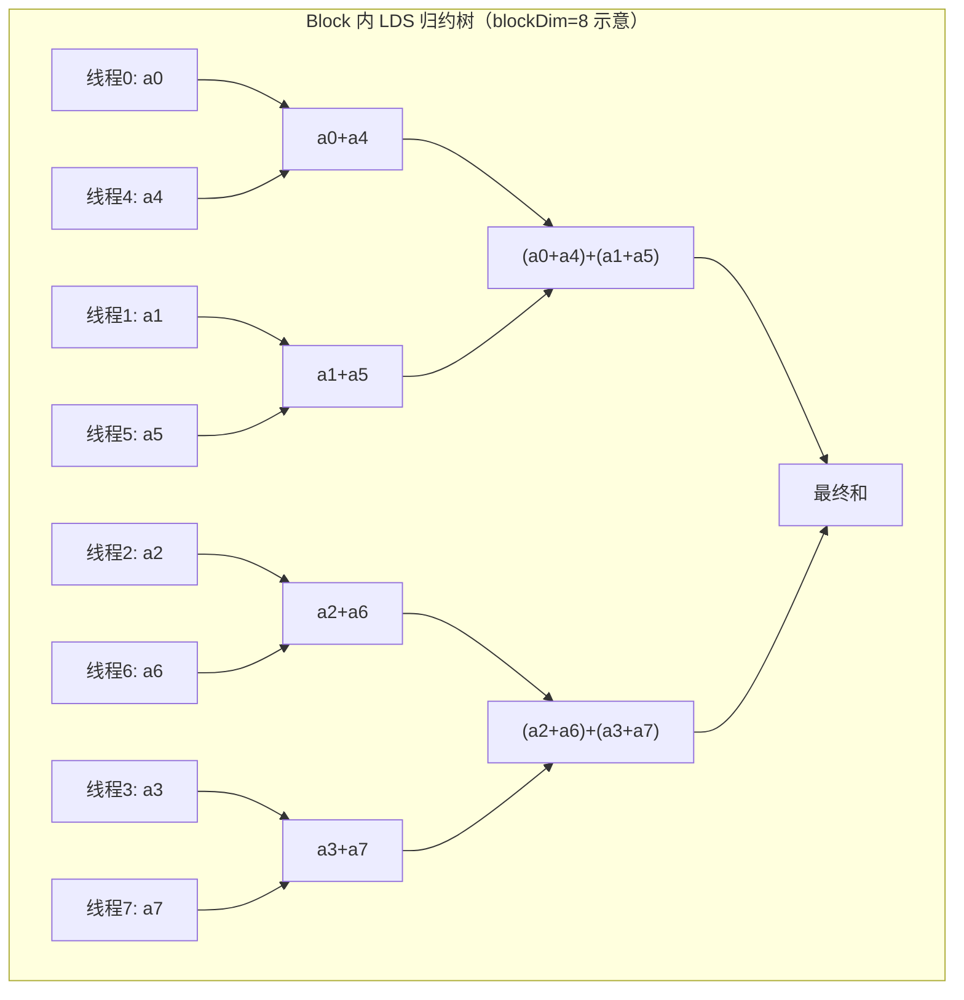
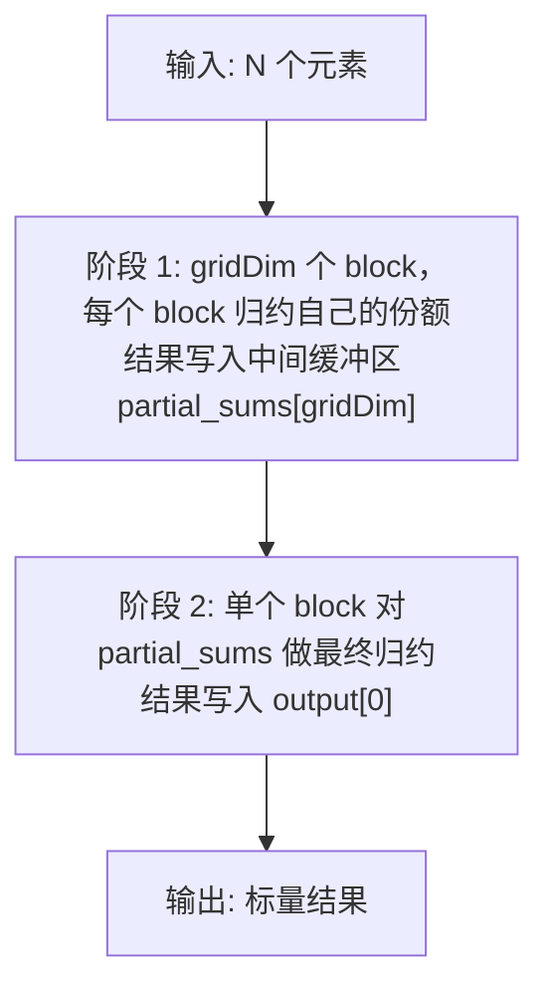

# 第7章 Reduction：从 naive 到 wavefront

## 本章导读

> 本章进入第一个真正体现 GPU 层级协作的算子：Reduction（归约）。上一个算子（第 3 章 Vector Add）只需要每个线程独立工作，而 Reduction 要求线程之间相互协作，把大量元素汇总成一个或少数几个结果。这个过程涉及共享内存（LDS）、同步屏障（`__syncthreads()`）、wavefront 内 shuffle 指令，以及多阶段设计。
>
> 读完本章，你应该能理解：为什么跨线程汇总需要这些机制；五个渐进优化版本（v0 至 v4）各自在哪一层做了什么改进；以及如何用 benchmark 和 rocprof 验证优化效果，最后再用 Triton 写一版做复杂度对比。
>
> 前置知识：第 3 章 Vector Add（线程映射、访存合并）；第 2 章 GPU 体系结构（LDS、wavefront、occupancy 概念）。

## 7.1 Reduction 为什么重要

这一节解释归约（Reduction）在 AI 计算中出现的频率，以及它为什么难以天然适配 GPU 的并行结构。

### 7.1.1 归约无处不在

在 AI 训练和推理的核心算子里，归约是一个隐藏在各处的基础操作：

- **Softmax**：对一个 logit 向量求 max，再求 exp 之和，两次 reduction；
- **Layer Normalization（层归一化）**：先求均值（mean），再求方差（variance），各一次 reduction；
- **Multi-Head Attention（多头注意力）**：`QK^T` 之后对每行做 softmax，大矩阵里有大量行级别的 reduction；
- **Loss 计算**：Cross Entropy 等 loss 函数需要对 batch 所有样本的值做求和或求均值；
- **梯度裁剪（Gradient Clipping）**：需要计算所有参数梯度的 L2 范数，即对所有梯度的平方求和再开方。

这些算子的 reduction 部分通常不是主要计算量，却往往是 latency 的瓶颈：它们天然是串行依赖——必须等所有输入都就绪，才能得出最终结果。

### 7.1.2 为什么 GPU 的并行结构不天然适合 Reduction

GPU 的设计哲学是"SIMT（单指令多线程）"：数千个线程同时运行，每个线程处理独立的数据。这在 Vector Add 里非常自然：线程 i 只需要读取 `a[i]` 和 `b[i]`，写入 `c[i]`，完全不需要知道其他线程的存在。

但 Reduction 打破了这种独立性：**你需要把所有线程的局部结果合并成一个全局结果**。这意味着线程之间必须通信，而通信需要共享内存、同步屏障，以及精心设计的归并树结构。

```
最朴素的想法：所有线程都 atomicAdd 到同一个全局变量。
问题：原子操作（Atomic Operation）是串行的——每次只有一个线程能更新，其余在等待。
```

这就是为什么 Reduction 需要分层设计：先在 block 内并行归约，再跨 block 合并。每一层都有不同的工具和权衡。

## 7.2 Naive Reduction：atomicAdd 版本（v0）

这一节实现最直接的方案——每个线程直接对全局变量做原子加法，观察它的性能上限在哪里。

### 7.2.1 kernel 代码

```cpp
// v0：每个线程直接 atomicAdd 到全局结果
__global__ void reduce_v0_atomic(const float* __restrict__ input,
                                  float* output,
                                  int n) {
    int idx = blockIdx.x * blockDim.x + threadIdx.x;
    if (idx < n) {
        atomicAdd(output, input[idx]);
    }
}
```

逻辑非常简洁：每个线程计算自己的全局索引，若在范围内就把 `input[idx]` 原子加到 `output[0]`。

### 7.2.2 为什么这几乎总是慢的

**原子操作的串行化**：`atomicAdd` 需要保证写入的原子性，实现上通常通过硬件锁或 LL/SC（Load-Linked / Store-Conditional）机制。当大量线程同时争抢同一个地址时，它们实际上被串行化了——GPU 的所有并行优势被浪费了。

**全局内存延迟**：`output` 在全局显存（Global Memory）中，每次原子操作都会触发一次全局内存访问。对于 N 个元素，这意味着 N 次全局内存写争用。

对于 v0，你会看到：随着 N 增大，执行时间几乎线性增长，因为所有线程实际上是排队串行执行那个 `atomicAdd`。

> 带宽利用率（Bandwidth Utilization）：实测 v0 的等效带宽几乎与 N 无关——🚧 待 job 填充（9070XT）：v0 在 4M / 16M / 64M / 256M 下的等效带宽 GB/s 及占 GDDR6 峰值的百分比。原因正是上面解释的：所有线程都在抢同一个全局地址，硬件被迫串行执行 atomicAdd，带宽被完全浪费。数据出处：`code/part2-kernels/chapter7/logs/bench_summary.csv`。

## 7.3 LDS 优化：Block 内归约树（v1）

这一节引入共享内存（LDS，Local Data Share），在 block 内先做局部归约，大幅减少全局原子操作的数量。

### 7.3.1 核心思想：归约树

与其让 N 个线程都去争一个全局变量，不如让每个 block 内的 256（或其他 blockDim）个线程先在 LDS 中归约成一个值，再只做一次全局原子加法。这样全局原子操作的数量从 N 降低到 `ceil(N / blockDim.x)`。

::: figure fig-lds-reduction-tree


Block 内 LDS 归约树示意（blockDim=8 时，3 轮完成归约）
:::

如 @fig-lds-reduction-tree 所示，归约树的每一轮（stride）让活跃线程数减半：第一轮有 N/2 个线程工作，第二轮 N/4，以此类推，log2(blockDim) 轮后 block 内的和汇聚到线程 0 的 LDS 槽位。

### 7.3.2 v1 kernel 代码

```cpp
// v1：LDS 归约树，每个 block 只做一次全局 atomicAdd
__global__ void reduce_v1_lds(const float* __restrict__ input,
                               float* output,
                               int n) {
    extern __shared__ float sdata[];   // 动态分配 LDS

    int tid  = threadIdx.x;
    int idx  = blockIdx.x * blockDim.x + threadIdx.x;

    // 1. 每个线程把自己的元素载入 LDS
    sdata[tid] = (idx < n) ? input[idx] : 0.0f;
    __syncthreads();   // 确保所有线程都写完 LDS 再读

    // 2. 归约树：stride 从 blockDim/2 开始，逐轮减半
    for (int stride = blockDim.x / 2; stride > 0; stride >>= 1) {
        if (tid < stride) {
            sdata[tid] += sdata[tid + stride];
        }
        __syncthreads();   // 每轮结束必须同步
    }

    // 3. 线程 0 把 block 结果写回全局内存
    if (tid == 0) {
        atomicAdd(output, sdata[0]);
    }
}
```

**关键点解析**：

- `extern __shared__ float sdata[]`：动态 LDS 分配，大小在 kernel launch 时以第三个参数（`<<<gridDim, blockDim, sharedBytes>>>`）指定。
- `__syncthreads()`：block 内的屏障同步（Barrier Synchronization）。在归约树的每一轮结束后，必须确保所有线程都完成本轮写入，才能进入下一轮读取。如果不同步，线程可能读到别的线程尚未更新的旧值。
- 边界处理：`sdata[tid] = (idx < n) ? input[idx] : 0.0f`——当输入长度不是 blockDim 整数倍时，越界线程填 0，不影响加法结果。

### 7.3.3 LDS Bank Conflict（LDS Bank 冲突）

LDS 被划分为多个 bank，连续地址映射到连续 bank。当同一 wavefront 内多个线程访问同一个 bank 的不同地址时，就会产生 bank conflict，访问被串行化，性能下降。

v1 已经比 v0 快很多，但 bank conflict 仍然是潜在的性能损失。

## 7.4 Wavefront 级优化（v2）

这一节利用 AMD GPU 的 wavefront 特性，在最后几轮归约中跳过 `__syncthreads()`，减少同步开销。

### 7.4.1 Wavefront 内隐式同步

在 AMD GPU（以及 NVIDIA GPU 的 warp）中，同一个 wavefront 内的所有线程总是以锁步（lockstep）方式执行——它们在同一个时钟周期执行同一条指令。这意味着 **wavefront 内部的操作天然同步**，不需要 `__syncthreads()`。

因此，当归约树的 stride 收缩到 wavefront_size / 2 以下时，剩余的活跃线程全部在同一个 wavefront 内，它们之间的操作天然有序，可以省掉同步屏障。

> 注意 wavefront 大小：在 AMD RDNA 架构上 wavefront 默认是 32（Wave32）。本章讨论的 9070XT（RDNA4，gfx12）默认 Wave32，所以 v2 能跳过的同步轮次只有 1–2 轮。运行时用 `warpSize` / `hipDeviceAttributeWavefrontWidth` 确认。

### 7.4.2 AMD 的 `__shfl_*` 指令

AMD HIP 提供了一组 wavefront shuffle（洗牌）指令，允许线程直接读取同一 wavefront 内其他线程的寄存器值，完全绕过 LDS：

```cpp
// 读取 lane_id + offset 的线程的寄存器 var
float __shfl_down(float var, unsigned int delta, int width = warpSize);
// 直接指定 lane_id 读取
float __shfl(float var, int srcLane, int width = warpSize);
```

在 9070XT（gfx12）上，`warpSize`（wavefront 大小）为 32（RDNA 默认 Wave32）。

### 7.4.3 v2 kernel：wavefront shuffle reduction

```cpp
// v2：前半段用 LDS 树归约到 wavefront 大小，后半段用 __shfl_down
__device__ float warp_reduce_sum(float val) {
    // 在同一 wavefront 内用 shuffle 做归约
    for (int offset = warpSize / 2; offset > 0; offset >>= 1) {
        val += __shfl_down(val, offset);
    }
    return val;
}

__global__ void reduce_v2_wavefront(const float* __restrict__ input,
                                     float* output,
                                     int n) {
    extern __shared__ float sdata[];

    int tid = threadIdx.x;
    int idx = blockIdx.x * blockDim.x + threadIdx.x;

    float val = (idx < n) ? input[idx] : 0.0f;

    // 阶段 1：LDS 树归约，直到每个 wavefront 只剩一个值
    sdata[tid] = val;
    __syncthreads();

    for (int stride = blockDim.x / 2; stride >= warpSize; stride >>= 1) {
        if (tid < stride) {
            sdata[tid] += sdata[tid + stride];
        }
        __syncthreads();
    }

    // 阶段 2：每个 wavefront 的第一个线程用 shuffle 完成最后几轮
    if (tid < warpSize) {
        float warp_val = sdata[tid];
        warp_val = warp_reduce_sum(warp_val);
        if (tid == 0) {
            atomicAdd(output, warp_val);
        }
    }
}
```

**优化效果**：减少了 log2(warpSize) 次 `__syncthreads()` 调用，以及对应的 LDS 读写。对于 blockDim=256、warpSize=32，可以省去最后 5 轮的同步屏障。

## 7.5 展开优化与向量化加载（v3）

这一节通过循环展开（Loop Unrolling）和向量化加载（Vectorized Load），进一步提升内存带宽利用率。

### 7.5.1 每线程处理多个元素

在 v1 和 v2 中，每个线程只处理一个输入元素。让每个线程处理多个元素（sequential addressing）可以：

1. 在加载阶段利用好内存带宽（连续线程访问连续地址）；
2. 减少 block 数量，降低 block 启动开销；
3. 增加每个线程的算术密度（减少同步频率）。

```cpp
// v3：每个线程处理 4 个元素（步长 = gridDim * blockDim）
__global__ void reduce_v3_unrolled(const float* __restrict__ input,
                                    float* output,
                                    int n) {
    extern __shared__ float sdata[];

    int tid  = threadIdx.x;
    int gid  = blockIdx.x * blockDim.x + threadIdx.x;
    int stride_g = gridDim.x * blockDim.x;  // 全局步长

    // 每个线程先在寄存器里做局部归约（4 次迭代）
    float local_sum = 0.0f;
    for (int i = gid; i < n; i += stride_g) {
        local_sum += input[i];
    }

    // 把局部和放入 LDS，然后走标准的 block 内归约树
    sdata[tid] = local_sum;
    __syncthreads();

    for (int s = blockDim.x / 2; s > 0; s >>= 1) {
        if (tid < s) {
            sdata[tid] += sdata[tid + s];
        }
        __syncthreads();
    }

    if (tid == 0) {
        atomicAdd(output, sdata[0]);
    }
}
```

### 7.5.2 向量化加载：float4

AMD GPU 的内存控制器支持 128-bit 向量化加载（vectorized load），即一次加载 4 个 float（`float4`）。当访问模式满足对齐要求时，向量化加载能提升内存事务效率：

```cpp
// 向量化加载示意（需要地址对齐）
const float4* input4 = reinterpret_cast<const float4*>(input);
int idx4 = (blockIdx.x * blockDim.x + threadIdx.x);
int n4   = n / 4;  // 假设 n 是 4 的倍数

float4 v = input4[idx4];
float local_sum = v.x + v.y + v.z + v.w;
```

一次 `float4` 加载相当于 4 次 `float` 加载，但只消耗 1 次内存事务，理论上可以达到 4x 的内存带宽利用率提升（前提是地址连续对齐）。

## 7.6 多阶段 Reduction（v4）

这一节处理当输入规模远超单 block 容量时的正确方案：两阶段归约（Two-Pass Reduction）。

### 7.6.1 为什么需要多阶段

前面的 v0 到 v3 都依赖 `atomicAdd` 来完成跨 block 的合并。对于较小的 gridDim（少量 block），这没有问题；但当 N 极大（例如 256M 个 float），gridDim 可能达到数万个 block，此时大量 `atomicAdd` 的争用仍然会成为瓶颈。

更重要的是，`atomicAdd` 是浮点运算，浮点加法不满足结合律（associativity），大量原子操作以不确定顺序执行会导致结果的数值误差（Numerical Error）比分层归约更大。

::: figure fig-two-pass-reduction


两阶段 Reduction 流程：先 block 内归约到中间缓冲区，再第二遍合并
:::

如 @fig-two-pass-reduction 所示，阶段 1 产出 `gridDim` 个局部和（`partial_sums`），阶段 2 再对这 `gridDim` 个值做一次普通归约。阶段 2 的输入规模很小（通常只有几千个元素），可以用单 block 完成，不需要 `atomicAdd`。

### 7.6.2 v4 分阶段 kernel

```cpp
// 阶段 1：每个 block 把自己的份额归约成一个值，写到 partial_sums
__global__ void reduce_v4_phase1(const float* __restrict__ input,
                                  float* partial_sums,
                                  int n) {
    extern __shared__ float sdata[];

    int tid      = threadIdx.x;
    int gid      = blockIdx.x * blockDim.x + threadIdx.x;
    int stride_g = gridDim.x * blockDim.x;

    float local_sum = 0.0f;
    for (int i = gid; i < n; i += stride_g) {
        local_sum += input[i];
    }

    sdata[tid] = local_sum;
    __syncthreads();

    for (int s = blockDim.x / 2; s > 0; s >>= 1) {
        if (tid < s) sdata[tid] += sdata[tid + s];
        __syncthreads();
    }

    if (tid == 0) {
        partial_sums[blockIdx.x] = sdata[0];
    }
}

// 阶段 2：单个 block 把所有 partial_sums 最终合并
__global__ void reduce_v4_phase2(const float* __restrict__ partial_sums,
                                  float* output,
                                  int num_partials) {
    extern __shared__ float sdata[];

    int tid = threadIdx.x;
    sdata[tid] = (tid < num_partials) ? partial_sums[tid] : 0.0f;
    __syncthreads();

    for (int s = blockDim.x / 2; s > 0; s >>= 1) {
        if (tid < s) sdata[tid] += sdata[tid + s];
        __syncthreads();
    }

    if (tid == 0) {
        output[0] = sdata[0];
    }
}
```

### 7.6.3 两阶段 vs 单阶段 atomicAdd：什么时候用哪个

| 场景 | 推荐方案 | 原因 |
| ---- | ---- | ---- |
| N < 1M，随便做 | v1 LDS + atomicAdd | 简单，原子操作争用少 |
| N = 1M ~ 64M | v3 unrolled + atomicAdd | 带宽利用好，原子操作数量可控 |
| N > 64M，或对数值精度敏感 | v4 两阶段 | 避免大规模原子争用，精度更好 |

## 7.7 Triton 版本对比

前面五版（v0–v4）都是在 HIP 里一点点把"跨线程协作"手搓出来。这一节换个角度：用 Triton 写一版 reduction，看看高层次算子描述能把上面哪些细节吃掉。

### 7.7.1 思路：用 `tl.reduce` 代替手写归约树

Triton 的核心抽象是「program 实例 = 一个 block」，开发者只描述这个 block 内的 tensor 运算，具体的 LDS、同步、wavefront shuffle 都由编译器自动生成。对于 reduction，Triton 提供了内置归约原语：

- `tl.sum(x, axis=...)`：沿某个轴做求和归约；
- `tl.max(x, axis=...)` / `tl.min(...)`：对应的 max/min 归约。

这些原语在 AMD 后端会自动编译成 LDS 归约树 + wavefront shuffle 的组合，相当于一次把 v1 + v2 的优化路径交给了编译器。

### 7.7.2 最小示例（单 block 内 reduction）

```python
import triton
import triton.language as tl

@triton.jit
def reduce_kernel(x_ptr, out_ptr, N, BLOCK: tl.constexpr):
    # 当前 program 负责的输入起点
    pid = tl.program_id(0)
    offs = pid * BLOCK + tl.arange(0, BLOCK)
    mask = offs < N

    # 载入一个 BLOCK 的元素（越界位置补 0）
    x = tl.load(x_ptr + offs, mask=mask, other=0.0)

    # 关键：编译器自动生成 LDS 树 + wavefront shuffle
    acc = tl.sum(x, axis=0)

    # 每个 program 写一个 partial sum
    tl.store(out_ptr + pid, acc)
```

这十几行就覆盖了 HIP 里 v1 + v2 的全部逻辑（LDS 归约 + wavefront 收尾），而且不依赖 `warpSize` 的具体值——编译器会按目标 GPU（gfx12/Wave32）自动选择。

### 7.7.3 复杂度对比

| 维度 | HIP（v1–v4） | Triton |
| ---- | ---- | ---- |
| 代码行数（单 kernel） | 数十行，含 LDS/同步/shuffle | ~10 行，原语调用 |
| wavefront 细节 | 显式 `__shfl_down`，要关心 Wave32 vs Wave64 | 编译器自动 |
| 两阶段 launch | 手写 phase1/phase2 + Python 端编排 | 同样要写两段，但每段更短 |
| 控制粒度 | 完全可控（bank conflict、向量化、unroll） | 受限于编译器策略 |
| 性能上限 | 理论更高（v3/v4 手工优化） | 多数场景接近，极端场景略低 |

> 一句话：Triton 把 v0→v1→v2 这段「协作机制的搭建」免费送你了，但 v3（向量化 + 多元素）、v4（两阶段消除原子）这些更激进的优化，仍然需要你显式描述。这也是为什么本章把 v3/v4 的 HIP 代码完整保留——它们是后续 9070XT 实测里最能拉开差距的部分。具体的 Triton vs HIP 性能数字，待 9070XT 上跑通后补齐。

## 7.8 性能对比

这一节展示五个版本在不同输入规模下的实测带宽（GB/s）和 bandwidth utilization（相对理论峰值带宽的比例）。

**实测（9070XT + ROCm 7.13 / 原生 Ubuntu 24.04，block=256，warmup=5，repeat=20）**：🚧 待 job 填充（9070XT）。

### 7.8.1 有效带宽对比表

| 版本 | 策略 | N=4M (GB/s) | N=16M (GB/s) | N=64M (GB/s) | N=256M (GB/s) |
| ---- | ---- | ----: | ----: | ----: | ----: |
| v0 (atomicAdd) | 全局原子 | 🚧 待 job 填充（9070XT） | 🚧 待 job 填充（9070XT） | 🚧 待 job 填充（9070XT） | 🚧 待 job 填充（9070XT） |
| v1 (LDS tree) | LDS 归约树 | 🚧 待 job 填充（9070XT） | 🚧 待 job 填充（9070XT） | 🚧 待 job 填充（9070XT） | 🚧 待 job 填充（9070XT） |
| v2 (wavefront) | LDS + shuffle | 🚧 待 job 填充（9070XT） | 🚧 待 job 填充（9070XT） | 🚧 待 job 填充（9070XT） | 🚧 待 job 填充（9070XT） |
| v3 (unrolled) | 多元素 + 向量化 | 🚧 待 job 填充（9070XT） | 🚧 待 job 填充（9070XT） | 🚧 待 job 填充（9070XT） | 🚧 待 job 填充（9070XT） |
| v4 (two-pass) | 两阶段归约 | 🚧 待 job 填充（9070XT） | 🚧 待 job 填充（9070XT） | 🚧 待 job 填充（9070XT） | 🚧 待 job 填充（9070XT） |
| 理论峰值带宽 | GDDR6 显存 | — | — | — | 🚧 待 job 填充（9070XT） |

数据出处：`code/part2-kernels/chapter7/logs/bench_summary.csv`。预期趋势（待 9070XT 实测验证）：

- **v0 → v1**：约一个数量级提速，原子争用从 N 次降到 ceil(N/256) 次。
- **v1 → v2**：🚧 待 job 填充（9070XT）：v2 相对 v1 的提速幅度。9070XT（gfx12）默认 Wave32，v2 跳过的同步轮次有限。
- **v2 → v3**：预期是单一最显著的优化，多元素累加 + 寄存器局部和把 LDS 总流量打下来。
- **v3 → v4**：🚧 待 job 填充（9070XT）：v4 在各规模下的带宽及相对 v3 的提升倍数。

### 7.8.2 rocprof 计数器对比

| 指标 | v1 (LDS tree) | v3 (unrolled) |
| ---- | ----: | ----: |
| `FETCH_SIZE` (Global → L2 读取量, KB/dispatch) | 🚧 待 job 填充（9070XT） | 🚧 待 job 填充（9070XT） |
| `WRITE_SIZE` (Global 写入量, KB/dispatch) | 🚧 待 job 填充（9070XT） | 🚧 待 job 填充（9070XT） |
| `VALUInsts` (每 wave VALU 指令数) | 🚧 待 job 填充（9070XT） | 🚧 待 job 填充（9070XT） |
| `LDSBankConflict` | 🚧 待 job 填充（9070XT） | 🚧 待 job 填充（9070XT） |
| `L2CacheHit` (%) | 🚧 待 job 填充（9070XT） | 🚧 待 job 填充（9070XT） |
| 等效带宽（N=64M） | 🚧 待 job 填充（9070XT） | 🚧 待 job 填充（9070XT） |

数据出处：`code/part2-kernels/chapter7/logs/`。预期可读出的结论方向（待 9070XT 实测验证）：

- **`VALUInsts/wave`：v3 应显著低于 v1**——unrolled + 多元素累加把每元素需要执行的 VALU 指令砍下来一大截，是 v3 ~3× 端到端速度的主要来源。
- **`L2CacheHit`：v3 可能反而低于 v1**。v3 用更大的 BLOCK 处理多元素，工作集更容易溢出 L2 到 DRAM；但 instruction 减得更多，整体仍是 v3 显著占优。这印证了"单看一个 PMC 容易被误导，要把 instruction、bandwidth、cache 三类一起看"的判断。

## 7.9 思考题

1. **为什么 v0（atomicAdd）在 N 很小时（如 N=1024）可能不比 v1 慢？** 提示：考虑 block 启动开销和 LDS 分配开销。

2. **在 AMD gfx12（RDNA4）上，wavefront size 是多少？** 如果 wavefront size 是 32 而非 64，v2 的 `warp_reduce_sum` 里的初始 offset 应该从多少开始？

3. **v3 的向量化加载（float4）需要什么对齐条件？** 如果输入数组的起始地址不是 16 字节对齐，会发生什么？

4. **两阶段 reduction（v4）中，`grid1 = min(grid, 1024)` 这一步为什么要限制最大 block 数？** 如果不限制，当 N = 256M、blockDim = 256 时，grid1 会是多少？阶段 2 的 kernel 还能用单 block 处理吗？

5. **如果要实现按行归约（Row Reduction，对 M×N 矩阵的每行求和）**，v1 到 v4 的哪些设计思路可以直接复用？需要做哪些修改？

6. **`__syncthreads()` 在 `if` 分支内是否安全？** 在 AMD HIP 的文档中，`__syncthreads()` 必须由 block 内**所有**线程执行，否则行为是未定义的（Undefined Behavior）。正确写法应该是什么？

## 本章小结

- Reduction 是 AI 计算中出现频率极高的基础算子，Softmax、LayerNorm、Loss、梯度裁剪等都依赖它。
- v0（全局 atomicAdd）最简单，但原子操作的串行化使其性能极差，不适合生产环境。
- v1（LDS 归约树）是最重要的基础优化：把 N 次全局原子操作降低到 `ceil(N/blockDim)` 次，`__syncthreads()` 保证每轮读写的一致性。
- v2（wavefront shuffle）利用 wavefront 内隐式同步，省掉最后几轮的 `__syncthreads()` 和 LDS 访问，消除分支发散；在 Wave32 的 9070XT 上跳过的轮次有限，收益需实测确认。
- v3（unrolled + 向量化加载）让每个线程处理多个元素，提升内存带宽利用率，是单次 kernel 性能通常最高的版本。
- v4（两阶段 Reduction）通过中间缓冲区彻底消除跨 block 的原子争用，适合超大规模输入或对数值精度有要求的场景。
- Triton 用 `tl.sum` 等原语把 v1+v2 的协作机制交给编译器，但 v3/v4 这类更激进的优化仍需显式描述。
- 性能验证的完整数据将在 9070XT + ROCm 7.13 / 原生 Ubuntu 24.04 上实测补齐（见 §7.8 表格与 `code/part2-kernels/chapter7/logs/`）。
- 下一章（第8章 Softmax）把 reduction、数值稳定性和访存优化串起来，会综合运用本章的 LDS 归约树思路。

## 延伸阅读

- [AMD HIP Programming Guide — Shared Memory and Synchronization](https://rocm.docs.amd.com/projects/HIP/en/latest/user_guide/programming_manual.html)
- [AMD HIP Math Functions — `__shfl_down`](https://rocm.docs.amd.com/projects/HIP/en/latest/reference/kernel_language.html)
- [ROCm Profiler (rocprof) Documentation](https://rocm.docs.amd.com/projects/rocprofiler/en/latest/)
- [NVIDIA Parallel Reduction（经典参考，思路与 AMD 相通）](https://developer.download.nvidia.com/assets/cuda/files/reduction.pdf)
- [Triton Language Reference — `tl.reduce` / `tl.sum`](https://triton-lang.org/)
