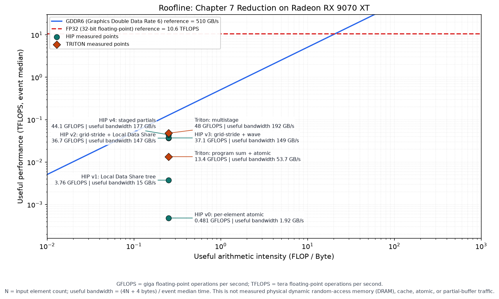

<script setup lang="ts">
import ReductionJourney from './reduction-journey.vue'
</script>

# 第7章 Reduction：从全局争用到分层归约

## 本章导读

> Reduction（归约）把很多输入合成一个结果。加法本身并不难，难的是许多 Graphics Processing Unit（GPU，图形处理器）线程怎样交换数据，又怎样避免在同一个全局地址前排队。
>
> 本章不先公布“最佳写法”。我们会从一个能算对的基线实现（baseline）出发，依次做正确性检查、性能计时（benchmark）、内核轨迹（kernel trace）和 Roofline 分析；每次只提出一个假设、只改一个机制，然后重新测量。Heterogeneous-compute Interface for Portability（HIP，异构计算可移植接口）的五个版本完整走完后，再单独用同一套方法分析 Triton。

## 本章缩写速查

下面只收录本章会出现在正文、命令输出或图表里的缩写。第一次阅读时先看“中文含义”即可，英文全称用于以后查文档。

| 缩写或短写 | 英文全称或官方名称 | 本章中的中文含义 |
| ---- | ---- | ---- |
| AMD | Advanced Micro Devices | AMD 公司 |
| CPU | Central Processing Unit | 中央处理器 |
| GPU | Graphics Processing Unit | 图形处理器 |
| HIP | Heterogeneous-compute Interface for Portability | 异构计算可移植接口；当前 AMD 官方通常直接使用名称 HIP |
| ROCm | AMD ROCm software；早期名称常展开为 Radeon Open Compute | AMD 的开源 GPU 计算软件栈 |
| CUDA | Compute Unified Device Architecture | NVIDIA 的并行计算平台与编程模型 |
| API | Application Programming Interface | 应用程序编程接口 |
| CU | Compute Unit | AMD GPU 的计算单元 |
| LDS | Local Data Share | 工作组内共享的片上存储空间 |
| VGPR | Vector General-Purpose Register | 向量通用寄存器，每个 lane 保存自己的值 |
| SGPR | Scalar General-Purpose Register | 标量通用寄存器，同一 wave 共享标量值 |
| DRAM | Dynamic Random-Access Memory | 动态随机存取存储器；本章指物理显存流量时会用到 |
| GDDR6 | Graphics Double Data Rate 6 | 第 6 代图形双倍数据率显存 |
| FP32 | 32-bit Floating-Point | 32 位浮点数 |
| AI | Arithmetic Intensity | 算术强度，即每搬运 1 Byte 完成多少次浮点运算 |
| FLOP | Floating-Point Operation | 一次浮点运算 |
| GFLOPS | Giga Floating-Point Operations Per Second | 每秒十亿次浮点运算 |
| TFLOPS | Tera Floating-Point Operations Per Second | 每秒万亿次浮点运算 |
| BW | Bandwidth | 带宽 |
| GB/s | Gigabytes per Second | 每秒传输多少 GB 数据 |
| MiB | Mebibyte | 二进制容量单位，`1 MiB = 2^20 Byte` |
| ms | millisecond | 毫秒，`1 ms = 10^-3` 秒 |
| CSV | Comma-Separated Values | 逗号分隔值文件 |
| JSON | JavaScript Object Notation | JavaScript 对象表示法，一种结构化数据格式 |
| JIT | Just-In-Time | 即时编译，在程序运行时完成编译 |
| rtol | relative tolerance | 相对容差，参考结果越大时允许误差按比例增加 |
| atol | absolute tolerance | 绝对容差，固定允许的小误差 |

`v0` 到 `v4` 中的 `v` 是 version（版本）；`H1` 到 `H4` 中的 `H` 是 hypothesis（假设）；`T1` 表示 Triton 路线的第 1 个假设。Triton、Roofline、`rocprofv3` 与 `gfx1201` 是项目名、模型名、工具名或架构编号，不是需要展开的英文缩写。

代码里为了简短还会出现下面这些变量名或别名：`tl` 是 `triton.language` 模块的别名，`tid` 是 thread identifier（线程编号），`id` 是 identifier（编号），`idx`/`Idx` 是 index（索引），`Dim` 是 dimension（维度），`ptr` 是 pointer（指针），`std` 表示 C++ standard library（C++ 标准库）命名空间，`numel` 是 number of elements（元素数量）。这些名字属于源码接口，正文会优先使用中文解释。

## 7.1 固定问题、正确性与测量口径

这一节先把“算什么、怎样算对、怎样比较”固定下来。后面每轮只改 kernel，不改裁判规则。

### 7.1.1 我们要算什么

给定 `N > 0` 个 32 位单精度浮点数（float32）输入，其中 `N` 表示输入元素数量：

```text
x = [x0, x1, x2, ..., x(N-1)]
```

求和 Reduction 只输出一个标量：

```text
sum = x0 + x1 + x2 + ... + x(N-1)
```

Central Processing Unit（CPU，中央处理器）从左到右相加只有一条执行链。GPU 可以同时读取很多元素，但最后必须把这些局部结果汇到一起。本章真正要回答的是：

> 怎样让许多线程参与求和，又不让跨线程通信成为新的瓶颈？

### 7.1.2 先定义“算对”

浮点加法不满足结合律：

```text
(a + b) + c 可能不等于 a + (b + c)
```

串行求和、树形求和与原子求和的相加顺序不同，最后几位可以略有差异。因此配套程序先用 CPU 的 64 位浮点数（float64）求参考值，再判断 GPU 结果是否落在允许误差内，而不是要求二进制的每一位都完全相同。

程序中的两个参数名来自常见的数值计算约定：

- `rtol` 是 **relative tolerance（相对容差）** 的缩写。参考结果越大，允许的差值会按比例增加；本章默认值是 `1e-7`。
- `atol` 是 **absolute tolerance（绝对容差）** 的缩写。它提供一个固定的允许差值，尤其用于参考结果接近 0 时；本章默认值是 `1e-3`。

这里的 `e` 是科学计数法写法：`1e-7 = 1 × 10^-7`，`1e-3 = 1 × 10^-3`。

它们不是两道互相独立的检查。程序实际使用下面这一条规则：

```text
|GPU 结果 - CPU 参考结果| <= atol + rtol × |CPU 参考结果|
```

例如 CPU 参考结果是 `1000`，默认设置允许的差值就是 `0.001 + 1e-7 × 1000 = 0.0011`。超过这个范围才判定为计算错误。

每个版本都必须通过同一组边界输入：

- `N` 小于一个 block；
- `N` 等于当前基线的 wavefront size；
- `N` 比 block size 多 1；
- `N` 不是 2 的幂；
- partial 数量大于 block size；
- atomic 版本重复运行时，不会把上一次结果继续累加。

HIP 与 Triton 的 benchmark 都先执行一次**预检查（precheck）**。预检查失败就跳过**预热（warmup）**和**正式重复计时（repeat）**并返回非 0；正式计时结束后还会再做一次**结果复查（postcheck）**。这样，一个很快但错误的 kernel 不会进入结果表。

### 7.1.3 固定比较口径

| 项目 | 本章固定方式 |
| ---- | ---- |
| 实验环境 | Radeon RX 9070 XT（架构编号 `gfx1201`）+ ROCm 7.13 + 原生 Ubuntu 24.04 |
| 输入 | HIP 与 Triton 使用同一确定性公式生成 32 位浮点数（float32）数据 |
| 参考结果 | CPU 使用 64 位浮点数（float64）求和 |
| 统计 | 相同 warmup、repeat；同时记录 minimum、median、mean |
| 计时范围 | GPU kernel；不含输入创建与 Host-to-Device 拷贝 |
| atomic 清零 | 在 start event 之前执行，不计入当前 kernel 计时口径 |
| 多阶段版本 | 所有 reduction kernel 都在 start/end event 之间 |

这套口径测的是“kernel 区间”，不是包含数据准备的端到端耗时。以后如果要比较完整应用延迟，应另开实验，不能把两种口径混在同一张表里。

这里的三个统计量分别回答不同问题：`minimum` 是多次计时中最快的一次，`mean` 是算术平均值，`median` 是把结果排序后的中间值。偶发的系统调度或频率波动会明显拉高 mean，却不容易带偏 median，所以本章主要用 median 比较版本。每个实现再独立启动 3 次进程，是为了避免某一个进程刚好处在特殊的编译、缓存或频率状态；最后对 3 个进程的同名统计量再取一次中位数。后文括号里的 “3 次范围” 只表示 3 个**进程内 median** 的范围，不是全部 150 次 kernel 计时的范围。需要回顾 benchmark 基础时，可先看[第 4 章的计时方法](../../part1-profiling/chapter4/index.md)。

本章数据于 2026-07-11 在表中环境实测。每个实现独立启动 3 次进程，每次 warmup 10 次、正式计时 50 次；正文的 minimum、median、mean 分别取 3 个进程对应统计量的中位数。kernel trace 另用 warmup 0 次、repeat 10 次采集，主要检查 dispatch 与资源字段，不拿 profiler 下的时间替代 event benchmark。

### 7.1.4 本章反复使用的闭环

每一轮都按同一个顺序前进：

```text
当前版本
  → 正确性
  → benchmark
  → kernel trace / Roofline
  → 提出一个能用测量结果判断对错的假设
  → 只做一个优化
  → 再次正确性与测量
  → 接受或拒绝假设
  → 进入下一轮
```

源码能直接数出的 atomic 次数、kernel 数量和同步次数属于**结构计数**；时间、带宽、GFLOPS 与 Roofline 工作点属于**实测结果**。后文会把两类证据分栏记录，避免把“代码看起来应该更快”写成“已经测得更快”。

## 7.2 HIP 基线版本：v0 每个元素一次原子更新

这一节先得到第一个能复现、能测量的 HIP 版本，再让证据决定下一步。

### 7.2.1 写出最短的可运行内核函数（kernel）

v0 让每个有效线程读取一个元素，然后原子更新同一个 `output[0]`。`atomic` 是“原子的”，这里指一次不可拆开的原子操作，不是英文缩写：

`atomicAdd(p, v)` 会把“读取 `*p`、加上 `v`、写回 `*p`”作为一次不可分割的更新。同一个地址上的更新不会互相覆盖，但必须一个接一个完成。

```cpp
__global__ void reduce_v0_atomic(const float* __restrict__ input,
                                 float* output,
                                 std::size_t n) {
    const std::size_t index =
        static_cast<std::size_t>(blockIdx.x) * blockDim.x + threadIdx.x;
    if (index < n) {
        atomicAdd(output, input[index]);
    }
}
```

从源码可以数出：`N` 个有效线程会执行 `N` 次 atomic，而且目标地址相同。这是结构事实；它还不是“v0 慢了多少”的性能结论。

::: figure fig-hip-v0-atomic-hotspot
<ReductionJourney scenario="atomic" />

固定输入如何在逐元素 atomic 路径上汇入同一个全局地址。
:::

如 @fig-hip-v0-atomic-hotspot 所示，atomic 能保证并发更新不把结果写坏，但同地址更新必须形成顺序。动画为了教学固定按线程 0 到线程 7 演示；真实硬件只保证原子性，不保证按线程编号排序。动画只说明数据路径；实际代价要交给性能计时和性能分析。

### 7.2.2 编译、运行与正确性门槛

以下命令在实验机的 `code/part2-kernels/` 目录执行：

```bash
source ./activate-rocm.sh

hipcc --offload-arch=gfx1201 -O3 -std=c++17 \
    chapter7/reduction_hip.hip \
    -o chapter7/reduction_hip

chapter7/reduction_hip \
    --version v0 \
    --size 1048576 \
    --block 256 \
    --warmup 10 \
    --repeat 50
```

`hipcc` 是 HIP 的 C++ 编译器驱动程序。`--offload-arch=gfx1201` 指定目标 GPU 架构，`-O3` 中的 `O` 是 optimization（优化），表示启用第 3 级编译优化；`-std=c++17` 选择 C++17 语言标准，`-o` 指定输出文件名。

| 检查 | 记录位置 | 状态 |
| ---- | ---- | ---- |
| v0 预检查 / 结果复查 | `chapter7/logs/hip_benchmark.log` | 均通过 |
| `N=1/32/257` | `chapter7/logs/hip_correctness.log` | 均通过 |

### 7.2.3 第一次 benchmark

结果表只记录实测，不提前写版本排名：

| 版本 | minimum | median | mean | 正确性 |
| ---- | ---- | ---- | ---- | ---- |
| HIP v0 | 2.180 ms | 2.181 ms | 2.187 ms | 通过 |

3 次独立进程的 v0 median 四舍五入到 `0.001 ms` 后均为 `2.181 ms`，说明这个 baseline 在当前配置下很稳定。更高精度的原始值保留在 `chapter7/results/summary.json` 中，正文不再展开伪精度。

### 7.2.4 用 kernel trace 看 dispatch

GPU 计时事件（event）给出时间统计，内核轨迹（kernel trace）把每一次内核派发（dispatch）单独列出来：

```bash
mkdir -p chapter7/profiles

rocprofv3 --kernel-trace \
    --output-directory chapter7/profiles \
    --output-file hip-v0 \
    --output-format csv \
    -- chapter7/reduction_hip \
       --version v0 \
       --size 1048576 \
       --block 256 \
       --warmup 0 \
       --repeat 10 \
       --seed 20260711
```

当前性能计时在预热前还有一次预检查启动。因此，若命令使用 `W` 次 warmup、`R` 次 repeat，这里的 `W` 表示预热次数、`R` 表示正式重复计时次数；v0 的轨迹会看到 `1 + W + R` 次 reduction kernel dispatch，而不是只有 `W + R` 次。后面的 v4 每次逻辑运行包含两个 kernel，所以对应 dispatch 数还要乘 2。读 Comma-Separated Values（CSV，逗号分隔值）文件时要区分预检查、预热与正式计时，不能把所有行直接当成 repeat 样本。

还要先统一 “grid” 的单位。源码和正文中的 grid 指 **block 数**，也就是 `gridDim.x`；`rocprofv3` 的 `Grid_Size_X` 记录的是 **总 work-item 数**，本章可以先把它理解成总线程数。对于一维 launch：

```text
Grid_Size_X = block 数 × Workgroup_Size_X
```

因此下面的 `Grid_Size_X=1,048,576` 不是 1,048,576 个 block，而是 `4,096 blocks × 256 threads/block`。

| 观察项 | 实测记录 |
| ---- | ---- |
| `Kernel_Name` 与 dispatch 数 | `reduce_v0_atomic`，11 次：1 次预检查 + 10 次计时 |
| `Start_Timestamp` / `End_Timestamp` | 10 个计时 dispatch 的 trace median 为 2.167 ms |
| launch 形状与寄存器 | 4,096 blocks × 256 threads/block = 1,048,576 个 work-items；`Grid_Size_X=1,048,576`、VGPR 8、SGPR 128 |

### 7.2.5 第一张 Roofline 只回答“离上限多远”

Roofline 图的横轴是算术强度，也就是每搬运 1 Byte 数据完成多少次计算；纵轴是实际计算吞吐。斜线表示内存带宽能支持的上限，横线表示计算单元能支持的上限。工作点靠哪条线更近，只能帮助我们选择接下来优先排查的方向。

对 `N` 个数求和，算法需要的有效加法次数为。这里 `F` 表示浮点运算次数，Floating-Point Operation（FLOP）表示一次浮点运算：

```text
F = N - 1 FLOP
```

若统一按“读 `N` 个 32 位浮点输入、写 1 个 32 位浮点输出”的**有用数据量**计。Arithmetic Intensity（AI，算术强度）表示每搬运 1 Byte 数据完成多少次浮点运算：

```text
Bytes_useful = 4N + 4 Byte
AI_useful = (N - 1) / (4N + 4) → 0.25 FLOP/Byte
```

这里的 `4N + 4` 是为了让所有版本使用同一个算法口径。它没有把 atomic read-modify-write、输出清零、cache transaction 或中间 partial 的实际流量冒充成已测字节数。

Roofline 可以帮助我们判断这个算法的低算术强度，以及实测工作点离带宽屋顶还有多远；它**不能单独证明 atomic 争用**。一个远低于屋顶的点，也可能受同步、occupancy、cache、launch 开销或其他停顿影响。

本章使用的 510 GB/s 参考线数值来自[第 2 章的大数组独立测量](../../part0-intro/chapter2/index.md)，把实测点画到 Roofline 上的方法见[第 6 章](../../part1-profiling/chapter6/index.md)。前者回答“参考值是多少”，后者回答“图怎样画”，两者不是同一项实验。

要验证 atomic 是否是关键因素，需要把四类证据放在一起：

1. 源码显示 `N` 次 atomic 指向同一地址；
2. kernel trace 确认实际 dispatch、耗时与资源字段符合预期，但它本身看不到“线程正在等待 atomic”；
3. 若目标平台上有经过验证的相关硬件 counter，再把它作为补充证据；
4. 只减少 atomic 次数、保持其它条件尽量不变，然后重新测量。

| Roofline 项 | 状态 |
| ---- | ---- |
| v0 工作点 | `AI=0.250 FLOP/Byte`，`0.481 GFLOPS`，有用有效带宽 1.92 GB/s |
| 与 510 GB/s 参考线的距离 | 约为参考值的 0.377%，相差约 265 倍 |

这里的 1.92 GB/s 仍是按 `4N+4` 换算的算法有效带宽，不是 atomic 实际产生的物理显存流量。输入只有 4 Mebibyte（MiB，`4 × 2^20 Byte`），也可能受缓存（cache）影响；“离参考线很远”只说明还有大量未解释损失，不能单靠这一点给 atomic 定罪。

### 7.2.6 假设 H1

这里的 `H` 是 Hypothesis（假设）的首字母。现在提出 HIP 路线的第 1 个可验证假设：

> **H1：** 如果先在每个 block 内合并，只让 block leader 更新全局结果，那么同地址 atomic 次数会从 `N` 降到 grid 中的 block 数 `G`；若同地址 atomic 是主要限制之一，v1 的时间应低于 v0。

这里的 `G` 表示 grid 中的 block 数量。

下一轮只改变 block 内合并方式，不先加入 grid-stride，也不使用 wave shuffle。

## 7.3 HIP 第 1 轮：v1 用 LDS 做 block 内归约

Local Data Share（LDS，局部数据共享存储）是 AMD GPU 上供同一工作组共享的片上存储空间。这一节验证 H1：先把 block 内的值合成一个 partial，再做一次全局 atomic。

::: figure fig-hip-v1-lds-tree
<ReductionJourney scenario="lds" />

同一组输入先在工作组内逐层合并，每个组只留下一个 partial。
:::

如 @fig-hip-v1-lds-tree 所示，跨出 block 的不再是每个输入，而是一个 block partial。这里的工作组在 HIP 中就是 block。

### 7.3.1 这一轮只改什么

v1 仍然让每个线程读取一个输入，也仍然用 atomic 合并不同 block；唯一的算法变化是先经过完整的 LDS 二叉树：

<details>
<summary>代码：HIP v1 完整 LDS 归约树</summary>

```cpp
__global__ void reduce_v1_lds_atomic(const float* __restrict__ input,
                                     float* output,
                                     std::size_t n) {
    extern __shared__ float shared[];

    const unsigned int tid = threadIdx.x;
    const std::size_t index =
        static_cast<std::size_t>(blockIdx.x) * blockDim.x + tid;
    shared[tid] = index < n ? input[index] : 0.0f;
    __syncthreads();

    for (unsigned int stride = blockDim.x / 2; stride > 0; stride >>= 1) {
        if (tid < stride) {
            shared[tid] += shared[tid + stride];
        }
        __syncthreads();
    }

    if (tid == 0) {
        atomicAdd(output, shared[0]);
    }
}
```

</details>

当 grid 有 `G` 个 block 时，源码结构计数是每个 block 一次 atomic，共 `G` 次。LDS 树要求 block size 是 2 的幂；程序入口会拒绝不满足条件的配置。

### 7.3.2 正确性与复测

```bash
chapter7/reduction_hip \
    --version v1 \
    --size 1048576 \
    --block 256 \
    --warmup 10 \
    --repeat 50
```

| 版本 | 同地址 atomic（源码计数） | median（实测） | kernel trace | 正确性 |
| ---- | ---- | ---- | ---- | ---- |
| v0 | `1,048,576` | 2.181 ms | 11 个 reduction dispatch | 通过 |
| v1 | `4,096` | 0.2792 ms | 11 个 reduction dispatch | 通过 |

v1 比 v0 快 `7.81×`，3 次进程的 median 四舍五入到 4 位有效数字后都是 `0.2792 ms`。这组控制实验支持 H1：把同址 atomic 从 `N` 次降到 `G` 次是当前配置中的关键改进。它不表示 LDS 没有成本，只表示减少的争用远大于新增的 LDS 树与同步成本。

复测不只包括上面的 event 时间，还要重新采集 kernel trace。后面每一轮都复用这条命令，只替换 `version`：

```bash
version=v1  # 后续依次改成 v2、v3、v4
rocprofv3 --kernel-trace \
    --output-directory chapter7/profiles \
    --output-file "hip-${version}" \
    --output-format csv \
    -- chapter7/reduction_hip \
       --version "${version}" \
       --size 1048576 \
       --block 256 \
       --warmup 0 \
       --repeat 10 \
       --seed 20260711
```

把新时间和 trace 与上一版并排看：先确认 dispatch 数和 kernel 名符合预期，再判断这轮假设是否得到支持。需要重画工作点时，继续使用[第 6 章的 Roofline 绘图流程](../../part1-profiling/chapter6/index.md)，并保持本章的 `F`、`Bytes_useful` 口径不变。

### 7.3.3 下一份证据与 H2

v1 的源码还暴露出一个事实：每个线程只读取一个输入，随后每层都经过 LDS 与 block 屏障。下一轮先不动这棵 LDS 树，只改变输入怎样分配给线程。

> **H2：** 如果用较少的 block 覆盖同一输入，并让每个线程在寄存器中通过 grid-stride 循环累加多个元素，那么 block partial 与全局 atomic 数会减少；若额外串行累加没有抵消收益，v2 应优于 v1。

## 7.4 HIP 第 2 轮：v2 先做 grid-stride 局部累加

这一节只改输入分工。组内合并仍使用与 v1 相同的完整 LDS 树。

::: figure fig-hip-v2-local-accumulation
<ReductionJourney scenario="local" />

线程先在寄存器中积累自己负责的多个输入，再把较少的局部和交给组内归约。
:::

如 @fig-hip-v2-local-accumulation 所示，局部累加先减少需要在线程间交换的值。动画画的是数据关系；真实线程读取的是 `index, index + grid_stride, ...`，单个线程并不是连续读取一段数组。

### 7.4.1 这一轮只改什么

<details>
<summary>代码：HIP v2 grid-stride 局部累加 + 完整 LDS 树</summary>

```cpp
__device__ __forceinline__ float grid_stride_local_sum(
    const float* __restrict__ input,
    std::size_t n) {
    const std::size_t index =
        static_cast<std::size_t>(blockIdx.x) * blockDim.x + threadIdx.x;
    const std::size_t grid_stride =
        static_cast<std::size_t>(gridDim.x) * blockDim.x;

    float local_sum = 0.0f;
    for (std::size_t i = index; i < n; i += grid_stride) {
        local_sum += input[i];
    }
    return local_sum;
}

__global__ void reduce_v2_grid_stride_lds_atomic(
    const float* __restrict__ input,
    float* output,
    std::size_t n) {
    extern __shared__ float shared[];

    const unsigned int tid = threadIdx.x;
    shared[tid] = grid_stride_local_sum(input, n);
    __syncthreads();

    for (unsigned int stride = blockDim.x / 2; stride > 0; stride >>= 1) {
        if (tid < stride) {
            shared[tid] += shared[tid + stride];
        }
        __syncthreads();
    }

    if (tid == 0) {
        atomicAdd(output, shared[0]);
    }
}
```

</details>

这里第一次出现 `optimized_grid`。v0/v1 必须启动 `ceil(N / block)` 个 block，才能让每个输入都对应一个线程；v2 以后改用 grid-stride 循环，所以 block 数可以更少。未传 `--grid` 时，host 端使用：

```text
optimized_grid = min(ceil(N / block), HIP 的 multiProcessorCount × 8)
```

传入 `--grid G` 时则直接使用 `G`。因此这一轮的单一策略是“改变工作分配”；grid 规模与每线程循环是这项策略不可分开的两面。LDS 树、同步位置和每 block 一次 atomic 均保持不变。

这里的“每个 HIP multiprocessor 取 8 个 block”只是程序先试的默认值，不是硬件定律。本机 `rocminfo` 报告 64 个物理 Compute Unit（CU，计算单元），而 `hipDeviceProp_t::multiProcessorCount` 返回 32；程序使用后者，因此默认 `optimized_grid = 32 × 8 = 256`。两个字段的口径不同，不能把 64 直接代入。后续可以固定其它参数，用 `--grid` 扫描验证这个默认值。

### 7.4.2 正确性与复测

```bash
chapter7/reduction_hip \
    --version v2 \
    --size 1048576 \
    --block 256 \
    --warmup 10 \
    --repeat 50
```

| 版本 | 输入分工 | 组内归约 | median（实测） | 正确性 |
| ---- | ---- | ---- | ---- | ---- |
| v1 | 每线程一个元素 | 完整 LDS 树 | 0.2792 ms | 通过 |
| v2 | grid-stride 局部累加 | 完整 LDS 树 | 0.02854 ms | 通过 |

v2 比 v1 快 `9.78×`，3 次进程 median 为 `0.02852–0.02856 ms`，因此 H2 得到支持。要注意，这一轮验证的是“grid 从 4,096 个 block 缩到 256 个 block + 每线程 grid-stride 局部累加”的组合工作分配，不能把全部收益只归因于“寄存器更快”。

### 7.4.3 下一份证据与 H3

v2 仍把每个线程的局部和写入 LDS，并在每轮树形合并后执行 `__syncthreads()`。这里用 `B` 表示 block size，也就是每个 block 的线程数；循环结构中有 `log2(B)` 轮合并与对应屏障，这是源码计数，不是已测瓶颈。

> **H3：** 保持 v2 的 grid 与 grid-stride 局部和不变，只把组内归约改为 wave shuffle 与少量 wave partial 共享；若 LDS 读写和 block 屏障占据了可见成本，v3 应优于 v2。

## 7.5 HIP 第 3 轮：v3 用 wave shuffle 收尾

这一节只替换组内合并机制，不改变输入分工和跨 block atomic。

HIP 为兼容 Compute Unified Device Architecture（CUDA，统一计算设备架构）代码，沿用了 Application Programming Interface（API，应用程序编程接口）名称 `warpSize`；在 Advanced Micro Devices（AMD）GPU 的术语里，它表示 wavefront 宽度。本章实验机上的 `warpSize=32`，也就是一个 wavefront 包含 32 个 lane 的 Wave32。所以下面的代码写 `warpSize`，正文则用 AMD 更常见的 wave 和 lane；lane 可以理解为 wave 内的线程位置编号。

::: figure fig-hip-v3-wave-shuffle
<ReductionJourney scenario="wave" />

局部和先在 wave 内通过 shuffle 合并，再由第一个 wave 合并各 wave partial。
:::

如 @fig-hip-v3-wave-shuffle 所示，shuffle 让 lane 直接读取另一个 lane 的寄存器值。它不是“所有加法一个周期完成”；offset 仍按轮次减半。

`__shfl_down(v, offset, warpSize)` 让编号为 `lane` 的线程读取 `lane + offset` 的寄存器值；如果源 lane 超出当前 wave 范围，就返回调用线程自己的 `v`。这段归约最终只使用 lane 0 的结果，超出范围一侧的中间结果不会再进入最终求和。

一个 block 内的完整收尾分四步：每个 wave 先得到自己的和；各 wave 的 lane 0 把和写入 `wave_sums`；整个 block 同步一次；第一个 wave 读取这些 partial 再归约，最后由 lane 0 得到 block sum。动画把 wave 内交换放大画出，下面的代码补全跨 wave 的最后两步。

### 7.5.1 这一轮只改什么

<details>
<summary>代码：HIP v3 wave reduction</summary>

```cpp
__device__ __forceinline__ float wave_reduce_sum(float value) {
    for (int offset = warpSize / 2; offset > 0; offset >>= 1) {
        value += __shfl_down(value, offset, warpSize);
    }
    return value;
}

__device__ __forceinline__ float block_reduce_wave(float value,
                                                    float* wave_sums) {
    const unsigned int lane = threadIdx.x % warpSize;
    const unsigned int wave_id = threadIdx.x / warpSize;
    const unsigned int wave_count =
        (blockDim.x + warpSize - 1) / warpSize;

    value = wave_reduce_sum(value);
    if (lane == 0) {
        wave_sums[wave_id] = value;
    }
    __syncthreads();

    float block_sum = 0.0f;
    if (wave_id == 0) {
        block_sum = lane < wave_count ? wave_sums[lane] : 0.0f;
        block_sum = wave_reduce_sum(block_sum);
    }
    return block_sum;
}

__global__ void reduce_v3_wave_atomic(
    const float* __restrict__ input,
    float* output,
    std::size_t n) {
    extern __shared__ float wave_sums[];

    const float local_sum = grid_stride_local_sum(input, n);
    const float block_sum = block_reduce_wave(local_sum, wave_sums);
    if (threadIdx.x == 0) {
        atomicAdd(output, block_sum);
    }
}
```

</details>

在当前 9070XT 的 Wave32 上，一个 256 线程 block 有 8 个 wave。v3 的动态共享空间只保存 wave partial；grid、grid-stride 局部累加和每 block 一次 atomic 与 v2 相同。

### 7.5.2 正确性与复测

```bash
chapter7/reduction_hip \
    --version v3 \
    --size 1048576 \
    --block 256 \
    --warmup 10 \
    --repeat 50
```

| 版本 | 输入分工 | 组内归约 | median（实测） | 正确性 |
| ---- | ---- | ---- | ---- | ---- |
| v2 | grid-stride | 完整 LDS 树 | 0.02854 ms | 通过 |
| v3 | grid-stride | wave shuffle + wave partial | 0.02824 ms | 通过 |

v3 比 v2 快 `1.01×`，约 1.06%。3 次进程的 median 区间分别是 v2 的 `0.02852–0.02856 ms` 与 v3 的 `0.02816–0.02826 ms`，方向一致但幅度很小，所以这里只写“弱支持 H3”。trace 还显示 VGPR 从 8 增到 16；shuffle 减少了完整 LDS 树，却不是没有代价的自动加速按钮。

### 7.5.3 下一份证据与 H4

v3 的源码仍显示每个 block leader 对同一个 `output` 执行一次 atomic。现在跨 block 只剩 `optimized_grid` 个值，但热点并未从算法中消失。

> **H4：** 保持 v3 的 grid-stride 与 wave reduction 不变，只把跨 block 合并从 atomic 改为“各写一个 partial，再启动下一阶段”；若剩余热点成本大于额外写回和 kernel launch，v4 应优于 v3。

这个判断不能由 Roofline 单独给出，必须测量包含全部阶段的 v4。

## 7.6 HIP 第 4 轮：v4 写 partial，再启动下一阶段

这一节只改变跨 block 的合并方式。

::: figure fig-hip-v4-staged-reduction
<ReductionJourney scenario="staged" />

每个 block 写入独立 partial 槽位，下一次 kernel 把 partial 当成更小的新输入。
:::

如 @fig-hip-v4-staged-reduction 所示，第一阶段不再争一个标量。第二阶段不是新算法，而是在更小数组上重复同一条归约路径。

### 7.6.1 这一轮只改什么

<details>
<summary>源码节选：HIP v4 partial kernel 与完整 launch 分支</summary>

下面两段分别节选自 `reduction_hip.hip` 的 kernel 定义和 `main()` 中的 v4 分支，代码与源文件保持一致。

```cpp
// v4 阶段 1：每个 block 写一个 partial，不做全局原子操作。
__global__ void reduce_v4_partials(const float* __restrict__ input,
                                   float* partials,
                                   std::size_t n) {
    extern __shared__ float wave_sums[];

    const float local_sum = grid_stride_local_sum(input, n);
    const float block_sum = block_reduce_wave(local_sum, wave_sums);
    if (threadIdx.x == 0) {
        partials[blockIdx.x] = block_sum;
    }
}

if (wants("v4")) {
    const auto result = benchmark(args, false, device_output, expected, [&] {
        hipLaunchKernelGGL(reduce_v4_partials, dim3(optimized_grid),
                           dim3(args.block), wave_shared_bytes, 0,
                           device_input, device_partials, args.size);
        HIP_CHECK(hipGetLastError());
        // 同一个 kernel 以单 block 处理第二阶段。它的 grid-stride 循环会
        // 遍历全部 partial，而不是只读取前 blockDim.x 个。
        hipLaunchKernelGGL(reduce_v4_partials, dim3(1), dim3(args.block),
                           wave_shared_bytes, 0, device_partials,
                           device_output, optimized_grid_size);
        HIP_CHECK(hipGetLastError());
    });
    print_result("v4", optimized_grid, args.block, expected, result);
    all_correct = all_correct && result.correct;
}
```

</details>

v4 不做全局 atomic；代价是写 partial buffer，并为第二阶段增加一次 kernel launch。第二阶段的 grid-stride 循环不能假设 partial 数量小于 block size。

### 7.6.2 正确性与完整计时

```bash
chapter7/reduction_hip \
    --version v4 \
    --size 1048576 \
    --block 256 \
    --warmup 10 \
    --repeat 50
```

v4 的 start event 记录在第一阶段前，end event 记录在第二阶段后。只量第一阶段会漏掉算法必须完成的工作。正确性测试还要专门让非零 partial 数量大于 block size，以检查第二阶段没有漏读尾部。

| 版本 | 跨 block 合并 | 每次逻辑运行 | median（实测） | 正确性 |
| ---- | ---- | ---- | ---- | ---- |
| v3 | 每 block 一次同地址 atomic | 1 个 kernel | 0.02824 ms | 通过 |
| v4 | 独立 partial + 再归约 | 2 个 kernel | 0.02376 ms | 通过 |

v4 的 event 区间包含两个 kernel，仍比 v3 快 `1.19×`；3 次进程 median 为 `0.02372–0.02380 ms`。因此当前配置支持 H4：去掉剩余同址 atomic 的收益超过了 partial 写回和额外 launch。`partials > block` 的专项边界用例也通过，第二阶段没有漏读尾部。

### 7.6.3 HIP 路线证据表

| 版本 | 本轮策略 | median（3 次范围） | 有用有效带宽 | trace 摘要（blocks × threads/block） | 假设结论 |
| ---- | ---- | ---- | ---- | ---- | ---- |
| v0 | `N` 次同址 atomic | 2.181 ms（三次按 0.001 ms 取整后同值）| 1.92 GB/s | 11 dispatch；4,096 × 256；VGPR 8 | baseline |
| v1 | LDS 树，`G` 次 atomic | 0.2792 ms（区间同值）| 15.0 GB/s | 11 dispatch；4,096 × 256；VGPR 8 | H1：支持，`7.81×` |
| v2 | 256-block grid-stride + LDS | 0.02854 ms（0.02852–0.02856）| 147 GB/s | 11 dispatch；256 × 256；VGPR 8 | H2：支持，`9.78×` |
| v3 | wave shuffle，256 次 atomic | 0.02824 ms（0.02816–0.02826）| 149 GB/s | 11 dispatch；256 × 256；VGPR 16 | H3：弱支持，`1.01×` |
| v4 | partial buffer + 第二阶段 | 0.02376 ms（0.02372–0.02380）| 177 GB/s | 22 dispatch；阶段 1 为 256 × 256，阶段 2 为 1 × 256；VGPR 16 | H4：支持，`1.19×` |

从 v0 到 v4 的完整时间缩短了 `91.8×`。最大两步收益来自减少同址 atomic 与改变工作分配；wave shuffle 的单步收益最小。这个结果正说明为什么应逐轮测量，而不是先背“shuffle 一定很快”。

这里的“接受”或“拒绝”都只针对当前硬件、输入规模、block/grid 配置和测量口径，不代表某种机制在所有 GPU 上永远更快或更慢。

## 7.7 Triton baseline：program partial 后 atomic

HIP 路线到这里已经完整结束。现在从 Triton 自己的 baseline 重新开始，不在两种语言之间来回切换。

### 7.7.1 Triton atomic 不等价于 HIP v0

Triton 的 atomic 基线中，一个 program（程序实例）先加载一个连续数据块（chunk），用 `tl.sum` 得到一个局部结果（partial），最后才做一次原子更新（atomic）。因此它已经包含“组内先合并”，并不是 HIP v0 的“每个元素一次 atomic”。

下面只画 Triton program partial 的数据流。Triton program 与 HIP block 都对应一次工作组实例，但两者的源码抽象和参数不能直接等同；尤其不能用 Triton 的 `BLOCK_SIZE` 推出实际线程数。动画也不推断 `tl.sum` 一定使用 LDS；最终生成什么指令，要由目标 GPU、块形状与编译结果决定。

::: figure fig-triton-atomic-program-partial
<ReductionJourney scenario="program" />

两个 Triton program 各自产生一个 partial，随后原子更新同一个全局结果。
:::

如 @fig-triton-atomic-program-partial 所示，这个 baseline 的争用数量由 program 数决定，而不是由输入元素数直接决定。

下面代码中的 `tl` 是 `triton.language` 模块的常用别名，所以 `tl.sum` 就是这个模块提供的求和函数。`@triton.jit` 中的 JIT 是 Just-In-Time（即时编译），表示 kernel 会在运行时根据参数完成编译。

<details>
<summary>代码：Triton atomic baseline</summary>

```python
@triton.jit
def reduce_atomic_kernel(
    input_ptr,
    output_ptr,
    n_elements,
    BLOCK_SIZE: tl.constexpr,
):
    program_id = tl.program_id(axis=0)
    offsets = program_id * BLOCK_SIZE + tl.arange(0, BLOCK_SIZE)
    values = tl.load(input_ptr + offsets, mask=offsets < n_elements, other=0.0)
    partial = tl.sum(values, axis=0)
    tl.atomic_add(output_ptr, partial)
```

</details>

### 7.7.2 正确性、benchmark 与 profiling

```bash
source ./activate-rocm.sh

python chapter7/reduction_triton.py \
    --version atomic \
    --size 1048576 \
    --block 1024 \
    --warmup 10 \
    --repeat 50

rocprofv3 --kernel-trace \
    --output-directory chapter7/profiles \
    --output-file triton-atomic \
    --output-format csv \
    -- python chapter7/reduction_triton.py \
       --version atomic \
       --size 1048576 \
       --block 1024 \
       --warmup 0 \
       --repeat 10 \
       --seed 20260711
```

Triton benchmark 同样先 precheck，因此这条 profiling 命令会得到 1 次 precheck + 10 次计时，共 11 个 reduction dispatch。先按 `Kernel_Name` 找到 reduction kernel，再区分预检与计时 dispatch。rocprofv3 最终生成的 trace 文件是 `chapter7/profiles/triton-atomic_kernel_trace.csv`。

| 项目 | 状态 |
| ---- | ---- |
| 正确性 | 预检查 / 结果复查与边界输入均通过 |
| median | 0.07808 ms（3 次范围 0.07772–0.07814 ms）|
| kernel trace | 11 个 `reduce_atomic_kernel` dispatch；1,024 programs × 128 work-items/program = 131,072 个 work-items；`Grid_Size_X=131,072`、VGPR 16 |
| Roofline 工作点 | `AI=0.250`，`13.4 GFLOPS`，有用有效带宽 53.7 GB/s |

Triton 的有用 Roofline 口径仍是 `F=N-1`、`Bytes=4N+4`、`AI→0.25 FLOP/Byte`。它可以显示工作点位置，仍不能单独证明 program partial 的 atomic 正在争用。

注意，命令中的 `--block 1024` 是一个 Triton program 每轮处理的**元素数**，不是线程数；trace 中的 workgroup 128 才是该 kernel 实际 launch 使用的 work-item 数。两者不能直接画等号。

### 7.7.3 假设 T1

这里的 `T1` 表示 Triton 路线的第 1 个假设。源码可以确认：每个 program 最终对同一个标量执行一次 `tl.atomic_add`。于是提出：

> **T1：** 如果每个 program 改写独立 partial，并在 host 端反复 launch 同一个 chunk kernel，去掉跨 program atomic 的收益可能超过中间写回与额外 launch 成本。

下一节只改变跨 program 合并方式。

## 7.8 Triton 第 1 轮：multistage partial buffer

::: figure fig-triton-multistage-buffer
<ReductionJourney scenario="staged" />

每个 Triton program 写入独立 partial，host 端把 partial tensor 作为下一轮输入。
:::

如 @fig-triton-multistage-buffer 所示，输入数组每轮都会缩小，直到只剩一个值。

### 7.8.1 这一轮只改什么

`reduce_chunks_kernel` 保留相同的连续加载、mask 与 `tl.sum`，只把末尾的 atomic 改为按 `program_id` 普通 store：

<details>
<summary>代码：Triton chunk kernel 与多阶段 launch</summary>

```python
@triton.jit
def reduce_chunks_kernel(
    input_ptr,
    partial_ptr,
    n_elements,
    BLOCK_SIZE: tl.constexpr,
):
    program_id = tl.program_id(axis=0)
    offsets = program_id * BLOCK_SIZE + tl.arange(0, BLOCK_SIZE)
    values = tl.load(input_ptr + offsets, mask=offsets < n_elements, other=0.0)
    partial = tl.sum(values, axis=0)
    tl.store(partial_ptr + program_id, partial)


def launch_multistage(
    input_tensor: torch.Tensor,
    buffers: list[torch.Tensor],
    block_size: int,
) -> torch.Tensor:
    source = input_tensor
    current_size = source.numel()
    for destination in buffers:
        reduce_chunks_kernel[(destination.numel(),)](
            source,
            destination,
            current_size,
            BLOCK_SIZE=block_size,
            num_warps=num_warps_for(block_size),
        )
        source = destination
        current_size = destination.numel()
    return source
```

</details>

每轮输出 buffer 在计时前分配，所有 chunk kernel launch 都位于 event 区间内。partial 数量大于 `BLOCK_SIZE` 时，循环会继续生成下一层 buffer，而不是只处理第一块。

### 7.8.2 正确性、复测与 T1 结论

```bash
python chapter7/reduction_triton.py \
    --version multistage \
    --size 1048576 \
    --block 1024 \
    --warmup 10 \
    --repeat 50
```

| 版本 | 跨 program 合并 | median（实测） | stages | 正确性 | T1 |
| ---- | ---- | ---- | ---- | ---- | ---- |
| atomic | program partial 后 atomic | 0.07808 ms | 1 | 通过 | baseline |
| multistage | 独立 partial + 循环 launch | 0.02184 ms | 2 | 通过 | 支持，`3.58×` |

multistage 的 event 区间包含两个阶段。它的 3 次进程 median 范围是 `0.01728–0.02238 ms`，比 HIP 的波动更明显；不过最慢 multistage 仍明显快于最快三次 atomic，因此当前配置支持 T1。trace 中每个逻辑运行对应两个 `reduce_chunks_kernel`：第一阶段是 1,024 programs × 128 work-items，对应 `Grid_Size_X=131,072`；第二阶段是 1 program × 128 work-items，对应 `Grid_Size_X=128`。

::: figure fig-ch7-reduction-roofline


Radeon RX 9070 XT 上七个 Reduction 实现的工作点；时间取三次独立进程聚合后的 event median。
:::

@fig-ch7-reduction-roofline 中所有点的横坐标相同，因为它们完成同一个 `N-1` 加法任务，并统一使用 `4N+4` 有用字节口径。优化后点向上移动，表示同样的有用工作用时更短。图中 510 GB/s 是第 2 章用大数组独立测得的 GDDR6 参考线；本章只有 4 MiB 输入，所以标注的 1.92–192 GB/s 只能用于版本间比较，不能解释成实测物理 DRAM 流量。

## 7.9 最后再对照 HIP 与 Triton

两条路线都走完后，再建立迁移关系。这里比较的是算法对象，不是把版本号强行对齐。

| 优化问题 | HIP | Triton | 观察重点 |
| ---- | ---- | ---- | ---- |
| 越界怎样处理 | `if (index < n)` 或循环条件 | `mask = offsets < n` | 非整除长度能否算对 |
| 怎样先做局部和 | grid-stride 寄存器累加 | 一个 program 加载张量块 | 跨线程通信前剩下多少值 |
| 怎样做组内归约 | LDS 树或 wave shuffle | `tl.sum` | 每组是否只产出一个 partial |
| 怎样跨组合并 | block leader atomic 或 partial buffer | program atomic 或 partial tensor | 是否仍争同一个标量 |
| 怎样扩展到大输入 | 再启动 HIP kernel | 循环 launch chunk kernel | partial 是否被完整处理 |

需要特别记住两点：

1. Triton atomic baseline 已经在 program 内做 `tl.sum`，不等价于 HIP v0；
2. “Triton 代码更短”不表示优化自动完成，`BLOCK_SIZE`、`num_warps`、atomic 与阶段数仍要在目标 GPU 上测量。

跨语言性能比较还必须明确各自 block/program 配置。输入相同并不代表 launch 形状相同，因此不能只看一行时间就推导语言高低。

## 7.10 用 run_all.sh 复跑整章

`run_all.sh` 会完成下面这些工作：

- 编译 `reduction_hip.hip`；
- 运行 HIP `v0`、`v1`、`v2`、`v3`、`v4`；
- 覆盖 `N=1`、Wave32、`block+1` 等边界输入；
- 用 v4 单独覆盖“非零 partial 数量大于 block size”；
- 运行 Triton `atomic` 与 `multistage` 及相应边界输入；
- 额外启动 3 次独立进程，把主尺寸结果写入 `chapter7/logs/runs/`；
- 把环境、benchmark 与正确性日志写入 `chapter7/logs/`。

```bash
cd code/part2-kernels
bash chapter7/run_all.sh
bash chapter7/profile_all.sh
python chapter7/summarize_results.py --strict
python chapter7/plot_roofline_ch7.py \
    --out ../../docs/part2-kernels/chapter7/images/roofline-ch7.png
```

`run_all.sh` 负责正确性、计时事件 benchmark 与独立复跑；`profile_all.sh` 为七个实现分别生成轨迹；`summarize_results.py` 把计时事件与轨迹汇总成 `chapter7/results/summary.csv` 和 JavaScript Object Notation（JSON）文件；最后一条命令直接重画本章 Roofline，不需要再复制图片。实验底稿中的命令、环境和原始文件应与这四步对应。

## 7.11 动手练习

1. 对 `N = 1025`、`block = 256`，HIP v0 会启动多少线程？其中多少线程真正执行 `atomicAdd`？
2. HIP v1 中，如果删除循环末尾的 `__syncthreads()`，下一轮可能读到什么？为什么第一次同步仍然不能省？
3. v1 与 v2 的组内归约完全相同。它们之间唯一改变的工作分配是什么？怎样设计一张表验证 H2？
4. 对 block size 256、wavefront size 32，一个 block 会产生多少个 wave partial？v3 最后由哪些 lane 合并？
5. 为什么 v4 的第二阶段必须用 grid-stride？如果 partial 数量为 1024、block size 为 256，只读一次会漏掉多少？
6. 为什么 Triton atomic 不能和 HIP v0 直接视为同一 baseline？
7. Roofline 点远低于带宽屋顶时，为什么仍不能直接写“atomic 争用已经被证明”？还缺哪一轮控制变量实验？

## 本章小结

- Reduction 优化不是背一串版本名，而是重复“正确性 → 测量 → 解释 → 单变量验证”的闭环。
- HIP v0 到 v4 分别把逐元素 atomic、block 内 LDS、grid-stride 局部累加、wave shuffle 与多阶段合并拆成独立实验。
- Roofline 给出算术强度与上限方向；atomic 是否关键要靠源码结构、profiling 和单变量复测共同判断。
- HIP 与 Triton 的数据流可以对照，但代码层次和 baseline 含义不同，不能按名字硬对齐。
- 多阶段版本必须把全部 kernel 计入，并保证下一阶段读取所有 partial。

下一章会把求最大值与求和两次 Reduction 组合进 Softmax。届时算子更复杂，但实验顺序不变：先量准，再一次只改一个机制。

## 延伸阅读

- [HIP C++ language extensions：同步与 shuffle](https://rocm.docs.amd.com/projects/HIP/en/latest/how-to/hip_cpp_language_extensions.html)
- [HIP performance guidelines](https://rocm.docs.amd.com/projects/HIP/en/latest/how-to/performance_guidelines.html)
- [rocprofiler-compute / rocprofv3 文档](https://rocm.docs.amd.com/projects/rocprofiler-compute/en/latest/)
- [Roofline Model 原论文](https://dl.acm.org/doi/10.1145/1498765.1498785)
- [Triton `sum` API](https://triton-lang.org/main/python-api/generated/triton.language.sum.html)
- [Triton fused softmax 教程（包含行级归约）](https://triton-lang.org/main/getting-started/tutorials/02-fused-softmax.html)
