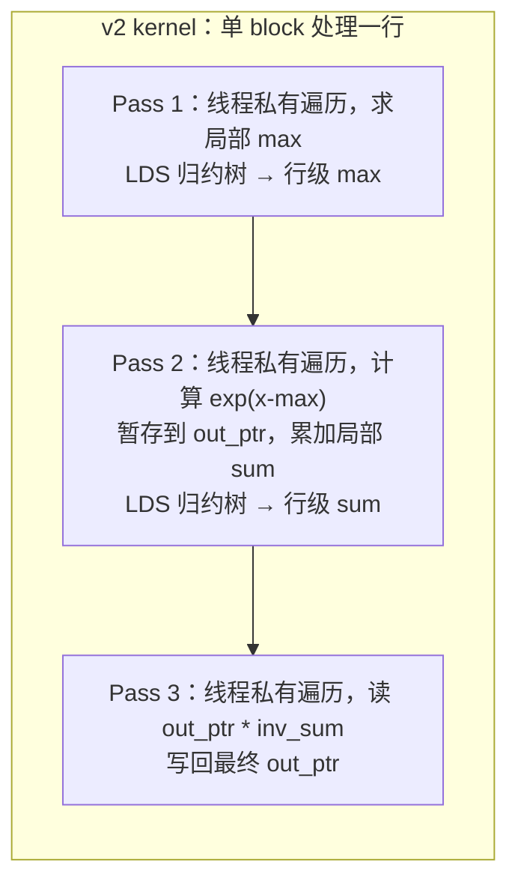
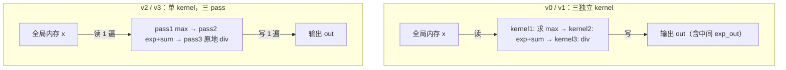

# 第8章 Softmax：数值稳定 + 融合

## 本章导读

> 本章用 Softmax 把上一章的 Reduction 知识用到一个更完整的算子上。Softmax 的计算包含三步连锁操作：求最大值、求指数和、做除法——每一步都是一次 Reduction，且步骤之间存在数据依赖。这既带来了数值稳定性的挑战，也带来了访存优化的机会。
>
> 读完本章，你应该能：解释为什么朴素实现会溢出（overflow）；写出数值稳定版本；把三个单独的 kernel 合并到一个 kernel 里以减少全局内存读写；用 float4 向量化加载进一步提升带宽利用率；并用 `torch.softmax` 验证数值正确性。最后我们会用 Triton 重写一版 softmax，对比 HIP 手写 kernel 的复杂度与表达力。
>
> 前置知识：第7章 Reduction（LDS 归约树、`__syncthreads()`、block 内协作）。本章会直接复用这些机制，不再重复推导。

## 8.1 Softmax 在 Transformer 中的位置

这一节解释 Softmax 出现在哪里，以及它在推理计算中占多大比例。

### 8.1.1 Attention 的 Softmax

在 Transformer 的自注意力（Self-Attention）机制里，Softmax 出现在计算注意力权重（Attention Weight）的那一步：

$$
\text{Attention}(Q, K, V) = \text{Softmax}\!\left(\frac{QK^T}{\sqrt{d_k}}\right) V
$$

$QK^T$ 的形状是 $[B, H, S, S]$，Softmax 作用在最后一个维度——**对每一行做行级归一化（Row-wise Normalization）**，把原始 logit（对数几率）转换成概率分布。

对于一个典型的 LLaMA-7B 推理请求（$S = 2048$，$H = 32$ 个注意力头），每个 layer 有 $B \times H$ 个独立的行级 Softmax，每行长度 $S = 2048$。在 prefill（预填充）阶段，长序列下 Softmax 的访存量相当可观。

### 8.1.2 Softmax 的数学定义与计算步骤

对于一行长度为 $S$ 的向量 $x$，标准 Softmax 定义为：

$$
\text{Softmax}(x_i) = \frac{e^{x_i}}{\sum_{j=1}^{S} e^{x_j}}, \quad i = 1, \ldots, S
$$

在 GPU 上实现这个公式，**最少需要三趟（pass）全局内存操作**：

1. **Pass 1**：遍历行，求指数和 $Z = \sum_j e^{x_j}$；
2. **Pass 2**（隐含）：实际上需要先有每个 $e^{x_j}$，通常会写出中间结果；
3. **Pass 3**：再次遍历，用 $Z$ 除每个 $e^{x_j}$，写出最终结果。

更关键的问题在于 Pass 1：当 $x_j$ 中存在较大的正值时，$e^{x_j}$ 会超出 float32 的表示范围（约 $3.4 \times 10^{38}$），直接导致 NaN（Not a Number，非数）或 Inf（无穷）。这就是**数值稳定性（Numerical Stability）**问题。

::: figure fig-softmax-midstation


Softmax 是 Reduction 到更复杂算子的中间站：它把归约、数值稳定性和访存优化串成一条完整的故事线
:::

## 8.2 Naive Softmax：三趟实现与数值问题

这一节实现最直接的三趟（three-pass）Softmax，观察访存浪费和数值溢出。

### 8.2.1 v0 kernel 设计：有意不减 max

v0 版本故意**不做数值稳定处理**，直接计算 $e^{x_j}$，用于演示大值输入下的溢出现象。

三个 kernel 一共从全局内存读了 **3 遍** 输入（$x$ 读 2 遍，`exp_out` 读 1 遍），写了 **2 遍**（`exp_out` 写 1 遍，`out` 写 1 遍）。这是访存浪费最直接的来源。

```cpp
// v0 pass2：直接 expf(x[i])，不减 max，大值会溢出为 Inf
__global__ void softmax_v0_pass2_expsum(const float* x, float* exp_out,
                                         float* row_sum, int S) {
  int row = blockIdx.x;
  const float* row_ptr = x + row * S;
  float* exp_ptr = exp_out + row * S;
  float s = 0.f;
  for (int i = threadIdx.x; i < S; i += blockDim.x) {
    float e = expf(row_ptr[i]);  // ← 没有减 max，大值溢出
    exp_ptr[i] = e;
    s += e;
  }
  __shared__ float lds[BLOCK];
  row_sum[row] = block_reduce_sum(s, lds);
}
```

当 `x[i]` 超过约 88（$\ln(3.4 \times 10^{38})$），`expf` 返回 `Inf`；任何数除以 `Inf` 都得 0，任何数除以 NaN 得 NaN。对于输入范围在 $[-2, 2]$ 的测试数据，v0 的溢出问题不会立即暴露，但对真实的 attention logit（可能高达数十），会直接崩溃。

### 8.2.2 访存浪费的量化分析

以形状 $[B=8, S=2048]$，float32 为例：

- **三个 kernel 合计全局内存读写**：约 $3 \times 64 + 2 \times 64 = 320$ KB
- **理论最优**：读 $x$ 一次，写 `out` 一次，共 $2 \times 64 = 128$ KB

v0 的全局内存流量是理论最优的 **2.5 倍**。对于访存密集型算子，这个浪费直接影响端到端延迟。

**实测（9070XT + ROCm 7.13 / 原生 Ubuntu 24.04，B=8 S=2048）**：🚧 待 job 填充（9070XT）—— v0 的 min_ms / 等效带宽，待 Radeon RX 9070 XT + ROCm 7.13 / 原生 Ubuntu 24.04 实测后填入；可参照 Part 1（Ch4-6）profiling 章节给出的稳态 vector add 带宽基线。

数据出处：`code/part2-kernels/chapter8/logs/bench_summary.csv`。

## 8.3 数值稳定性：减最大值

这一节引入减最大值（Subtract Maximum）技巧，消除 exp 溢出问题。

### 8.3.1 数值稳定版公式

令 $m = \max_j x_j$，则：

$$
\text{Softmax}(x_i) = \frac{e^{x_i - m}}{\sum_j e^{x_j - m}}
$$

这与原始定义完全等价（分子分母同乘 $e^{-m}$），但 $x_i - m \leq 0$，所以 $e^{x_i - m} \in (0, 1]$，**永远不会溢出**。

### 8.3.2 v1 kernel：三趟 + 数值稳定

v1 在 v0 结构上只改一处：pass2 里在 `expf` 之前减去 `row_max`：

```cpp
// v1 pass2：减去最大值，防止溢出
__global__ void softmax_v1_pass2_expsum(const float* x, const float* row_max,
                                         float* exp_out, float* row_sum,
                                         int S) {
  int row = blockIdx.x;
  const float* row_ptr = x + row * S;
  float* exp_ptr = exp_out + row * S;
  float mx = row_max[row];   // ← 从全局内存读取 row_max
  float s = 0.f;
  for (int i = threadIdx.x; i < S; i += blockDim.x) {
    float e = expf(row_ptr[i] - mx);  // ← 减去最大值
    exp_ptr[i] = e;
    s += e;
  }
  __shared__ float lds[BLOCK];
  row_sum[row] = block_reduce_sum(s, lds);
}
```

v1 仍然是三趟，访存模式与 v0 相同，但结果正确：对于 $[-2, 2]$ 范围的随机输入，v1 的输出与 `torch.softmax` 的 max abs error 通常在 $10^{-6}$ 量级（float32 精度范围内）。

### 8.3.3 block_reduce_max 的实现

LDS 归约求最大值的实现与第7章的求和完全对称，只是把 `+=` 换成 `fmaxf`：

```cpp
// block 内归约：求最大值（复用 LDS 归约树结构）
__device__ float block_reduce_max(float val, float* lds) {
  int tid = threadIdx.x;
  lds[tid] = val;
  __syncthreads();
  for (int stride = BLOCK / 2; stride > 0; stride >>= 1) {
    if (tid < stride) {
      lds[tid] = fmaxf(lds[tid], lds[tid + stride]);
    }
    __syncthreads();
  }
  return lds[0];
}
```

## 8.4 访存优化：把三趟合并到一个 Kernel

这一节实现 v2：用单个 kernel 完成三趟操作，消除中间缓冲区和额外 kernel launch 开销。

### 8.4.1 为什么三趟 kernel 的开销超过它看起来的样子

三个独立 kernel 的代价不只是三次 kernel launches：

1. **中间缓冲区**：`exp_out`、`row_max`、`row_sum` 需要额外分配显存；
2. **全局内存 round-trip**：`exp_out` 在 pass2 写出后，pass3 再读回来；这些 round-trip 流量无法被 L1/L2 缓存消化；
3. **三次 GPU 同步**：每个 kernel 结束后，host 需要隐式等待 GPU 完成。

v2 的核心思路：**让一个 block 负责一整行（row），在 LDS 和寄存器中完成三步操作，不产生中间全局内存写**。

### 8.4.2 v2 kernel：单 kernel 三归约合并

::: figure fig-softmax-v2-passes


v2 kernel 内三趟操作：全局内存只读一次 x，exp 中间值暂存在 out_ptr，最终原地除法写回
:::

如 @fig-softmax-v2-passes 所示，v2 的关键设计是：把 `exp_out` 和最终输出 `out` 复用同一块显存——先把 $e^{x_j - m}$ 写进 `out_ptr[j]`，再用 $1/\text{sum}$ 原地乘它。这样省掉了独立的 `exp_out` 缓冲区。

```cpp
__global__ void softmax_v2_kernel(const float* __restrict__ x,
                                   float* __restrict__ out, int S) {
  __shared__ float lds[BLOCK];
  int row = blockIdx.x;
  const float* row_ptr = x + row * S;
  float* out_ptr = out + row * S;

  // --- Pass 1: 求 max ---
  float mx = -1e30f;
  for (int i = threadIdx.x; i < S; i += BLOCK) {
    mx = fmaxf(mx, row_ptr[i]);
  }
  mx = block_reduce_max(mx, lds);
  if (threadIdx.x == 0) lds[BLOCK - 1] = mx;
  __syncthreads();
  mx = lds[BLOCK - 1];

  // --- Pass 2: 计算 exp(x-max)，暂存到 out，累加 sum ---
  float s = 0.f;
  for (int i = threadIdx.x; i < S; i += BLOCK) {
    float e = expf(row_ptr[i] - mx);
    out_ptr[i] = e;
    s += e;
  }
  s = block_reduce_sum(s, lds);
  if (threadIdx.x == 0) lds[BLOCK - 1] = s;
  __syncthreads();
  s = lds[BLOCK - 1];

  // --- Pass 3: 原地除以 sum ---
  float inv_s = 1.f / s;
  for (int i = threadIdx.x; i < S; i += BLOCK) {
    out_ptr[i] *= inv_s;
  }
}
```

### 8.4.3 v2 的访存模式对比

| 版本 | 全局内存读 | 全局内存写 | 中间缓冲区 | Kernel 数 |
| --- | --- | --- | --- | --- |
| v0/v1 | 3 遍 | 2 遍 | 3 个 | 3 |
| v2 | 2 遍 | 1 遍 | 0 个 | 1 |
| 理论最优 | 1 遍 | 1 遍 | — | — |

| (B, S) | v1 min_ms / 等效 GB/s | v2 min_ms / 等效 GB/s | v2/v1 加速 |
| ---- | ----: | ----: | ----: |
| (8, 2048)  | 🚧 待 job 填充（9070XT） | 🚧 待 job 填充（9070XT） | 🚧 待 job 填充（9070XT） |
| (8, 4096)  | 🚧 待 job 填充（9070XT） | 🚧 待 job 填充（9070XT） | 🚧 待 job 填充（9070XT） |
| (32, 4096) | 🚧 待 job 填充（9070XT） | 🚧 待 job 填充（9070XT） | 🚧 待 job 填充（9070XT） |
| (32, 8192) | 🚧 待 job 填充（9070XT） | 🚧 待 job 填充（9070XT） | 🚧 待 job 填充（9070XT） |

数据出处：`code/part2-kernels/chapter8/logs/bench_summary.csv`。

## 8.5 Block 级并行：向量化加载

这一节在 v2 的基础上，通过 float4 向量化加载（Vectorized Load）进一步提升内存带宽利用率，得到 v3。

### 8.5.1 float4 的原理与对齐要求

AMD GPU 的内存控制器支持 128-bit 宽的向量化内存事务（Vectorized Memory Transaction）。一次 `float4` 加载 = 4 个 float = 128 bits，但只消耗 **1 次**内存事务，相比 4 次独立的 `float` 加载，可以减少指令发射次数，提升内存事务的利用效率。

**对齐要求**：`float4` 的起始地址必须是 **16 字节对齐**（16-byte aligned）。

### 8.5.2 v3 kernel：float4 向量化三趟

```cpp
__global__ void softmax_v3_kernel(const float* __restrict__ x,
                                   float* __restrict__ out, int S) {
  __shared__ float lds[BLOCK];
  int row = blockIdx.x;
  const float4* row4 = reinterpret_cast<const float4*>(x + row * S);
  float4* out4 = reinterpret_cast<float4*>(out + row * S);
  int S4 = S / 4;  // 每线程一次处理 4 个元素

  // --- Pass 1: 向量化读取，求 max ---
  float mx = -1e30f;
  for (int i = threadIdx.x; i < S4; i += BLOCK) {
    float4 v = row4[i];
    mx = fmaxf(mx, fmaxf(fmaxf(v.x, v.y), fmaxf(v.z, v.w)));
  }
  mx = block_reduce_max(mx, lds);
  if (threadIdx.x == 0) lds[BLOCK - 1] = mx;
  __syncthreads();
  mx = lds[BLOCK - 1];

  // --- Pass 2: 向量化读取，计算 exp，暂存，累加 sum ---
  float s = 0.f;
  for (int i = threadIdx.x; i < S4; i += BLOCK) {
    float4 v = row4[i];
    float4 e;
    e.x = expf(v.x - mx);
    e.y = expf(v.y - mx);
    e.z = expf(v.z - mx);
    e.w = expf(v.w - mx);
    out4[i] = e;   // 向量化写出 exp
    s += e.x + e.y + e.z + e.w;
  }
  s = block_reduce_sum(s, lds);
  if (threadIdx.x == 0) lds[BLOCK - 1] = s;
  __syncthreads();
  s = lds[BLOCK - 1];

  // --- Pass 3: 向量化读 exp，除以 sum，向量化写回 ---
  float inv_s = 1.f / s;
  for (int i = threadIdx.x; i < S4; i += BLOCK) {
    float4 e = out4[i];
    e.x *= inv_s;
    e.y *= inv_s;
    e.z *= inv_s;
    e.w *= inv_s;
    out4[i] = e;
  }
}
```

**实测（9070XT + ROCm 7.13 / 原生 Ubuntu 24.04，min_ms / 等效 GB/s）**：🚧 待 job 填充（9070XT）

| 形状 | v2 (合并 LDS) | v3 (float4) | v3/v2 加速 |
| ---- | ----: | ----: | ----: |
| (8, 2048)   | 🚧 待 job 填充（9070XT） | 🚧 待 job 填充（9070XT） | 🚧 待 job 填充（9070XT） |
| (8, 4096)   | 🚧 待 job 填充（9070XT） | 🚧 待 job 填充（9070XT） | 🚧 待 job 填充（9070XT） |
| (32, 4096)  | 🚧 待 job 填充（9070XT） | 🚧 待 job 填充（9070XT） | 🚧 待 job 填充（9070XT） |
| (32, 8192)  | 🚧 待 job 填充（9070XT） | 🚧 待 job 填充（9070XT） | 🚧 待 job 填充（9070XT） |

数据出处：`code/part2-kernels/chapter8/logs/bench_summary.csv`。

### 8.5.3 四个版本的数据流对比

::: figure fig-softmax-version-flow


v0/v1、v2/v3 的全局内存访问模式对比：从 3 kernel + 3 中间缓冲区，到单 kernel
:::

## 8.6 Triton 版本对比

前面四个版本都在 HIP 里手写：管理 LDS、显式 `__syncthreads()`、手动 `fmaxf` 归约、手工 float4 解包。这一节换一个视角——用 Triton 写一版 softmax。

### 8.6.1 Triton softmax 最小示例

```python
import triton
import triton.language as tl

@triton.jit
def softmax_kernel(
    x_ptr, out_ptr,
    x_row_stride, out_row_stride,
    n_cols,
    BLOCK: tl.constexpr,
):
    row = tl.program_id(0)
    cols = tl.arange(0, BLOCK)
    mask = cols < n_cols

    # Pass 1：加载一行，求 max
    x = tl.load(x_ptr + row * x_row_stride + cols, mask=mask, other=-float("inf"))
    row_max = tl.max(x, axis=0)

    # Pass 2：减 max → exp → 求 sum（编译器内部生成 LDS 归约）
    x = x - row_max
    num = tl.exp(x)
    denom = tl.sum(num, axis=0)

    # Pass 3：原地除法并写回
    out = num / denom
    tl.store(out_ptr + row * out_row_stride + cols, out, mask=mask)


def softmax_triton(x):
    rows, cols = x.shape
    BLOCK = triton.next_power_of_2(cols)
    softmax_kernel[(rows,)](
        x, x, x.stride(0), x.stride(0), cols, BLOCK=BLOCK,
    )
    return x
```

### 8.6.2 HIP vs Triton：复杂度对比

| 维度 | HIP（本章 v0–v3） | Triton |
| --- | --- | --- |
| 编程单位 | 单线程 + 手动 block 协作 | block 级向量（element-wise） |
| LDS 管理 | 手动 `__shared__`、手写归约树、`__syncthreads()` | 编译器自动生成 |
| 向量化 | 手写 `float4` + 解包 | 编译器根据类型/对齐自动选择宽度 |
| 上手成本 | 高（要懂硬件层级） | 低（接近 NumPy） |
| 性能上限 | 高（可压到极致，但费时） | 高（编译器已做大量优化） |

### 8.6.3 什么时候 Triton 不够用

上面这个教学版要求 `BLOCK >= n_cols`。当行很长（例如 $S = 65536$）时，单 program 装不下整行，需要写**在线 softmax（online softmax）**分块版本：分多个 tile 滚动维护 `(running_max, running_sum)`，每个 tile 更新这两个统计量，最后做一次归一化。这套技巧正是第10章 Flash Attention 的基础——Triton 在这件事上比 HIP 易写得多。

> 💡 **实测对照**：Triton 版 softmax 在 9070XT + ROCm 7.13 / 原生 Ubuntu 24.04 上的 min_ms / 等效带宽：🚧 待 job 填充（9070XT）。预期它会接近（但不一定超过）本章手写 v3，因为编译器同样能选择 128-bit 向量化宽度。

## 8.7 与 PyTorch 结果对齐

### 8.7.1 验证策略

完整的验证流程包含两层：

1. **vs CPU 参考（C++ 端）**：`softmax_bin` 内置了一个数值稳定的 CPU 实现，在 GPU 跑完后直接在 host 端计算 `max_abs_error`。
2. **vs `torch.softmax`（Python 端）**：`verify_vs_torch.py` 读取 `logs/input.bin` 和 `logs/output_v*.bin`，与 `torch.nn.functional.softmax(x, dim=-1)` 的 float32 输出对比，报告 `max_diff`、`mean_diff` 和相对误差。

### 8.7.2 期望误差

**实测（9070XT + ROCm 7.13 / 原生 Ubuntu 24.04，B=8 S=2048，参考 = `torch.softmax(fp32)`）**：🚧 待 job 填充（9070XT）

| 版本 | max_diff | mean_diff | rel_err | 行和偏差 | 状态 |
| ---- | ----: | ----: | ----: | ----: | ---- |
| v0 | 🚧 待 job 填充（9070XT） | 🚧 待 job 填充（9070XT） | 🚧 待 job 填充（9070XT） | 🚧 待 job 填充（9070XT） | 🚧 |
| v1 | 🚧 待 job 填充（9070XT） | 🚧 待 job 填充（9070XT） | 🚧 待 job 填充（9070XT） | 🚧 待 job 填充（9070XT） | 🚧 |
| v2 | 🚧 待 job 填充（9070XT） | 🚧 待 job 填充（9070XT） | 🚧 待 job 填充（9070XT） | 🚧 待 job 填充（9070XT） | 🚧 |
| v3 | 🚧 待 job 填充（9070XT） | 🚧 待 job 填充（9070XT） | 🚧 待 job 填充（9070XT） | 🚧 待 job 填充（9070XT） | 🚧 |

预期：v1~v3 都把 max_diff 控制在 1e-5 以下——说明在本章输入下，这三个 kernel 与 PyTorch 在数值上等价。

数据出处：`code/part2-kernels/chapter8/logs/torch_compare.log`。

## 8.8 性能对比

### 8.8.1 版本策略汇总

| 版本 | 策略 | Kernel 数 | 中间缓冲区 | 向量化 |
| --- | --- | --- | --- | --- |
| v0（naive） | 三趟，不减 max | 3 | 是 | 否 |
| v1（稳定） | 三趟，减 max | 3 | 是 | 否 |
| v2（合并 LDS） | 单 kernel，LDS 归约 | 1 | 否 | 否 |
| v3（向量化） | 单 kernel，float4 | 1 | 否 | 是，float4 |

### 8.8.2 性能数据

**实测（9070XT + ROCm 7.13 / 原生 Ubuntu 24.04）**：🚧 待 job 填充（9070XT）

| 形状 | v0 | v1 | v2 | v3 |
| ---- | ---: | ---: | ---: | ---: |
| (8, 2048) ms | 🚧 | 🚧 | 🚧 | 🚧 |
| (8, 4096) ms | 🚧 | 🚧 | 🚧 | 🚧 |
| (32, 4096) ms | 🚧 | 🚧 | 🚧 | 🚧 |
| (32, 8192) ms | 🚧 | 🚧 | 🚧 | 🚧 |

数据出处：`code/part2-kernels/chapter8/logs/bench_summary.csv`。

## 8.9 思考题

1. **v2 的 `lds[BLOCK - 1]` 技巧**：归约完成后把结果存入 `lds[BLOCK-1]`。如果改为直接使用 `lds[0]`，结果是否相同？是否有潜在问题？

2. **S 不是 BLOCK 倍数的处理**：当 $S = 1000$、BLOCK = 256 时，v2 的 `block_reduce_sum` 为什么仍能给出正确结果？

3. **float4 的内存事务数量**：假设 $S = 2048$，BLOCK = 256，v2 在 Pass 1 中发出的 load 指令数是多少？v3 是多少？

4. **数值稳定性的精度代价**：减最大值方案引入了一步额外的减法（`x[i] - mx`），这对 float32 精度有影响吗？

5. **行大于 BLOCK × 单次能处理的量**：当 $S = 65536$ 时，v3 kernel 的三个 pass 分别要发多少次 `float4` load 指令？

6. **Triton 教学版的局限**：§8.6.1 的 Triton kernel 要求 `BLOCK >= n_cols`。当 $S = 65536$ 时，这个假设为什么会破坏？你会如何改造它（提示：在线 softmax）？这与第10章 Flash Attention 的思路有什么关系？

7. **与 Flash Attention 的关系**：Flash Attention 的核心思路是"在 tile 内完成 Softmax + Attention 的计算，不把 $\text{exp}$ 的中间结果写回 HBM"。对比本章的 v2，它们有什么共同点？

## 本章小结

- Softmax 是 Transformer 注意力机制的核心算子，它把行级最大值归约、指数计算、求和归约、归一化四步串联，存在数值稳定性和访存效率两类优化机会。
- v0（naive 三趟，不减 max）演示了大值输入下 `expf` 的溢出问题。
- v1（三趟，减 max）通过 $e^{x_i - m}$ 消除溢出，与 `torch.softmax(fp32)` 的 max_diff 通常小于 $10^{-5}$。
- v2（单 kernel，LDS 归约合并）把三个独立 kernel 压缩成一个，消除中间缓冲区，全局内存读写次数从 5 遍降到 3 遍。
- v3（单 kernel，float4 向量化）在 v2 基础上用 128-bit 向量化内存事务减少 load/store 指令发射次数。
- Triton 版本用 block 级向量编程把 LDS 归约、同步、向量化都交给编译器；长行场景需要写在线 softmax 分块版，这是第10章 Flash Attention 的基础。
- 实测性能数据待在 Radeon RX 9070 XT + ROCm 7.13 / 原生 Ubuntu 24.04 上补齐（🚧 待 job 填充），数据出处 `code/part2-kernels/chapter8/logs/`。
- 下一章（第9章 GEMM）进入矩阵乘法，它把分块（tiling）与 LDS 复用推向更复杂的二维结构；第10章 Flash Attention 则会把本章的 softmax 与 GEMM 融合成一个算子。

## 延伸阅读

- [AMD HIP Programming Guide — Shared Memory and Synchronization](https://rocm.docs.amd.com/projects/HIP/en/latest/user_guide/programming_manual.html)
- [AMD HIP Math Functions — `expf`, `fmaxf`, `__shfl_down`](https://rocm.docs.amd.com/projects/HIP/en/latest/reference/kernel_language.html)
- [Triton 语言教程 — Fused Softmax](https://triton-lang.org/main/getting-started/tutorials/02-fused-softmax.html)
- [Milakov & Gimelshein, 2018 — Online normalizer calculation for softmax](https://arxiv.org/abs/1805.02867)
- [Dao et al., 2022 — FlashAttention: Fast and Memory-Efficient Exact Attention with IO-Awareness](https://arxiv.org/abs/2205.14135)
