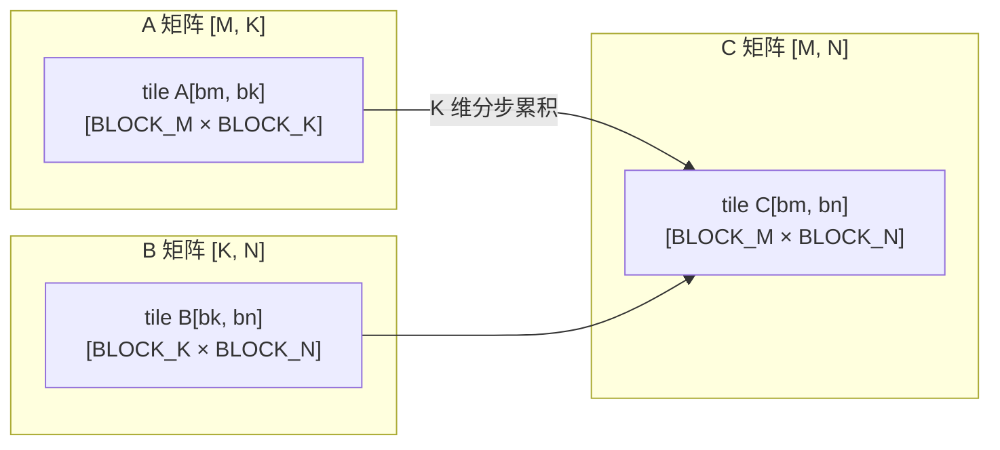
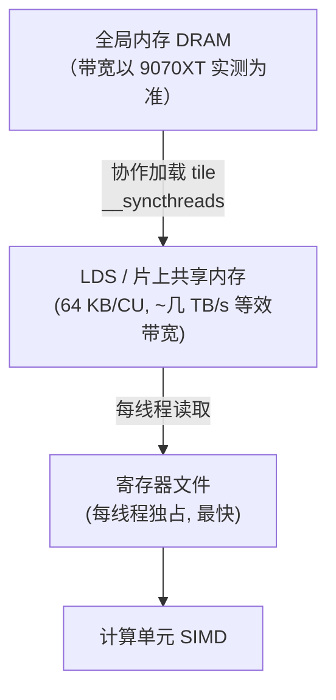
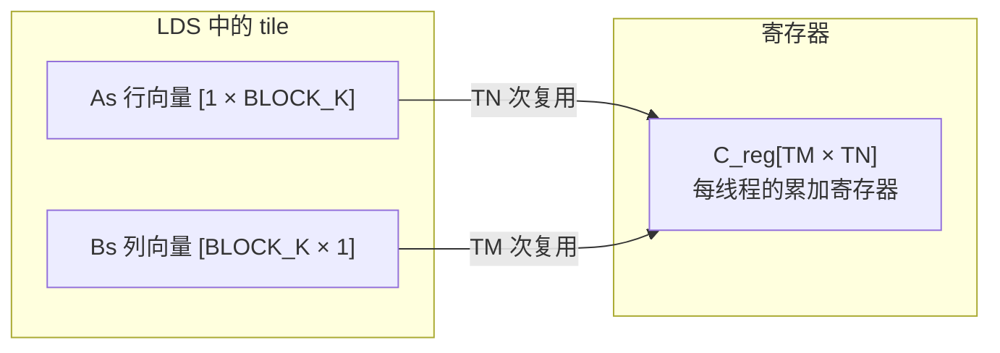

# 第9章 GEMM：tiling + LDS

## 本章导读

> 矩阵乘（General Matrix Multiplication，GEMM）是 AI 计算中出现频率最高的算子。全连接层、注意力的 QKV 投影、FFN 的两个线性变换——几乎每一层都可以归结为若干次 GEMM。本章不追平 rocBLAS，而是通过五个版本的教学实现，从最朴素的 Naive 写法出发，逐步引入 Tiling、LDS 缓存、Register Blocking 和组合优化，让你看清高性能 GEMM 的基本思路。
>
> 关于硬件：9070XT 是 RDNA4 架构，它的矩阵加速靠 **WMMA**（Wave Matrix Multiply Accumulate）而不是 MFMA——MFMA 是 CDNA 数据中心卡的指令族，RDNA4 没有。WMMA 的基本形态在第 2 章 2.9 节（[WMMA：RDNA4 的矩阵加速单元](../../part0-intro/chapter2/index.md)）已经讲过，本章在讨论"教学版离库还有多远"时会反复用到。

## 9.1 GEMM 为什么是核心算子

一个 Transformer 层大致有如下几类计算：

```
输入向量 x  →  QKV 投影（3 × Linear）  →  Attention Score（QK^T）  →  AV（矩阵乘）  →  输出投影  →  FFN（2 × Linear）
```

每一个 `Linear` 就是一次 GEMM。以一个中等规模模型（B=1, seq_len=2048, d_model=4096）为例，仅注意力层的 Q/K/V 投影就产生三次形状约为 `[2048, 4096] × [4096, 4096]` 的 GEMM。这些矩阵乘通常占整体推理耗时的 60%–90%。

### FLOP 计算

一次 `C = A × B`，A 形状 `[M, K]`，B 形状 `[K, N]`，输出 C 形状 `[M, N]`，每个输出元素需要 K 次乘加（即 2K 次浮点运算），总 FLOP 数：

```
FLOP = 2 × M × N × K
```

举例：M=N=K=4096 时，FLOP ≈ 2 × 4096³ ≈ 137 × 10⁹，即约 137 GFLOP。

> 🚧 待 job 填充（9070XT）：9070XT 的 fp32 理论峰值 TFLOPS（不走 WMMA 时）以及 137 GFLOP 在该峰值下应有的目标耗时，需在 Radeon RX 9070 XT + ROCm 6.4.x（Linux）上实测确认。

### 为什么朴素实现远不够快

GEMM 计算强度（Arithmetic Intensity）很高，但前提是**数据要被充分复用**：

```
计算强度 = FLOP / bytes_moved = 2MNK / (M×K + K×N + M×N) × 4  （fp32）
```

> 🚧 待 job 填充（9070XT）：9070XT 的显存带宽（GDDR6，标称 ~760 GB/s，以实测为准），以及在该带宽下计算强度门槛的位置。

高性能 GEMM 的核心任务是：**让每个从 DRAM 搬来的字节被尽可能多地复用**，充分利用 LDS（共享内存）和寄存器。

## 9.2 Naive Matmul — 一线程一输出元素

每个线程计算输出矩阵 C 中的一个元素。

<details>
<summary>代码：gemm_v0_naive kernel</summary>

```hip
// v0: Naive — 一线程计算一个输出元素，直接循环 K 维
__global__ void gemm_v0_naive(
    const float* __restrict__ A,   // [M, K]
    const float* __restrict__ B,   // [K, N]
    float*       __restrict__ C,   // [M, N]
    int M, int N, int K)
{
    int row = blockIdx.y * blockDim.y + threadIdx.y;
    int col = blockIdx.x * blockDim.x + threadIdx.x;

    if (row >= M || col >= N) return;

    float acc = 0.0f;
    for (int k = 0; k < K; k++) {
        acc += A[row * K + k] * B[k * N + col];
    }
    C[row * N + col] = acc;
}
```

</details>

### v0 的问题在哪里

考虑 `A[row * K + k]` 的访问方式：同一 wavefront 里不同线程的 `row` 不同，所以它们在访问同一列 `A[0..w-1][k]`，而 A 以行主序存储，这些元素间距为 K，形成非连续（strided）访问——访存不合并（Non-coalesced），带宽利用率很低。

此外，每个线程独立读取 A 和 B，没有任何共享，同一行的 A 数据被 N 个线程分别读了 N 遍。

> 🚧 待 job 填充（9070XT）：M=N=K ∈ {512,1024,2048,4096} 的 v0 耗时 / TFLOPS / 占理论峰值百分比，需在 9070XT + ROCm 6.4.x（Linux）上实测。

## 9.3 Tiling — 矩阵拆块，数据复用第一步

将 A 按行分块、B 按列分块，每次只在一个 `[BLOCK_M, BLOCK_K]` 和 `[BLOCK_K, BLOCK_N]` 的子矩阵对上做乘加，把 K 维的累积分成多个小步骤：

::: figure fig-gemm-tiling


Tiling 将 A、B 切成小 tile 逐步累积到 C 的对应位置
:::

Tiling 本身不减少计算量，FLOP 数一样是 `2MNK`，但它让**每次搬进来的数据块被该 block 的所有线程共同复用**，大幅减少实际 DRAM 访问次数。

## 9.4 LDS 缓存 — 缓存 tile，减少全局内存重复读

引入 LDS（Local Data Share，AMD GPU 片上共享内存），实现 v1。

::: figure fig-gemm-mem-hierarchy


内存层次：DRAM → LDS → 寄存器 → 计算，每层带宽和延迟差异悬殊
:::

<details>
<summary>代码：gemm_v1_lds kernel（BLOCK_M = BLOCK_N = 16, BLOCK_K = 16）</summary>

```hip
#define BLOCK_M 16
#define BLOCK_N 16
#define BLOCK_K 16

__global__ void gemm_v1_lds(
    const float* __restrict__ A,
    const float* __restrict__ B,
    float*       __restrict__ C,
    int M, int N, int K)
{
    __shared__ float As[BLOCK_M][BLOCK_K];
    __shared__ float Bs[BLOCK_K][BLOCK_N];

    int ty = threadIdx.y, tx = threadIdx.x;
    int row = blockIdx.y * BLOCK_M + ty;
    int col = blockIdx.x * BLOCK_N + tx;

    float acc = 0.0f;

    for (int kb = 0; kb < (K + BLOCK_K - 1) / BLOCK_K; kb++) {
        int a_col = kb * BLOCK_K + tx;
        As[ty][tx] = (row < M && a_col < K) ? A[row * K + a_col] : 0.0f;

        int b_row = kb * BLOCK_K + ty;
        Bs[ty][tx] = (b_row < K && col < N) ? B[b_row * N + col] : 0.0f;

        __syncthreads();

        #pragma unroll
        for (int k = 0; k < BLOCK_K; k++) {
            acc += As[ty][k] * Bs[k][tx];
        }

        __syncthreads();
    }

    if (row < M && col < N)
        C[row * N + col] = acc;
}
```

</details>

两个 `__syncthreads()` 缺一不可：第一个等 tile 加载完，第二个保护下一轮覆盖写入。

> 🚧 待 job 填充（9070XT）：v0 → v1 的 TFLOPS 提升（预期是本章单步收益最大的一次优化），需在 9070XT + ROCm 6.4.x（Linux）上实测。

## 9.5 Register Blocking — 每线程多输出，寄存器复用

让一个线程负责 `TM × TN` 个输出元素（例如 4×4），同样的 LDS 数据可以被复用 `TM × TN` 倍，极大提升计算与访存比。

::: figure fig-register-blocking


Register Blocking：每线程持有 TM×TN 个累加寄存器，LDS 数据被多次复用
:::

<details>
<summary>代码：gemm_v3_reg_blocking kernel（TM=TN=4）</summary>

```hip
#define V3_BLOCK_M  64
#define V3_BLOCK_N  64
#define V3_BLOCK_K  16
#define V3_TM        4
#define V3_TN        4
// 线程块：(BLOCK_N/TN, BLOCK_M/TM) = (16, 16)

__global__ void gemm_v3_reg_blocking(
    const float* __restrict__ A,
    const float* __restrict__ B,
    float*       __restrict__ C,
    int M, int N, int K)
{
    __shared__ float As[V3_BLOCK_M][V3_BLOCK_K];
    __shared__ float Bs[V3_BLOCK_K][V3_BLOCK_N];

    int thread_row = threadIdx.y * V3_TM;
    int thread_col = threadIdx.x * V3_TN;

    int block_row = blockIdx.y * V3_BLOCK_M;
    int block_col = blockIdx.x * V3_BLOCK_N;

    float acc[V3_TM][V3_TN] = {};

    int num_threads = blockDim.x * blockDim.y;
    int tid = threadIdx.y * blockDim.x + threadIdx.x;

    for (int kb = 0; kb < (K + V3_BLOCK_K - 1) / V3_BLOCK_K; kb++) {
        int A_tiles = V3_BLOCK_M * V3_BLOCK_K;
        for (int i = tid; i < A_tiles; i += num_threads) {
            int r = i / V3_BLOCK_K, c = i % V3_BLOCK_K;
            int g_row = block_row + r;
            int g_col = kb * V3_BLOCK_K + c;
            As[r][c] = (g_row < M && g_col < K) ? A[g_row * K + g_col] : 0.0f;
        }

        int B_tiles = V3_BLOCK_K * V3_BLOCK_N;
        for (int i = tid; i < B_tiles; i += num_threads) {
            int r = i / V3_BLOCK_N, c = i % V3_BLOCK_N;
            int g_row = kb * V3_BLOCK_K + r;
            int g_col = block_col + c;
            Bs[r][c] = (g_row < K && g_col < N) ? B[g_row * N + g_col] : 0.0f;
        }

        __syncthreads();

        #pragma unroll
        for (int k = 0; k < V3_BLOCK_K; k++) {
            float a_frag[V3_TM], b_frag[V3_TN];
            #pragma unroll
            for (int tm = 0; tm < V3_TM; tm++)
                a_frag[tm] = As[thread_row + tm][k];
            #pragma unroll
            for (int tn = 0; tn < V3_TN; tn++)
                b_frag[tn] = Bs[k][thread_col + tn];
            #pragma unroll
            for (int tm = 0; tm < V3_TM; tm++)
                #pragma unroll
                for (int tn = 0; tn < V3_TN; tn++)
                    acc[tm][tn] += a_frag[tm] * b_frag[tn];
        }

        __syncthreads();
    }

    #pragma unroll
    for (int tm = 0; tm < V3_TM; tm++) {
        #pragma unroll
        for (int tn = 0; tn < V3_TN; tn++) {
            int g_row = block_row + thread_row + tm;
            int g_col = block_col + thread_col + tn;
            if (g_row < M && g_col < N)
                C[g_row * N + g_col] = acc[tm][tn];
        }
    }
}
```

</details>

> 🚧 待 job 填充（9070XT）：v3 各形状的耗时 / TFLOPS / 占峰值百分比 / 相对 rocBLAS 的比例。注意 v3 是否反超 rocBLAS，取决于 9070XT + ROCm 6.4.x 上 rocBLAS 的 fp32 路径是否走 WMMA——这一点必须实测确认，不能照搬任何其它硬件的结论。

## 9.6 简化版高性能 GEMM — 组合优化

v4 在 v3 的基础上：把 tile 尺寸放大到 `128×128`，增大 BLOCK_K 到 32，把 register blocking 扩展到 TM=TN=8（每线程 64 个输出元素），加入 LDS bank conflict padding。

> 🚧 待 job 填充（9070XT）：v4 各形状的耗时 / TFLOPS / 占峰值百分比，重点观察"把 tile 推到 128×128 + TM=TN=8 后寄存器压力是否触及 occupancy 上限"，需在 9070XT + ROCm 6.4.x（Linux）上实测。

## 9.7 Triton 版本对比 — tile 表达的简洁性

Triton 的关键设计是：**程序员只描述 block 级的 tile 计算，编译器负责把 tile 落到 LDS / 寄存器 / wave，并处理同步、bank conflict、occupancy**。你不再写 `__syncthreads()`，也不再手写 padding。

```python
import triton
import triton.language as tl

@triton.autotune(
    configs=[
        triton.Config({"BLOCK_M": 64, "BLOCK_N": 64, "BLOCK_K": 16, "GROUP_M": 8}, num_warps=4, num_stages=3),
        triton.Config({"BLOCK_M": 128, "BLOCK_N": 128, "BLOCK_K": 32, "GROUP_M": 8}, num_warps=8, num_stages=3),
    ],
    key=["M", "N", "K"],
)
@triton.jit
def matmul_kernel(
    A_ptr, B_ptr, C_ptr,
    M, N, K,
    stride_am, stride_ak,
    stride_bk, stride_bn,
    stride_cm, stride_cn,
    BLOCK_M: tl.constexpr, BLOCK_N: tl.constexpr, BLOCK_K: tl.constexpr, GROUP_M: tl.constexpr,
):
    pid = tl.program_id(0)
    num_pid_m = tl.cdiv(M, BLOCK_M)
    num_pid_n = tl.cdiv(N, BLOCK_N)
    num_pid_in_group = GROUP_M * num_pid_n
    group_id = pid // num_pid_in_group
    first_pid_m = group_id * GROUP_M
    group_size_m = min(num_pid_m - first_pid_m, GROUP_M)
    pid_m = first_pid_m + (pid % group_size_m)
    pid_n = (pid % num_pid_in_group) // group_size_m

    offs_m = pid_m * BLOCK_M + tl.arange(0, BLOCK_M)
    offs_n = pid_n * BLOCK_N + tl.arange(0, BLOCK_N)
    offs_k = tl.arange(0, BLOCK_K)

    a_ptrs = A_ptr + offs_m[:, None] * stride_am + offs_k[None, :] * stride_ak
    b_ptrs = B_ptr + offs_k[:, None] * stride_bk + offs_n[None, :] * stride_bn

    acc = tl.zeros((BLOCK_M, BLOCK_N), dtype=tl.float32)
    for k in range(0, tl.cdiv(K, BLOCK_K)):
        a = tl.load(a_ptrs, mask=offs_m[:, None] < M, other=0.0)
        b = tl.load(b_ptrs, mask=offs_n[None, :] < N, other=0.0)
        # tl.dot 在 RDNA4 上由后端映射到 WMMA
        acc = tl.dot(a, b, acc)
        a_ptrs += BLOCK_K * stride_ak
        b_ptrs += BLOCK_K * stride_bk

    c_ptrs = C_ptr + offs_m[:, None] * stride_cm + offs_n[None, :] * stride_cn
    tl.store(c_ptrs, acc, mask=(offs_m[:, None] < M) & (offs_n[None, :] < N))
```

读这段代码时，把它和 HIP v3 对照：`tl.load` = 协作加载 tile 到 LDS，`tl.dot` = register blocking 的 `TM×TN` 外积 + WMMA，`acc` = 那个 `float acc[TM][TN]` 数组。**Triton 没有省掉任何优化思路，只是把它们从"手写"变成了"声明"。**

> 🚧 待 job 填充（9070XT）：Triton 版（autotune 选出最佳配置后）与 HIP v3/v4、rocBLAS 的对比，需在 9070XT + ROCm 6.4.x（Linux）上实测。重点看 Triton autotune 选出的 BLOCK_M/N/K 是否与手写 v4 的最优配置接近。

## 9.8 与 rocBLAS 对比 — 只观察差距和方向

rocBLAS 代表了当前软件栈能达到的上限（RDNA4 上内部用 WMMA）。我们的目的不是打败 rocBLAS，而是看清距离上限还有多少差距。

> 🚧 待 job 填充（9070XT）：v0–v4 + rocBLAS 在 M=N=K ∈ {512,1024,2048,4096} 上的 TFLOPS 对比表。需在 9070XT + ROCm 6.4.x（Linux）上跑 `code/part2-kernels/chapter9/` 下的 benchmark，数据放进 `logs/`。

**差距分析的方向**：

- **v0 → v1 的提升通常最大**：LDS 把全局内存访问减少 `BLOCK_M` 倍。
- **v4 距离 rocBLAS 的差距**：rocBLAS 会用 WMMA 等专用矩阵指令把 SIMD 教学版甩在后面。在 9070XT（gfx12）+ ROCm 6.4.x 这条路径上，rocBLAS 的 fp32 路径到底走不走 WMMA、教学版 register-blocking 有没有可观察的反超空间，都必须实测确认。

## 9.9 思考题

1. **tile 尺寸与 LDS 容量**：9070XT 每 CU 有 64 KB LDS。若 BLOCK_M=BLOCK_N=128，BLOCK_K=16，As 和 Bs 各占多少字节？是否可以同时放入 LDS？

2. **occupancy 与 register blocking**：TM=TN=8 时，每个线程需要分配多少浮点寄存器？> 🚧 待 job 填充（9070XT）：9070XT（gfx12）每 CU 的 VGPR 总量。

3. **bank conflict 实验**：把 `As[BLOCK_M][BLOCK_K + 1]` 的 `+1` 去掉，对比有无 padding 的性能差异。

4. **fp16 实验**：把 v4 的数据类型改为 `__half`（fp16），重新跑 M=N=K=4096。> 🚧 待 job 填充（9070XT）：fp16 重测结果，以及是否进一步接 WMMA 的 fp16 路径。

5. **rocBLAS 为什么快**：在 gfx12 上，WMMA 的 fp32 / fp16 吞吐相对 SIMD FMA 有何不同？（WMMA 基础见第 2 章 2.9 节。）

## 本章小结

- GEMM 是 AI 计算的核心算子，全连接层和注意力中的绝大多数 FLOP 都来自矩阵乘。
- v0 Naive 每个线程独立读 A、B，访存完全不复用，是 memory-bound 的典型反例。
- Tiling 把大矩阵分块，让每次从 DRAM 搬来的数据被整个 block 的线程共同复用，是后续一切优化的前提。
- LDS 把 tile 从 DRAM 搬到片上，v0 → v1 通常能带来最大的性能跃升。
- Register Blocking 让每个线程负责多个输出，把 LDS 的数据进一步在寄存器里复用，是逼近计算峰值的关键步骤。
- v4 组合版综合了以上所有技术，但仍与 rocBLAS 有差距——rocBLAS 使用了 WMMA 等专用矩阵指令（WMMA 见第 2 章 2.9 节）。
- Triton 把"分块 + 寄存器复用"从手写变成声明：`tl.load` / `tl.dot` 一行替代了 LDS 协作加载、同步、bank padding，在 RDNA4 上由后端映射到 WMMA。
- 下一章（[第 10 章 Flash Attention 思路](../chapter10/index.md)）把 Softmax（[第 8 章](../chapter8/index.md)）和本章 GEMM 的思路综合起来。

## 延伸阅读

- [rocBLAS 文档](https://rocm.docs.amd.com/projects/rocBLAS/en/latest/)
- [AMD Composable Kernel (CK)](https://github.com/ROCm/composable_kernel)
- [HIP 编程指南 — 共享内存](https://rocm.docs.amd.com/projects/HIP/en/latest/user_guide/programming_guide.html)
- [How to Optimize a CUDA Matmul Kernel for cuBLAS-like Performance](https://siboehm.com/articles/22/CUDA-MMM) — 方法论与 HIP 一致，推荐对照阅读
- [Triton tutorial — Fused Attention / Matmul](https://triton-lang.org/main/getting-started/tutorials/index.html)
- [GPUOpen：Using the Matrix Cores of AMD RDNA 4 architecture GPUs](https://gpuopen.com/learn/using_matrix_core_amd_rdna4/)
