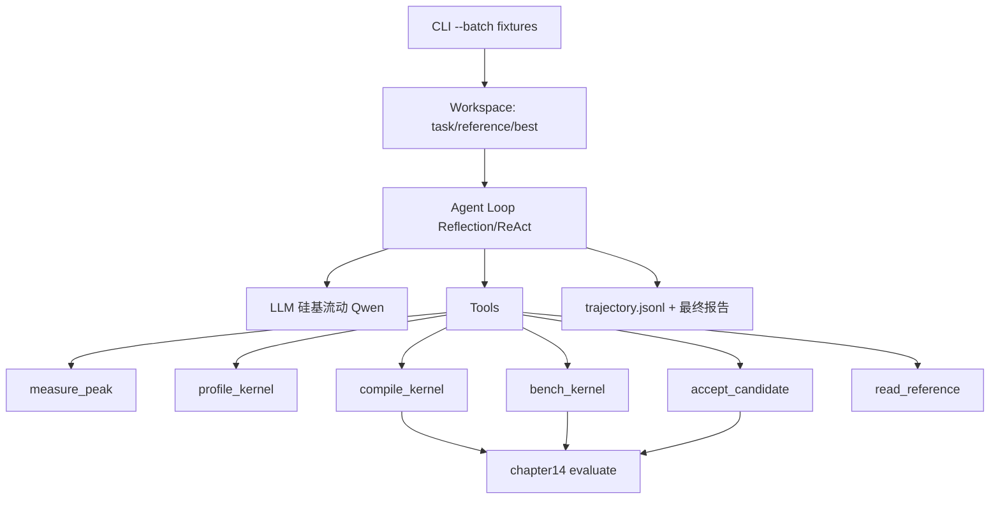

# DESIGN · 算子优化 Agent

## 1. 整体架构



## 2. 分层

| 层 | 组件 | 职责 |
|---|---|---|
| 入口 | `kernel_optimize/__main__.py` | 交互 / `--batch` 非交互 |
| Agent | `agent.py` | 主循环 + 完成护栏 |
| 工具 | `tools.py` | 权威工具 + 自由工具；batch 下 ask_user 拒答并引导 |
| 评测 | `chapter14/evaluate.py` | 正确性 / 计时 / 配对裁决 |
| Skill | `skills/rocm-kernel-optimize/` | 套路与硬件参考 |
| 教学 | `chapter15/` | fixtures + README + 运行脚本 |

## 3. 非交互数据流

1. 加载 `chapter15/fixtures/vector_add/{task.json,reference.py,baseline.py}`
2. 写入 workspace：`task.json` / `reference.py` / `best.py`
3. `run_agent(goal=BATCH_GOAL)`，`ask_user` 返回固定提示「非交互，请基于工作区继续」
4. 结束打印确定性汇总（baseline/best 延迟、接受轮次）+ LLM 报告

## 4. 接口契约

### CLI

```
uv run python -m kernel_optimize --batch chapter15/fixtures/vector_add [--max-steps 25]
```

### LLM env

```
KERNEL_AGENT_MODEL=openai/Qwen/Qwen3.6-35B-A3B
KERNEL_AGENT_API_BASE=https://api.siliconflow.cn/v1
KERNEL_AGENT_API_KEY=<secret>
```

## 5. 异常策略

- LLM/网络失败：工具或 chat 抛错 → agent 记入观察，步数耗尽后退出并保留轨迹
- 候选编译/正确性失败：`compile_kernel` / `accept_candidate` 拒绝并记录，继续反思
- 无 GPU：measure_peak 返回失败信息，仍可尝试但 `bench_kernel` 会失败
