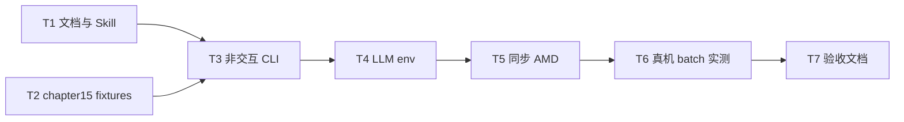

# TASK · 算子优化 Agent

## 任务依赖图

## T1 · Skill references

- **输入**：HANDOFF 套路库
- **输出**：`skills/rocm-kernel-optimize/{SKILL.md,references/*.md}`
- **验收**：`read_reference("optimization-patterns")` 可读

## T2 · chapter15 教学目录

- **输出**：`chapter15/README.md` + `fixtures/vector_add/{baseline.py,reference.py,task.json}` + `run_vector_add.sh`
- **验收**：fixtures 与 chapter14 vadd 语义一致，可被 --batch 加载

## T3 · 非交互 CLI

- **输出**：`__main__.py` 支持 `--batch`；`prompts.BATCH_GOAL`；batch 下 ask_user 行为；结束确定性汇总
- **验收**：无 TTY 可跑；本地单测覆盖 batch 加载

## T4 · LLM 配置

- **输出**：本地+远端 `~/.config/hello-gpu/kernel-agent.env`（chmod 600）
- **验收**：`llm._model_config()` 成功；仓库无 key

## T5 · 同步 AMD

- **输出**：`~/hello-gpu/code/part3-agent` 完整代码 + `uv sync`
- **验收**：`torch.cuda.is_available()` 且设备为 9070 XT

## T6 · 真机实测

- **命令**：`uv run python -m kernel_optimize --batch chapter15/fixtures/vector_add`
- **验收**：轨迹存在；至少一次权威工具调用；报告落地

## T7 · Assess 文档

- **输出**：`ACCEPTANCE_` / `FINAL_` / `TODO_`
